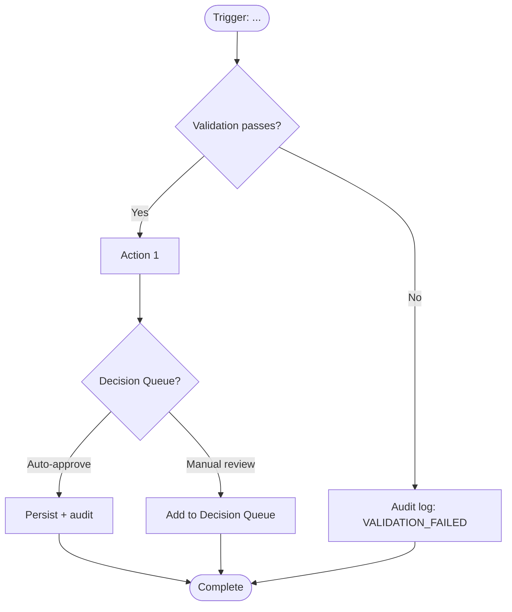

# {Module} {ShortName} — Workflows v{Major}.{Minor}

> **Locked from:** Spec v{Major}.{Minor} (Round {N-1})
> **Purpose:** Critical runtime flows with BR traceability. Every flow ends with a clear decision or state transition.

---

## Workflow Index

| ID | Name | Trigger | Primary Role | BRs Referenced |
|---|---|---|---|---|
| WF-{module}-001 | _[name]_ | _[trigger]_ | _[role]_ | _[BR-{module}-XXX list]_ |
| WF-{module}-002 | _[name]_ | _[trigger]_ | _[role]_ | _[]_ |

---

## WF-{module}-001 — _[Name]_

**Decision answered:** _[one sentence]_
**Trigger:** _[event / user action / scheduled / API call]_
**Primary role:** _[role code]_
**BR coverage:** _[BR-{module}-001, BR-{module}-002, ...]_

### Step-by-step

1. **Trigger fires.** _[detail]_
2. **Validation.** _[BR-{module}-XXX referenced]_
3. **Branch.** _[branch logic]_
4. **Persist.** _[entities written, audit events emitted]_
5. **Notify.** _[who is notified, via what channel]_

### Audit events emitted

| Event | When | Severity |
|---|---|---|
| _[EVENT_NAME]_ | _[when]_ | _[severity]_ |

### Failure modes

| Failure | Detection | Response |
|---|---|---|
| _[failure]_ | _[how detected]_ | _[what happens]_ |

---

## WF-{module}-002 — _[next workflow]_

_[Same structure.]_

---

## BR Coverage Matrix

| BR | Workflow(s) covering it |
|---|---|
| BR-{module}-001 | WF-{module}-001 |
| BR-{module}-002 | WF-{module}-001, WF-{module}-002 |

**Lock criterion:** Every BR from the Spec must appear in at least one workflow OR be explicitly marked NON-RUNTIME (data validation only, etc.) in this matrix.

---

*Workflows locked → Module is COMPLETE. Update CLAUDE.md Section 3 and EPCC_VersionLog.*
