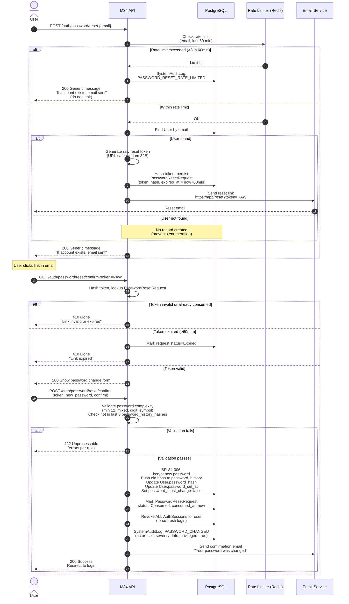
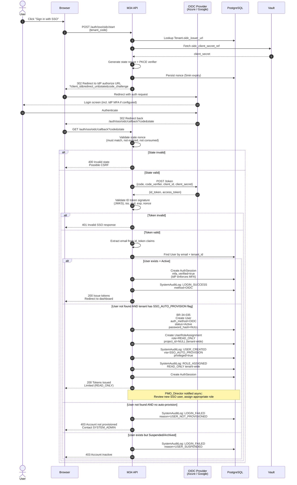
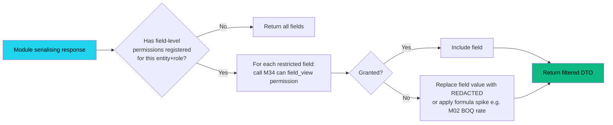

# M34 — System Administration & RBAC
## Workflows v1.0
**Status:** Locked
**Author:** PMO Director / System Architect
**Created:** 2026-05-03
**Reference Spec:** M34_SystemAdminRBAC_Spec_v1_0.md
**Folder:** /02_L1_Command/

---

## PURPOSE

This document captures the runtime workflows that the M34 spec describes statically. Mermaid diagrams render directly in GitHub, GitLab, VS Code, and most markdown viewers. Each flow references its governing Business Rules (BR-34-NNN) for traceability.

**Six workflows covered:**

| # | Workflow | Governing BRs |
|---|---|---|
| 1 | Login (local + MFA) | BR-34-003, 004, 005, 014, 034 |
| 2 | Password Reset (self-service) | BR-34-006, 008, 009, 031 |
| 3 | Role Assignment + Cache Invalidation | BR-34-010, 011, 015, 028 |
| 4 | User Offboarding Cascade | BR-34-013 |
| 5 | OIDC SSO Login (with auto-provision branch) | BR-34-035 |
| 6 | Permission Check Decision Tree | BR-34-014, 015, 028 |

---

## CONVENTIONS

- **Solid arrows** = synchronous request/response
- **Dashed arrows** = asynchronous events / notifications
- **Diamond shapes** = decision points
- **Rectangles with rounded corners** = system actions
- **Trapezoids / hexagons** = persistence (DB writes)
- All BR references map to `M34_SystemAdminRBAC_Spec_v1_0.md` Block 6
- All diagrams use BR-34 prefix; cross-module references use `M{ID}` notation

---

# WORKFLOW 1 — LOGIN (Local Auth + MFA)

**Trigger:** User submits POST /api/v1/auth/login
**Outcomes:** AuthSession issued OR error response (locked / bad credentials / MFA challenge)

```mermaid
flowchart TD
    Start([POST /auth/login<br/>{tenant_code, username, password}]) --> CheckTenant{Tenant<br/>active?}
    CheckTenant -->|No| RejectTenant[Return 403<br/>Tenant suspended/archived]
    CheckTenant -->|Yes| ResolveUser{Resolve<br/>username → User?}

    ResolveUser -->|Not found| LogFailNotFound[(LoginAttempt:<br/>Failed_User_Not_Found)]
    LogFailNotFound --> Generic[Return 401<br/>Invalid credentials<br/>generic message]

    ResolveUser -->|Found| CheckStatus{User.status?}
    CheckStatus -->|Suspended| LogSusp[(LoginAttempt:<br/>Failed_Suspended)]
    LogSusp --> Generic
    CheckStatus -->|Archived| Generic
    CheckStatus -->|Locked + locked_until > now| LogLock[(LoginAttempt:<br/>Failed_Locked)]
    LogLock --> ReturnLocked[Return 423<br/>Locked until X]
    CheckStatus -->|Active OR Locked-but-expired| VerifyPwd

    VerifyPwd[Bcrypt verify password] --> PwdMatch{Match?}
    PwdMatch -->|No| IncrFail[Increment<br/>failed_login_count]
    IncrFail --> CountCheck{Count<br/>= 5?}
    CountCheck -->|Yes| Lock[(BR-34-004<br/>Set locked_until = now + 30min<br/>SystemAuditLog: USER_LOCKED)]
    Lock --> NotifyAdmin[/.../ Notify PMO_Director]
    Lock --> Generic
    CountCheck -->|No| LogFailPwd[(LoginAttempt:<br/>Failed_Bad_Password)]
    LogFailPwd --> Generic

    PwdMatch -->|Yes| ResetCount[Reset failed_login_count = 0]
    ResetCount --> CheckMustChange{password_<br/>must_change?}
    CheckMustChange -->|Yes| Force[Return 200<br/>requires_password_change=true<br/>limited token]
    CheckMustChange -->|No| CheckMFA{User.mfa_enabled<br/>OR Role.requires_mfa?}

    CheckMFA -->|No| IssueSession
    CheckMFA -->|Yes| MFAChallenge[Return 200<br/>requires_mfa=true<br/>MFA challenge token]

    MFAChallenge -.-> MFASubmit([POST /auth/mfa/verify<br/>{code, mfa_token}])
    MFASubmit --> VerifyTOTP{TOTP / backup<br/>code valid?}
    VerifyTOTP -->|No| LogMFAFail[(LoginAttempt:<br/>Failed_MFA)]
    LogMFAFail --> RetryMFA[Return 401<br/>Invalid code]
    VerifyTOTP -->|Yes| IssueSession

    IssueSession[BR-34-003<br/>Create AuthSession<br/>access_token + refresh_token<br/>mfa_verified=true if applicable]
    IssueSession --> CheckConcurrent{Active<br/>sessions ≥ 3?}
    CheckConcurrent -->|Yes| RevokeOldest[BR-34-034<br/>Revoke oldest session<br/>Notify user via email]
    CheckConcurrent -->|No| Persist
    RevokeOldest --> Persist
    Persist[(AuthSession persisted<br/>SystemAuditLog: LOGIN_SUCCESS)]
    Persist --> UpdateLast[Update User.last_login_at]
    UpdateLast --> ReturnTokens([Return 200<br/>access_token, refresh_token<br/>expires_at])

    style Start fill:#22d3ee,color:#000
    style ReturnTokens fill:#10b981,color:#000
    style Generic fill:#ef4444,color:#fff
    style RetryMFA fill:#ef4444,color:#fff
    style ReturnLocked fill:#ef4444,color:#fff
    style Force fill:#f59e0b,color:#000
```

**Notes:**
- Generic 401 message on user-not-found, bad-password, suspended — prevents user enumeration
- locked_until check uses "expired lockout" logic — auto-unlock after 30 min
- MFA challenge token is short-lived (5 min), tied to a single auth attempt
- Concurrent session limit (3) per BR-34-034
- LoginAttempt records retained 90 days; SystemAuditLog records permanent (privileged)

---

# WORKFLOW 2 — PASSWORD RESET (SELF-SERVICE)

**Trigger:** User submits POST /api/v1/auth/password/reset {email}
**Outcomes:** Reset link emailed OR rate-limit response. Then consume → new password set.



**Notes:**
- Rate limit: 3 requests per email per 60 min (BR-34-031)
- Generic response prevents email enumeration attacks
- Token expires in 60 min, single-use (BR-34-008, OQ-2.10)
- All existing sessions revoked on password change (BR-34-006)
- Confirmation email is informational only (not a security control)
- Admin-forced password reset uses similar flow but bypasses self-rate-limit; logged as PASSWORD_RESET_FORCED

---

# WORKFLOW 3 — ROLE ASSIGNMENT + CACHE INVALIDATION

**Trigger:** Authorised user (SYSTEM_ADMIN, PMO_DIRECTOR, PORTFOLIO_MANAGER, or PROJECT_DIRECTOR-restricted) creates a UserRoleAssignment.
**Outcomes:** Assignment persisted, permission cache invalidated, target user notified.

```mermaid
flowchart TD
    Start([POST /admin/users/:id/roles<br/>{role_code, project_id, scope_override, valid_until}]) --> AuthN{AuthSession<br/>valid?}
    AuthN -->|No| Reject401[401 Unauthenticated]
    AuthN -->|Yes| AuthZ{Assigner has<br/>permission to grant<br/>this role?}

    AuthZ -->|No| Reject403[403 Forbidden<br/>Cannot grant this role]
    AuthZ -->|Yes — but PROJECT_DIRECTOR<br/>granting role above own level| RejectScope[403 Forbidden<br/>BR-34-010 scope check]
    AuthZ -->|Yes| ValidateUser{Target user<br/>exists + Active?}

    ValidateUser -->|No| Reject404[404 User not found<br/>or 422 User suspended]
    ValidateUser -->|Yes| ValidateRole{Role exists<br/>+ is_assignable?}

    ValidateRole -->|No| Reject422a[422 Invalid role]
    ValidateRole -->|Yes| ValidateProject{project_id<br/>provided?}

    ValidateProject -->|Yes| ProjActive{M01 Project<br/>exists + active?}
    ProjActive -->|No| Reject422b[422 Project not found<br/>or inactive]
    ProjActive -->|Yes| ValidateScope
    ValidateProject -->|No tenant-wide| ValidateAssigner{Assigner = PMO_DIRECTOR<br/>or SYSTEM_ADMIN?}
    ValidateAssigner -->|No| Reject403b[403 Only PMO/SysAdmin<br/>can grant tenant-wide]
    ValidateAssigner -->|Yes| ValidateScope

    ValidateScope[Validate scope_override<br/>is valid for this role's permissions]
    ValidateScope --> CheckDup{Duplicate<br/>UserRoleAssignment<br/>tenant+user+role+project?}

    CheckDup -->|Exists| Reject409[409 Conflict<br/>Already assigned]
    CheckDup -->|None| Persist[(BR-34-010<br/>INSERT UserRoleAssignment<br/>assignment_status=Active<br/>assigned_by, assigned_at)]

    Persist --> Audit[(SystemAuditLog:<br/>ROLE_ASSIGNED<br/>severity=Info<br/>is_privileged_action=true)]
    Audit --> InvalidateCache[BR-34-028<br/>Invalidate Redis cache<br/>rbac:perm:user_id:*]
    InvalidateCache --> NotifyUser[/.../ In-app notification<br/>to target user:<br/>Role assigned]
    InvalidateCache --> NotifyEmail[/.../ Email to target user]
    NotifyUser --> Return201([201 Created<br/>UserRoleAssignment payload])
    NotifyEmail --> Return201

    style Start fill:#22d3ee,color:#000
    style Return201 fill:#10b981,color:#000
    style Reject401 fill:#ef4444,color:#fff
    style Reject403 fill:#ef4444,color:#fff
    style RejectScope fill:#ef4444,color:#fff
    style Reject403b fill:#ef4444,color:#fff
    style Reject404 fill:#ef4444,color:#fff
    style Reject422a fill:#f59e0b,color:#000
    style Reject422b fill:#f59e0b,color:#000
    style Reject409 fill:#f59e0b,color:#000
```

**Revocation flow** (similar shape, key differences):

```mermaid
flowchart LR
    A([DELETE /admin/users/:id/roles/:assignment_id<br/>{revocation_reason}]) --> B{Reason<br/>≥ 30 chars?}
    B -->|No| BR[422 Reason required]
    B -->|Yes| C{Revoker has<br/>permission?}
    C -->|No| CR[403]
    C -->|Yes| D[(BR-34-011<br/>Set status=Revoked<br/>revoked_by, revoked_at<br/>revocation_reason)]
    D --> E[Revoke ALL AuthSessions<br/>for target user]
    E --> F[(SystemAuditLog:<br/>ROLE_REVOKED<br/>privileged=true)]
    F --> G[Invalidate Redis cache]
    G --> H[/.../ Notify user]
    H --> I([200 OK])

    style A fill:#22d3ee,color:#000
    style I fill:#10b981,color:#000
    style BR fill:#f59e0b,color:#000
    style CR fill:#ef4444,color:#fff
```

**Notes:**
- Cache invalidation pattern: delete by key prefix `rbac:perm:{user_id}:*` (Redis SCAN+DEL)
- Permission cache TTL is 60 sec; explicit invalidation handles role changes faster than TTL would
- Revocation forces fresh login → user re-authenticates → fresh role set loaded
- AuthSession revocation does NOT invalidate refresh tokens issued previously — those must be tracked separately and rotated

---

# WORKFLOW 4 — USER OFFBOARDING CASCADE

**Trigger:** SYSTEM_ADMIN or PMO_DIRECTOR sets User.terminated_at (e.g., employee leaves organisation).
**Outcomes:** All access revoked, sessions killed, API keys created by user rotated, user archived.

```mermaid
flowchart TD
    Start([PATCH /admin/users/:id<br/>{terminated_at: 2026-05-15}]) --> AuthZ{Permission to<br/>terminate user?<br/>SYS_ADMIN or PMO_DIR}
    AuthZ -->|No| Reject[403 Forbidden]
    AuthZ -->|Yes| BeginTxn[(BEGIN TRANSACTION)]

    BeginTxn --> SetTerm[(Update User<br/>terminated_at = ts<br/>status = Archived)]

    SetTerm --> FindAssignments[(SELECT all UserRoleAssignment<br/>where user_id = X<br/>AND assignment_status = Active)]

    FindAssignments --> RevokeRoles[(For each assignment:<br/>Set assignment_status = Revoked<br/>revoked_by = actor<br/>revocation_reason = User terminated YYYY-MM-DD)]

    RevokeRoles --> AuditRevokes[(SystemAuditLog: ROLE_REVOKED<br/>per assignment<br/>privileged=true)]

    AuditRevokes --> FindSessions[(SELECT all AuthSession<br/>where user_id = X<br/>AND revoked_at IS NULL)]

    FindSessions --> KillSessions[(For each session:<br/>Set revoked_at = now<br/>revocation_reason = Role_Change)]

    KillSessions --> FindAPIKeys[(SELECT all APIKey<br/>where created_by = X)]

    FindAPIKeys --> RotateOrFlag{API keys<br/>found?}
    RotateOrFlag -->|None| ClearMFA
    RotateOrFlag -->|Some| FlagKeys[Mark keys for review<br/>by SYSTEM_ADMIN<br/>do NOT auto-revoke<br/>service callers may break]
    FlagKeys --> NotifySysAdmin[/.../ Notify SYSTEM_ADMIN:<br/>Review keys created by terminated user]
    NotifySysAdmin --> ClearMFA

    ClearMFA[(Clear User.mfa_enabled<br/>Hard-delete MFAConfig.totp_secret_encrypted<br/>per privacy)]

    ClearMFA --> ClearCache[Invalidate Redis cache:<br/>rbac:perm:X:*<br/>session:X:*]

    ClearCache --> AuditTerm[(SystemAuditLog: USER_TERMINATED<br/>severity=Critical<br/>cascade_summary JSON]<br/>privileged=true]

    AuditTerm --> CommitTxn[(COMMIT TRANSACTION)]

    CommitTxn --> NotifyPMO[/.../ Email PMO_Director:<br/>User X terminated<br/>N roles revoked<br/>M sessions killed<br/>K API keys flagged]

    NotifyPMO --> Return200([200 OK<br/>Cascade summary])

    style Start fill:#22d3ee,color:#000
    style Return200 fill:#10b981,color:#000
    style Reject fill:#ef4444,color:#fff
    style FlagKeys fill:#f59e0b,color:#000
```

**Notes:**
- Single transaction prevents partial offboarding (ACID)
- API keys created by terminated user are NOT auto-revoked — could break running integrations. Flagged for review.
- MFA TOTP secret hard-deleted (not soft-deleted) per privacy minimisation
- User record itself is archived (is_active=false), not hard-deleted — audit retention requires it
- The `cascade_summary` JSON in the audit log records counts: `{roles_revoked: N, sessions_killed: M, api_keys_flagged: K}`
- Termination date can be FUTURE-DATED — daily Celery Beat applies this on the date

---

# WORKFLOW 5 — OIDC SSO LOGIN

**Trigger:** User clicks "Sign in with SSO" → redirected to IdP → returns to callback.
**Outcomes:** AuthSession issued, possibly auto-provisioned user (if SSO_AUTO_PROVISION flag enabled).



**Notes:**
- PKCE (Proof Key for Code Exchange) used per OAuth 2.1 best practice
- `state` nonce prevents CSRF; 5-min expiry; single-use
- mfa_verified=true assumed when IdP enforces MFA (configured per tenant)
- Auto-provisioned users get READ_ONLY tenant-wide; PMO_Director must elevate manually
- SSO_AUTO_PROVISION is a tenant feature flag (per OQ-1.9)
- ExternalUser table NOT used for OIDC — externals use Local_External or Email_Magic_Link only

---

# WORKFLOW 6 — PERMISSION CHECK DECISION TREE

**Trigger:** Any module calls `M34.can(user_id, permission_code, project_id?, record_id?)` per BR-34-015.
**Outcomes:** boolean — allowed / denied. Cached 60 sec in Redis.

```mermaid
flowchart TD
    Start([Module M_X calls<br/>POST /internal/v1/rbac/can<br/>{user_id, permission_code,<br/>project_id?, record_id?}]) --> CheckCache{Redis cache hit?<br/>key: rbac:perm:user_id:permission_code:project_id}

    CheckCache -->|Hit| ReturnCached([Return cached boolean])

    CheckCache -->|Miss| LoadUser[Load User<br/>+ active UserRoleAssignment list]

    LoadUser --> UserActive{User.status<br/>= Active?}
    UserActive -->|No| Deny0[Cache: false<br/>Return false]
    UserActive -->|Yes| LoadPerms[Resolve permissions:<br/>For each role assignment,<br/>JOIN RolePermission → Permission<br/>filter by permission_code]

    LoadPerms --> PermFound{Permission<br/>granted via any role?}
    PermFound -->|No| Deny1[Cache: false<br/>Return false]
    PermFound -->|Yes| ScopeCheck{What scope<br/>does the granting<br/>RolePermission have?}

    ScopeCheck -->|All| Allow[Cache: true<br/>Return true]
    ScopeCheck -->|Own_Tenant| TenantCheck{Record tenant_id<br/>= user.tenant_id?}
    TenantCheck -->|Yes| Allow
    TenantCheck -->|No| Deny2[Cache: false<br/>Return false]

    ScopeCheck -->|Own_Project| ProjCheck{project_id<br/>provided in context?}
    ProjCheck -->|No| Deny3[Cache: false<br/>Return false<br/>scope mismatch]
    ProjCheck -->|Yes| ProjAssign{User has<br/>UserRoleAssignment<br/>on this project?}
    ProjAssign -->|Yes| Allow
    ProjAssign -->|No| Deny4[Cache: false<br/>Return false]

    ScopeCheck -->|Own_Package| PkgCheck{record_id provided<br/>+ package_id resolvable?}
    PkgCheck -->|No| Deny5[Cache: false<br/>Return false]
    PkgCheck -->|Yes| PkgInList{package_id<br/>in user's<br/>package_ids?}
    PkgInList -->|Yes| Allow
    PkgInList -->|No| Deny6[Cache: false<br/>Return false]

    ScopeCheck -->|Own_Record| RecCheck{record_id provided<br/>+ user is created_by?}
    RecCheck -->|No| Deny7[Cache: false<br/>Return false]
    RecCheck -->|Yes| Allow

    Allow --> SetTTL[Redis TTL 60s]
    SetTTL --> ReturnTrue([Return true])

    Deny0 --> ReturnFalse([Return false])
    Deny1 --> ReturnFalse
    Deny2 --> ReturnFalse
    Deny3 --> ReturnFalse
    Deny4 --> ReturnFalse
    Deny5 --> ReturnFalse
    Deny6 --> ReturnFalse
    Deny7 --> ReturnFalse

    style Start fill:#22d3ee,color:#000
    style ReturnCached fill:#10b981,color:#000
    style ReturnTrue fill:#10b981,color:#000
    style ReturnFalse fill:#ef4444,color:#fff
```

**Notes:**
- Cache key includes project_id to prevent cross-project poisoning
- Cache TTL = 60 sec; explicit invalidation on role change (BR-34-028) handles fast revocation
- For SCOPE = Own_Package, `package_ids` array on UserRoleAssignment is checked against the entity's package_id (resolved by calling module — M34 doesn't load other modules' data; calling module passes context)
- For SCOPE = Own_Record, calling module passes `record.created_by` in context — M34 only compares
- Field-level permissions (is_field_level=true) are checked by calling module's serialiser, not in this flow — M34 returns boolean only

**Field-level overlay (called separately):**



---

# CROSS-WORKFLOW INVARIANTS

These invariants hold across all six workflows:

| Invariant | Mechanism |
|---|---|
| Every state change has an audit log entry | Each BR explicitly emits SystemAuditLog or module-owned log |
| Cache is invalidated immediately on role change | BR-34-028, fired by BR-34-010, BR-34-011, BR-34-013 |
| Sessions are revoked on credential change | BR-34-006 (password change), BR-34-013 (termination) |
| Failed auth events are rate-limited | LoginAttempt + Redis rate limiter (BR-34-031) |
| Privileged actions go to permanent retention | is_privileged_action=true on SystemAuditLog |
| Generic responses on auth failures | Login + password reset return identical messages |
| All workflows are tenant-scoped | tenant_id check in every API call before BR logic runs |

---

# ERROR PATHS — STANDARD HTTP CODES

| Code | When | Audit Action |
|---|---|---|
| 400 | Malformed request, invalid state nonce | None (no security event) |
| 401 | Invalid credentials, expired token, MFA required | LoginAttempt (Auth flow only) |
| 403 | Authenticated but lacks permission | None (frequent — would flood log). Module may log if business-relevant. |
| 404 | Resource not found | None |
| 409 | Conflict — duplicate role assignment, etc. | None |
| 410 | Reset token expired or consumed | None |
| 422 | Validation failure (password complexity, missing fields) | None |
| 423 | User account locked | LoginAttempt (Failed_Locked) |
| 429 | Rate limit exceeded | SystemAuditLog: RATE_LIMITED if security-relevant |
| 500 | Server error | Sentry / observability stack |

---

# PERFORMANCE NOTES

| Operation | Target latency | Backing |
|---|---|---|
| Login (cache cold) | < 250 ms | bcrypt cost 12, Postgres query, Redis write |
| Login (cache warm) | N/A — never cached | Bcrypt always runs |
| Permission check (cache hit) | < 5 ms | Redis GET |
| Permission check (cache miss) | < 30 ms | Postgres role-permission JOIN |
| Role assignment | < 100 ms | Postgres write + Redis SCAN+DEL |
| User offboarding cascade | < 500 ms | Single transaction; size-bounded |
| OIDC SSO callback | < 600 ms | External IdP token call dominates |

---

# IMPLEMENTATION CHECKLIST

When developers implement these workflows, verify:

```
[ ] Every BR-34-NNN reference resolves to spec Block 6
[ ] Generic error messages on Auth flow (no enumeration)
[ ] Bcrypt cost factor 12 (per Engineering Standards)
[ ] Redis cache key namespace consistent: rbac:perm:{user_id}:{permission_code}:{project_id}
[ ] Cache invalidation uses SCAN, not KEYS (production safety)
[ ] Single transaction for offboarding (ACID)
[ ] OIDC state nonce single-use, 5-min expiry
[ ] PKCE used on OIDC flow
[ ] All audit log entries include actor IP + user agent where applicable
[ ] LoginAttempt records pruned at 90 days (retention rule)
[ ] SystemAuditLog never deleted, only archived
[ ] Field-level permissions enforced at serialiser, not in business logic
[ ] Permission cache TTL 60s with explicit invalidation
[ ] Concurrent session limit (3) enforced before AuthSession insert
[ ] MFA secret encrypted at rest with key in Vault, not in DB
```

---

*v1.0 — Workflows locked. All 6 critical M34 paths diagrammed with BR traceability.*
