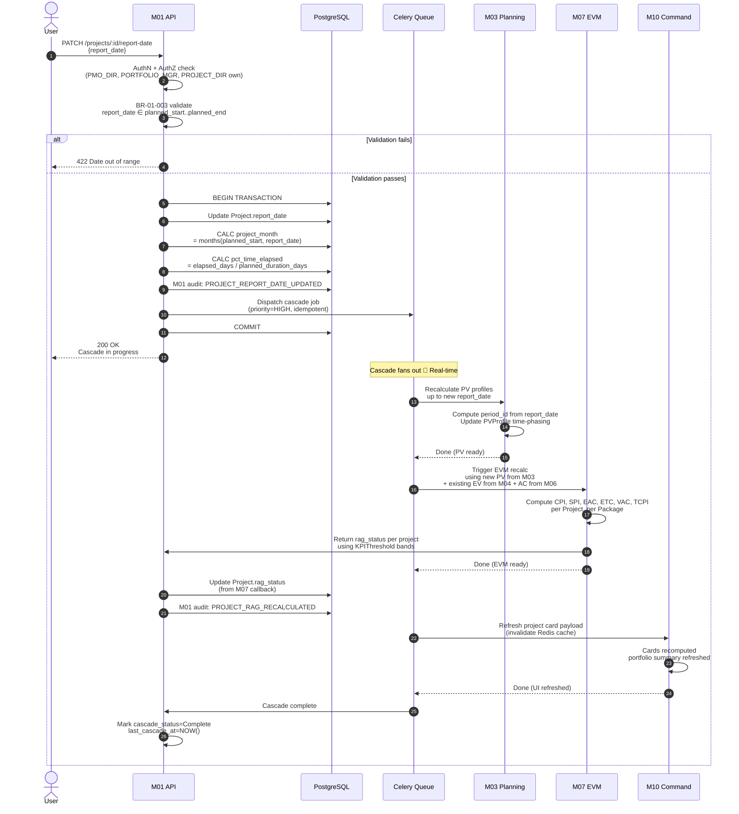
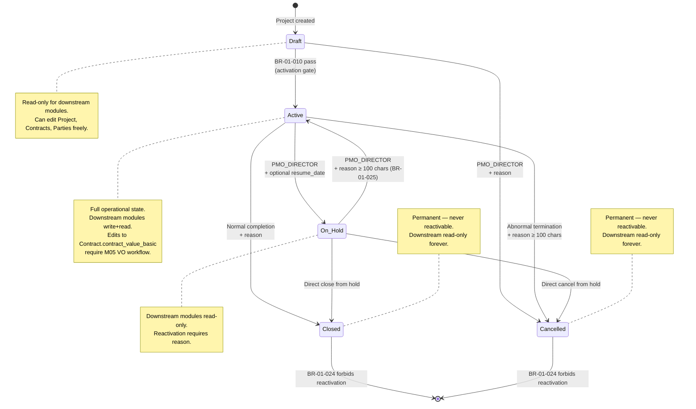
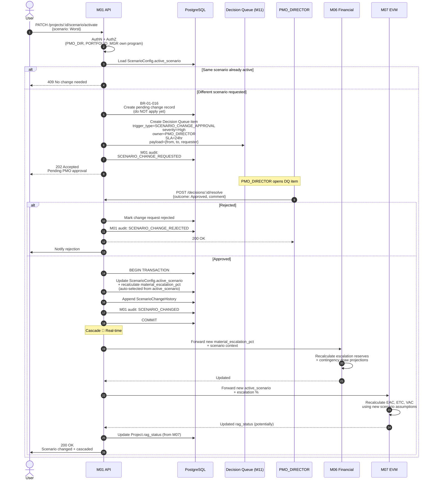

# M01 — Project Registry
## Workflows v1.0a
**Artefact:** M01_ProjectRegistry_Workflows_v1_0a
**Status:** LOCKED
**Author:** Monish (with Claude assist) _(grandfathered: PMO Director / System Architect)_
**Created:** 2026-05-03 | **Last Updated:** 2026-05-04 (v1.0a stamp normalisation — Round 29 audit, H10)
**Last Audited:** v1.0a on 2026-05-04
**Reference Standards:** M01_ProjectRegistry_Spec_v1_0.md (+ v1_1_CascadeNote + v1_2_CascadeNote + v1_3_CascadeNote), X8_GlossaryENUMs_v0_2.md _(historical at lock; current X8 v0.6a)_
**Folder:** /02_L1_Command/

---

## CHANGE LOG

| Patch | Date       | Author                      | Changes |
|-------|------------|-----------------------------|---------|
| v1.0a | 2026-05-04 | Monish (with Claude assist) | H10 in-place patch (Round 29 audit): Format B stamp normalised — added **Artefact**, **Last Updated**, **Last Audited**, **Reference Standards** (with v1_1/v1_2/v1_3 cascade-note forward-pointers); **Status** UPPERCASE; author canonicalised. No content change. |

---

## PURPOSE

Runtime workflows that the M01 spec describes statically. Mermaid diagrams render in GitHub, GitLab, VS Code, and most markdown viewers. Each diagram cross-references its governing Business Rules (BR-01-NNN).

**Seven workflows:**

| # | Workflow | Governing BRs |
|---|---|---|
| 1 | Project Creation Wizard | BR-01-001, 002, 003, 004, 005, 015 |
| 2 | Project Activation Gate (Draft → Active) | BR-01-010 |
| 3 | Report-Date Cascade (full recalculation) | BR-01-012, 020, 021 |
| 4 | Party Exclusivity Exception | BR-01-011 |
| 5 | Project Status State Machine | BR-01-014, 023, 024, 025, 030 |
| 6 | Multi-Primary Contract Justification | BR-01-018, 029 |
| 7 | Scenario Change Approval | BR-01-016 |

---

## CONVENTIONS

- **Solid arrows** = synchronous request/response
- **Dashed arrows** = asynchronous events
- **Diamonds** = decisions
- **Hexagons / cylinders** = persistence
- BR refs map to `M01_ProjectRegistry_Spec_v1_0.md` Block 6
- ENUMs reference X8 (e.g., `X8 §3.8 ProjectStatus`)

---

# WORKFLOW 1 — PROJECT CREATION WIZARD

**Trigger:** PMO_DIRECTOR or SYSTEM_ADMIN clicks "+ Create Project"
**Outcomes:** Project saved as `Draft` (X8 §3.8) with cascade-ready data, OR validation errors

```mermaid
flowchart TD
    Start([User clicks + Create Project]) --> AuthZ{Role =<br/>SYSTEM_ADMIN<br/>or PMO_DIRECTOR?}
    AuthZ -->|No| Reject403[403 Forbidden]
    AuthZ -->|Yes| Step1[Step 1: Identity<br/>project_code, name,<br/>portfolio, program,<br/>sector_top_level + sub_type,<br/>delivery_model]

    Step1 --> Val1{BR-01-001<br/>project_code unique<br/>+ format valid?}
    Val1 -->|No| Err1[422 Code duplicate or invalid format]
    Val1 -->|Yes| Val1b{Sub-type's parent_code_id<br/>matches sector_top_level?}
    Val1b -->|No| Err1b[422 Sector mismatch]
    Val1b -->|Yes| Step2[Step 2: Geography<br/>pincode]

    Step2 --> Val2{BR-01-004<br/>Pincode in<br/>PincodeMaster?}
    Val2 -->|No| Err2[422 Invalid pincode]
    Val2 -->|Yes| Resolve[BR-01-005<br/>Auto-populate state, city,<br/>district, region. Lock fields.]

    Resolve --> Step3[Step 3: Dates & Phase<br/>planned_start, planned_end,<br/>report_date, current_phase]

    Step3 --> Val3a{BR-01-002<br/>planned_end ><br/>planned_start?}
    Val3a -->|No| Err3a[422 End before start]
    Val3a -->|Yes| Val3b{BR-01-003<br/>report_date ∈<br/>start..end?}
    Val3b -->|No| Err3b[422 Report date out of range]
    Val3b -->|Yes| Calc1[CALC: planned_duration_days,<br/>project_month,<br/>pct_time_elapsed]

    Calc1 --> Step4[Step 4: Contracts<br/>at least 1 Contract<br/>add via sub-form]
    Step4 --> Step5[Step 5: Parties<br/>at least 1 Primary_Client<br/>+ EPC_Contractor]
    Step5 --> Step6[Step 6: Scenario<br/>defaults pre-populated]
    Step6 --> Step7[Step 7: KPI Thresholds<br/>BR-01-015 defaults pre-populated<br/>user must explicitly confirm]

    Step7 --> Save[(BEGIN TRANSACTION)]
    Save --> Persist[(INSERT Project<br/>status = Draft<br/>+ Contracts<br/>+ ProjectPartyAssignments<br/>+ ScenarioConfig<br/>+ KPIThreshold rows)]

    Persist --> Audit[(SystemAuditLog<br/>+ M01 module audit:<br/>PROJECT_CREATED)]

    Audit --> Commit[(COMMIT)]
    Commit --> Notify[/.../ Notify PMO_DIRECTOR<br/>+ assigned PROJECT_DIRECTOR if any]

    Notify --> Done([201 Created<br/>Project payload<br/>status = Draft])

    style Start fill:#22d3ee,color:#000
    style Done fill:#10b981,color:#000
    style Reject403 fill:#ef4444,color:#fff
    style Err1 fill:#f59e0b,color:#000
    style Err1b fill:#f59e0b,color:#000
    style Err2 fill:#f59e0b,color:#000
    style Err3a fill:#f59e0b,color:#000
    style Err3b fill:#f59e0b,color:#000
```

**Notes:**
- All wizard steps may be saved as `partial draft` between steps; final commit only on Step 7 completion
- Project enters `Draft` state (X8 §3.8). Activation requires separate gate (Workflow 2)
- KPI thresholds carry `default_applied=true` flag until user explicitly edits or confirms
- Pincode validation is on-blur per OQ-2.10 — real-time feedback in UI

---

# WORKFLOW 2 — PROJECT ACTIVATION GATE (Draft → Active)

**Trigger:** User clicks "Activate Project" on a Draft-status project
**Outcome:** Status transitions to `Active` AND triggers integration broadcast to M02–M11, OR returns specific failure list

```mermaid
flowchart TD
    Start([POST /projects/:id/activate]) --> AuthZ{Role permits<br/>activation?<br/>SYSTEM_ADMIN, PMO_DIR}
    AuthZ -->|No| Reject403[403 Forbidden]
    AuthZ -->|Yes| LoadProject[Load Project<br/>+ all child entities]

    LoadProject --> Status{project_status<br/>= Draft?}
    Status -->|No| RejectStatus[409 Conflict<br/>Project already in another state]
    Status -->|Yes| GateCheck{BR-01-010<br/>activation gate}

    GateCheck --> Check1{≥ 1 Contract<br/>with role=Primary?}
    Check1 -->|No| Fail1[Add to failure list:<br/>Missing Primary contract]
    Check1 -->|Yes| Check2

    Check2{ProjectPartyAssignment<br/>with role=Primary_Client?}
    Check2 -->|No| Fail2[Add: Missing Primary_Client]
    Check2 -->|Yes| Check3

    Check3{ProjectPartyAssignment<br/>with role=EPC_Contractor?}
    Check3 -->|No| Fail3[Add: Missing EPC_Contractor]
    Check3 -->|Yes| Check4

    Check4{ScenarioConfig<br/>exists?}
    Check4 -->|No| Fail4[Add: Missing ScenarioConfig]
    Check4 -->|Yes| Check5

    Check5{KPIThreshold rows<br/>= 5 + user confirmed?}
    Check5 -->|No| Fail5[Add: KPI thresholds<br/>not confirmed]
    Check5 -->|Yes| Check6

    Check6{Any active<br/>Decision Queue blocking<br/>e.g., exclusivity unapproved?}
    Check6 -->|Yes| Fail6[Add: Pending decisions<br/>must be resolved]
    Check6 -->|No| AllPass[All checks pass]

    Fail1 --> Aggregate[Aggregate failures]
    Fail2 --> Aggregate
    Fail3 --> Aggregate
    Fail4 --> Aggregate
    Fail5 --> Aggregate
    Fail6 --> Aggregate
    Aggregate --> AnyFails{Failures<br/>collected?}
    AnyFails -->|Yes| Return422[422 Unprocessable<br/>List of specific failures]
    AnyFails -->|No| AllPass

    AllPass --> Txn[(BEGIN TRANSACTION)]
    Txn --> SetStatus[(Update Project.project_status<br/>= Active<br/>per X8 §3.8)]
    SetStatus --> History[(Append ProjectStatusHistory<br/>from=Draft, to=Active,<br/>transition_reason=activation)]
    History --> AuditLog[(M01 audit:<br/>PROJECT_STATUS_CHANGED)]
    AuditLog --> Commit[(COMMIT)]

    Commit --> Broadcast[Broadcast integrations<br/>to dependent modules]
    Broadcast --> M02[/.../ SEND M02:<br/>project_id, contract_ids,<br/>planned dates, current_phase]
    Broadcast --> M03[/.../ SEND M03:<br/>project_id, dates,<br/>current_phase, report_date,<br/>active_scenario]
    Broadcast --> M05[/.../ SEND M05:<br/>Contract.ld_rate_per_week,<br/>ld_cap_pct, risk_buffer_pct,<br/>contract_value_basic]
    Broadcast --> M06[/.../ SEND M06:<br/>contract_id, financial terms,<br/>scenario_config]
    Broadcast --> M07[/.../ SEND M07:<br/>contract_value_basic per Contract,<br/>KPI thresholds, active_scenario]
    Broadcast --> M08[/.../ SEND M08:<br/>project_id, current_phase,<br/>contract_type, project_status]
    Broadcast --> M09[/.../ SEND M09:<br/>project_id, sector_top_level,<br/>sub_type, current_phase]
    Broadcast --> M10[/.../ SEND M10:<br/>project summary for cards]

    M02 --> Notify[/.../ Notify all<br/>ProjectPartyAssignments<br/>+ assigned roles]
    M03 --> Notify
    M05 --> Notify
    M06 --> Notify
    M07 --> Notify
    M08 --> Notify
    M09 --> Notify
    M10 --> Notify

    Notify --> Done([200 OK<br/>Project activated])

    style Start fill:#22d3ee,color:#000
    style Done fill:#10b981,color:#000
    style Reject403 fill:#ef4444,color:#fff
    style RejectStatus fill:#ef4444,color:#fff
    style Return422 fill:#f59e0b,color:#000
    style AllPass fill:#10b981,color:#000
```

**Notes:**
- Activation is the most consequential single action in M01 — once active, the project becomes the source of truth for 8+ downstream modules
- All 6 checks run in parallel; full failure list returned (not first-fail)
- Single transaction prevents partial activation
- Broadcasts are 🔴 Real-time per Block 7 — modules must accept and persist before activation completes successfully (or queue for retry)

---

# WORKFLOW 3 — REPORT-DATE CASCADE (Critical Path)

**Trigger:** Any user with permission updates `Project.report_date`
**Outcome:** Full recalculation cascade across M03, M07, M01, M10. **🔴 Real-time per BR-01-012.**



**Cascade Sequence (locked):**

```
project_month → pct_time_elapsed → M03 PV recalc → M07 EVM recalc → M01 RAG → M10 cards
```

**Notes:**
- Speed tier 🔴 Real-time — typical cascade < 3 sec end-to-end on KDMC-sized project
- Cascade is async via Celery queue but visible to user as "in progress" indicator
- If any step fails (e.g., M07 EVM error), cascade stops; user sees amber indicator on project card with "cascade incomplete"
- Idempotent: re-running same cascade with same report_date is no-op
- BR-01-021 separately handles `reporting_period_type` changes (from M03) by recalculating `report_date_staleness_threshold_days`

---

# WORKFLOW 4 — PARTY EXCLUSIVITY EXCEPTION

**Trigger:** User attempts to assign a Party to a Project where the same Party is already `is_primary_for_role=true` on another active project with same `party_role`
**Outcome:** Exception flagged, blocked until PMO_DIRECTOR approves OR rejected

```mermaid
flowchart TD
    Start([POST /projects/:p_id/parties<br/>{party_id, party_role,<br/>is_primary_for_role}]) --> AuthZ{Permission to<br/>assign?}
    AuthZ -->|No| Reject403[403 Forbidden]
    AuthZ -->|Yes| Validate{Validation<br/>basic fields valid<br/>party + project active?}

    Validate -->|No| Reject422[422 Validation failed]
    Validate -->|Yes| ExclusivityCheck[BR-01-011<br/>Query existing assignments]

    ExclusivityCheck --> SameRole{Same Party<br/>+ same party_role<br/>+ is_primary_for_role=true<br/>on another active project?}

    SameRole -->|No conflict| StraightCreate[(INSERT ProjectPartyAssignment<br/>exclusivity_override_required=false<br/>is_active=true)]
    SameRole -->|Conflict detected| FlagException[(INSERT ProjectPartyAssignment<br/>exclusivity_override_required=true<br/>exclusivity_override_approved=false<br/>is_active=true but pending)]

    FlagException --> CreateDecision[(Create Decision Queue item<br/>trigger_type=EXCLUSIVITY_EXCEPTION_APPROVAL<br/>severity=Medium<br/>owner=PMO_DIRECTOR<br/>SLA=12hr per Block 3m)]

    CreateDecision --> AuditFlag[(M01 audit:<br/>EXCLUSIVITY_EXCEPTION_FLAGGED)]
    AuditFlag --> NotifyPMO[/.../ Notify PMO_DIRECTOR<br/>+ originator]
    NotifyPMO --> Return202([202 Accepted<br/>Pending approval])

    StraightCreate --> AuditCreate[(M01 audit:<br/>PARTY_ASSIGNED_TO_PROJECT)]
    AuditCreate --> NotifyParty[/.../ Notify assigned party + PMO]
    NotifyParty --> Return201([201 Created<br/>Assignment active])

    Return202 -.-> ApproveFlow

    subgraph ApproveFlow [PMO Director resolves Decision Queue item]
        direction TB
        ReviewStart([PMO_DIRECTOR opens<br/>Decision Queue item]) --> ReviewDecision{Approve or<br/>reject?}
        ReviewDecision -->|Reject| RevokeAssignment[(Update assignment<br/>is_active=false<br/>exclusivity_override_approved=false)]
        ReviewDecision -->|Approve with reason| RequireReason{Reason<br/>≥ 100 chars?}
        RequireReason -->|No| ReasonError[422 Reason too short]
        RequireReason -->|Yes| ApproveAssignment[(Update assignment<br/>exclusivity_override_approved=true<br/>exclusivity_override_approver_user_id<br/>exclusivity_override_reason)]

        ApproveAssignment --> AuditApprove[(M01 audit:<br/>EXCLUSIVITY_OVERRIDE_APPROVED)]
        RevokeAssignment --> AuditRevoke[(M01 audit:<br/>PARTY_ASSIGNMENT_REVOKED)]
        AuditApprove --> CloseDQ[(Close Decision Queue item<br/>resolution=Approved)]
        AuditRevoke --> CloseDQ
        CloseDQ --> NotifyResolution[/.../ Notify originator]
    end

    style Start fill:#22d3ee,color:#000
    style Return201 fill:#10b981,color:#000
    style Return202 fill:#f59e0b,color:#000
    style Reject403 fill:#ef4444,color:#fff
    style Reject422 fill:#f59e0b,color:#000
    style ReasonError fill:#f59e0b,color:#000
```

**Notes:**
- Exception detected at write-time; assignment record persists in pending state (not blocked from DB)
- Assignment is `is_active=true but exclusivity_override_approved=false` — visible to PMO but not yet "in effect" for downstream modules
- M02–M09 modules ignore assignments where override pending (treat as if not yet assigned)
- 12hr SLA per Block 3m; auto-escalates after 24hr to PORTFOLIO_MANAGER
- Approval reason ≥ 100 chars enforces governance discipline

---

# WORKFLOW 5 — PROJECT STATUS STATE MACHINE

**Trigger:** Any status transition (Draft → Active, Active → On_Hold, etc.)
**Outcome:** Status changed (or blocked), audit trail, downstream modules notified



**State transition logic (BR-01-023, 024, 025, 030):**

```mermaid
flowchart TD
    Start([POST /projects/:id/status<br/>{to_status, reason}]) --> AuthZ{PMO_DIRECTOR?}
    AuthZ -->|No| Reject403[403 Forbidden]
    AuthZ -->|Yes| LoadCurrent[Load Project.project_status]

    LoadCurrent --> Forbidden{Trying to<br/>reactivate from<br/>Closed/Cancelled?}
    Forbidden -->|Yes| RejectForbidden[BR-01-024<br/>409 Forbidden transition<br/>Closed/Cancelled cannot reactivate]
    Forbidden -->|No| ValidPath{Transition<br/>permitted by<br/>state machine?}

    ValidPath -->|No| RejectInvalid[409 Invalid transition]
    ValidPath -->|Yes| ReasonCheck{Reactivation<br/>On_Hold→Active?}

    ReasonCheck -->|Yes| ReasonLen{Reason<br/>≥ 100 chars?}
    ReasonLen -->|No| RejectReason[422 Reason required]
    ReasonLen -->|Yes| Persist
    ReasonCheck -->|No| Persist

    Persist[(Update Project.project_status<br/>Append ProjectStatusHistory)]
    Persist --> Cascade{to_status =<br/>Closed or Cancelled?}

    Cascade -->|Yes| ReadOnly[BR-01-014<br/>Set downstream modules<br/>read-only via permission cache<br/>invalidation in M34]
    Cascade -->|No, On_Hold| ReadOnlyHold[Set downstream<br/>read-only mode]
    Cascade -->|No, Active| WriteEnabled[Downstream<br/>write-enabled]

    ReadOnly --> Audit[(M01 audit:<br/>PROJECT_STATUS_CHANGED)]
    ReadOnlyHold --> Audit
    WriteEnabled --> Audit
    Audit --> Notify[/.../ Notify all parties<br/>+ all role assignments<br/>+ PORTFOLIO_MANAGER]
    Notify --> Return200([200 OK])

    style Start fill:#22d3ee,color:#000
    style Return200 fill:#10b981,color:#000
    style RejectForbidden fill:#ef4444,color:#fff
    style RejectInvalid fill:#ef4444,color:#fff
    style RejectReason fill:#f59e0b,color:#000
    style Reject403 fill:#ef4444,color:#fff
```

**Notes:**
- Closed/Cancelled are terminal states — irreversible (BR-01-024)
- "Reactivation if work resumes" must be a NEW project, not status flip
- Reason field enforced (≥ 100 chars) for On_Hold → Active to prevent casual reactivations
- Read-only enforcement at M34 permission gate — modules don't need their own check; they call `M34.can()` and get false for write actions when project is non-Active

---

# WORKFLOW 6 — MULTI-PRIMARY CONTRACT JUSTIFICATION

**Trigger:** User creates or edits a Contract with `contract_role=Primary` on a project that already has Primary contract(s)
**Outcome:** Soft cap (≤3) enforced; amber flag + Decision Queue + justification ≥ 100 chars

```mermaid
flowchart TD
    Start([POST /projects/:p_id/contracts<br/>contract_role=Primary]) --> AuthZ{PMO_DIRECTOR<br/>or FINANCE_LEAD?}
    AuthZ -->|No| Reject403[403 Forbidden]
    AuthZ -->|Yes| Count[Count existing<br/>Primary contracts<br/>WHERE is_active=true]

    Count --> CapCheck{Existing<br/>Primary count?}
    CapCheck -->|0| StraightCreate[(INSERT Contract<br/>no flag)]
    CapCheck -->|1| AmberFlag[Soft amber flag<br/>+ require justification<br/>at this commit]
    CapCheck -->|2| AmberFlag
    CapCheck -->|3| HardBlock[BR-01-018 HARD BLOCK<br/>409 Conflict<br/>4th Primary forbidden]
    CapCheck -->|>3| HardBlock

    AmberFlag --> JustifInput{Justification<br/>provided?<br/>≥ 100 chars}
    JustifInput -->|No| RejectJustif[422 Justification required<br/>min 100 chars]
    JustifInput -->|Yes| PersistAmber[(INSERT Contract<br/>+ persist justification on Contract<br/>+ amber_flag=true)]

    PersistAmber --> CreateDQ[(Create Decision Queue<br/>trigger_type=MULTIPLE_PRIMARY_CONTRACTS_FLAG<br/>severity=Medium<br/>owner=PMO_DIRECTOR<br/>SLA=24hr)]

    CreateDQ --> AuditAmber[(M01 audit:<br/>CONTRACT_CREATED<br/>+ MULTI_PRIMARY_FLAGGED)]
    AuditAmber --> NotifyAmber[/.../ Notify PMO_DIRECTOR<br/>+ originator]
    NotifyAmber --> Return201Amber([201 Created<br/>amber flag pending review])

    StraightCreate --> AuditNormal[(M01 audit:<br/>CONTRACT_CREATED)]
    AuditNormal --> Return201([201 Created])

    Return201Amber -.-> ApproveSeq

    subgraph ApproveSeq [PMO Director reviews Decision Queue]
        direction TB
        Open([PMO_DIRECTOR opens DQ item]) --> Approve{Approve<br/>justification?}
        Approve -->|No| Revoke[(BR-01-029 fail path<br/>Set Contract.is_active=false<br/>OR change role to Secondary)]
        Approve -->|Yes| Confirm[(BR-01-029<br/>Persist justification audit<br/>Clear amber flag)]
        Revoke --> AuditRevoke[(audit:<br/>MULTI_PRIMARY_REJECTED)]
        Confirm --> AuditConfirm[(audit:<br/>MULTI_PRIMARY_JUSTIFICATION_APPROVED)]
        AuditRevoke --> CloseDQ[(Close DQ item)]
        AuditConfirm --> CloseDQ
        CloseDQ --> NotifyOriginator[/.../ Notify originator]
    end

    style Start fill:#22d3ee,color:#000
    style Return201 fill:#10b981,color:#000
    style Return201Amber fill:#f59e0b,color:#000
    style HardBlock fill:#ef4444,color:#fff
    style Reject403 fill:#ef4444,color:#fff
    style RejectJustif fill:#f59e0b,color:#000
```

**Notes:**
- Cap is **soft up to 3, hard at 4** per OQ-1.6 = C
- 1 Primary = no flag (normal case)
- 2nd or 3rd Primary = amber + justification + Decision Queue (acceptable for JV/consortium structures)
- 4th+ Primary = hard 409 (almost certainly a data error)
- Justification stored on Contract record itself (not just on DQ item) for audit traceability

---

# WORKFLOW 7 — SCENARIO CHANGE APPROVAL

**Trigger:** User attempts to change `ScenarioConfig.active_scenario` (Base → Best/Worst, etc.)
**Outcome:** Decision Queue created; change applied only after PMO_DIRECTOR approval; cascades to M06, M07



**Notes:**
- Change is gated; user does not directly switch scenarios
- 24hr SLA per Block 3m; auto-escalates beyond 36hr
- Cascade to M06 + M07 is 🔴 Real-time after approval
- M07 may produce a new RAG status (e.g., Worst scenario may push CPI/SPI projections into amber/red)
- Audit trail preserves both the request AND the approval/rejection decision

---

# CROSS-WORKFLOW INVARIANTS

| Invariant | Mechanism |
|---|---|
| Every state change has an audit log entry | Each BR explicitly emits M01 module audit OR M34 SystemAuditLog (per OQ-1.8 hybrid) |
| project_status terminal states are irreversible | BR-01-024 enforced at state machine; Closed/Cancelled blocked from any transition |
| sector_top_level immutable post-creation | BR-01-026 — entire project must be cancelled and recreated for sector reclassification |
| Every Decision Queue item has explicit owner + SLA | Block 3m table locks owner, SLA, escalation per trigger type |
| Soft delete blocked when child records exist | BR-01-019 — cascade check across M02–M11 dependent records |
| All ENUMs reference X8 v0.2 | spec validation in CI (future); no inline ENUM redefinition |
| KPI threshold direction-aware validation | BR-01-009 + KPIDirection enum (X8 §3.25) |

---

# STANDARD HTTP ERROR CODES

| Code | Used In | Trigger Examples |
|---|---|---|
| 200 | Successful read or update | All GET, PATCH, status change success |
| 201 | Successful create | Project, Contract, Party, Assignment |
| 202 | Accepted, pending review | Multi-Primary flag, Scenario change request, Exclusivity exception |
| 400 | Malformed request | Missing required body field |
| 401 | Unauthenticated | M34 auth failure (rare here) |
| 403 | Authenticated but insufficient role | Most permission failures |
| 404 | Resource not found | Project, Contract, Party not in tenant |
| 409 | State conflict | Forbidden status transition; activation when already Active; >3 Primary contracts |
| 410 | Gone | Reset token expired (relevant only for password flows) |
| 422 | Validation failure | BR-01-002 date order; BR-01-007 scenario order; missing required field; reason too short |

---

# PERFORMANCE TARGETS

| Operation | Target latency | Notes |
|---|---|---|
| Project list query (50 projects) | < 200 ms | with proper index on status + RAG |
| Project detail load (full tabs) | < 350 ms | includes contracts, parties, scenario, KPIs |
| Project creation (full wizard commit) | < 500 ms | single transaction, multiple inserts |
| Activation gate check | < 250 ms | parallel checks |
| Activation broadcast (8 module signals) | < 1.5 sec total | async, fire-and-forget per module |
| Report-date cascade end-to-end | < 3 sec | M03 + M07 + M10 chain |
| Pincode resolution (single lookup) | < 5 ms | indexed on pincode PK |
| Pincode bulk import (155k rows) | < 3 minutes | one-time, COPY-style bulk load |

---

# IMPLEMENTATION CHECKLIST

When developers implement these workflows, verify:

```
[ ] Every BR-01-NNN reference resolves to spec Block 6
[ ] All ENUMs imported from X8 v0.2 (no inline redefinition)
[ ] All roles imported from M34 canonical taxonomy
[ ] Activation gate runs all checks in parallel and returns full failure list
[ ] Single transaction enforces atomicity on activation, project creation, status change
[ ] Cascade Celery jobs are idempotent (retry-safe)
[ ] Decision Queue items include owner + SLA + escalation chain
[ ] Closed/Cancelled enforcement at state machine, not at API only
[ ] sector_top_level immutability enforced at DB level (or API guard)
[ ] PincodeMaster bulk import uses COPY for performance
[ ] Permission cache invalidated on project_status change (M34 BR-34-028 contract)
[ ] All audit log entries include actor, IP, user_agent
[ ] Cascade timing instrumented for SLO monitoring
[ ] Soft-delete child-record check uses index-aware queries (no full table scans)
```

---

# M01 MODULE STATUS — COMPLETE

| Artefact | Status |
|---|---|
| `M01_ProjectRegistry_Brief_v1_0.md` | ✅ Locked (Round 5b) |
| `M01_ProjectRegistry_Spec_v1_0.md` | ✅ Locked (Round 6) |
| `M01_ProjectRegistry_Wireframes_v1_0.html` | ✅ Locked (Round 7) |
| `M01_ProjectRegistry_Workflows_v1_0.md` | ✅ Locked (Round 8) |

**M01 module is fully specified. Foundation modules (M34 + M01) complete. Subsequent modules can now reference both modules' canonical entities.**

---

*v1.0 — Workflows locked. All 7 critical M01 paths diagrammed with BR traceability.*
