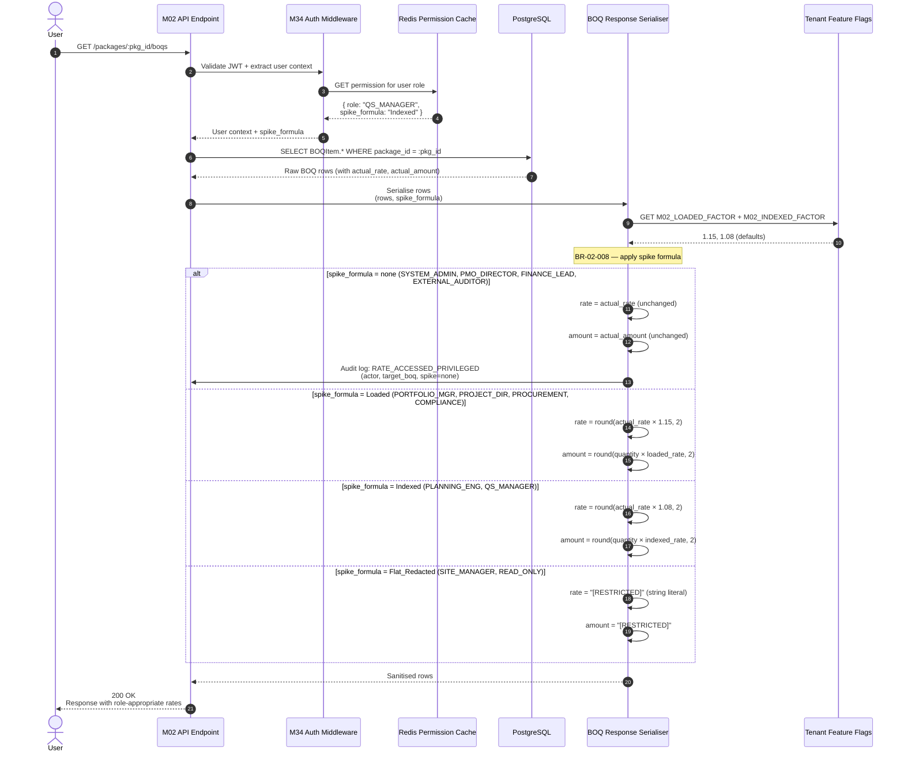
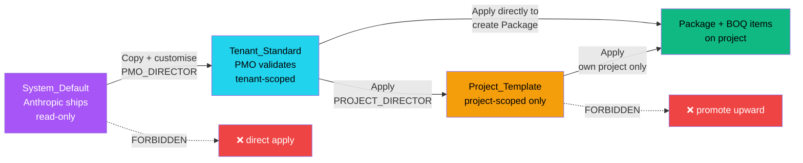
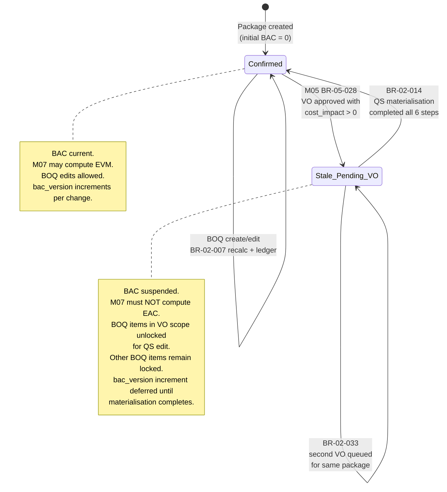
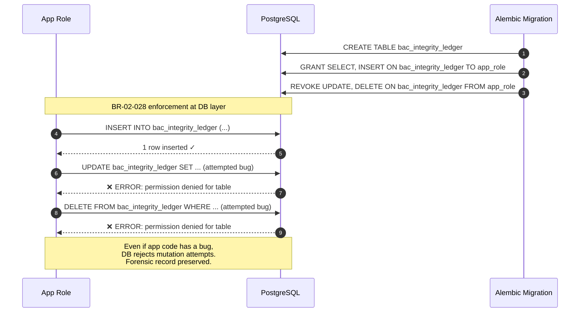

# M02 — Structure & WBS
## Workflows v1.0b
**Artefact:** M02_StructureWBS_Workflows_v1_0b
**Status:** LOCKED
**Author:** Monish (with Claude assist) _(grandfathered: PMO Director / System Architect)_
**Created:** 2026-05-03 | **Last Updated:** 2026-05-04 (v1.0b in-place patch — Round 29 audit medium-cleanup, M24 second-order Reference Standards refresh)
**Last Audited:** v1.0b on 2026-05-04
**Reference Standards:** M02_StructureWBS_Spec_v1_0.md (in-place patched to v1.0a R29) (+ v1_1 cascade note R29), X8_GlossaryENUMs_v0_3.md _(historical at lock; current X8 v0.6a)_
**Folder:** /03_L2_Planning/ _(aspirational; canonical placement is `SystemAdmin/Modules/` per Round 18 audit)_

---

## CHANGE LOG

| Patch | Date       | Author                      | Changes |
|-------|------------|-----------------------------|---------|
| v1.0b | 2026-05-04 | Monish (with Claude assist) | M24 in-place patch (Round 29 audit medium-cleanup, second-order): `Reference Standards` extended with M02 Spec v1.0a in-place patch reference + M02 v1_1 cascade-note (PR #6 created post v1.0a stamp); `Folder` field annotated with canonical-placement note. No content change. |
| v1.0a | 2026-05-04 | Monish (with Claude assist) | H11 in-place patch (Round 29 audit): Format B stamp normalised — added **Artefact**, **Last Updated**, **Last Audited**, **Reference Standards**; **Status** UPPERCASE; author canonicalised. No content change. |

---

## PURPOSE

Runtime workflows that the M02 spec describes statically. Mermaid diagrams render in GitHub, GitLab, VS Code, and most markdown viewers. Each diagram cross-references its governing Business Rules (BR-02-NNN).

**Seven workflows:**

| # | Workflow | Governing BRs |
|---|---|---|
| 1 | WBS Creation + Dotted-Code Generation + Drag-Reorder | BR-02-001, 002, 003, 031 |
| 2 | BOQ Creation with 5-ID Chain Validation | BR-02-004, 005, 006, 007 |
| 3 | Role-Tiered Rate Display at API Serialiser | BR-02-008 |
| 4 | VO Materialisation Receiving-End (3-Option Flow) | BR-02-009 to BR-02-014, 033, 036, 037 |
| 5 | CSV Import Wizard (Create_Only vs Create_And_Update) | BR-02-024, 025, 026, 027 |
| 6 | Three-Tier Template Apply Flow | BR-02-017 to BR-02-023, 035 |
| 7 | BAC Integrity Status Transition + Ledger Append | BR-02-028, 029 |

---

## CONVENTIONS

- **Solid arrows** = synchronous request/response
- **Dashed arrows** = asynchronous events
- **Diamonds** = decisions
- **Hexagons / cylinders** = persistence
- BR refs map to `M02_StructureWBS_Spec_v1_0.md` Block 6
- ENUMs reference X8 v0.3 (e.g., `X8 §3.27 BACIntegrityStatus`)

---

# WORKFLOW 1 — WBS CREATION + DOTTED-CODE GENERATION + DRAG-REORDER

**Trigger:** PMO_DIRECTOR / PROJECT_DIRECTOR / PLANNING_ENGINEER creates or reorders WBS node
**Outcome:** WBS node persists with auto-generated dotted-notation code; reorder cascades to siblings + descendants

```mermaid
flowchart TD
    Start([User action: + Create WBS<br/>OR drag-reorder]) --> AuthZ{Role permits<br/>WBS edit?<br/>PMO/PROJ_DIR/PLAN}
    AuthZ -->|No| Reject403[403 Forbidden]
    AuthZ -->|Yes| ActionType{Action<br/>type?}

    ActionType -->|Create| ValidateParent{Parent_id<br/>resolves to active<br/>WBSNode in same project?}
    ActionType -->|Reorder| LoadCurrent[Load current node<br/>+ all descendants]

    ValidateParent -->|No| Err1[422 Invalid parent_id]
    ValidateParent -->|Yes| DepthCheck{BR-02-001<br/>resulting depth<br/>≥ Project.min_wbs_depth?}

    DepthCheck -->|No| Err2[422 Depth violates<br/>project minimum]
    DepthCheck -->|Yes| GenCode[BR-02-002<br/>Auto-generate wbs_code<br/>= parent.wbs_code + . + max_sibling_position+1]

    GenCode --> AssignPos[Assign position_in_parent<br/>= max_sibling+1]
    AssignPos --> CalcLevel[Calculate wbs_level<br/>= parent.level + 1]
    CalcLevel --> InsertNode[(INSERT WBSNode<br/>+ tenant_id, project_id,<br/>wbs_code, name, parent_id,<br/>level, position)]

    InsertNode --> AuditCreate[(M02 audit:<br/>WBS_CREATED)]
    AuditCreate --> NotifyM03[/.../ Send to M03:<br/>wbs_id, activity_type,<br/>package_id]
    NotifyM03 --> NotifyM04[/.../ Send to M04:<br/>wbs_id list update]
    NotifyM04 --> Return201([201 Created])

    LoadCurrent --> ValidateMove{Target position<br/>valid? Same project,<br/>not into own descendant}
    ValidateMove -->|No| ErrMove[422 Invalid move<br/>cycle detected]
    ValidateMove -->|Yes| BeginTxn[(BEGIN TRANSACTION)]

    BeginTxn --> UpdateMoved[Update moved node:<br/>parent_id, position_in_parent]
    UpdateMoved --> ReassignCode[BR-02-003<br/>Recalculate wbs_code<br/>for moved node]
    ReassignCode --> CascadeChildren[Recursively recalculate<br/>wbs_code for all descendants]
    CascadeChildren --> AdjustSiblings[Renumber position_in_parent<br/>for old siblings + new siblings]
    AdjustSiblings --> AuditReorder[(M02 audit:<br/>WBS_REORDERED with<br/>code_changes JSONB)]
    AuditReorder --> CommitMove[(COMMIT)]
    CommitMove --> NotifyDownstream[/.../ Notify M03, M04, M06<br/>of code changes<br/>cascade]
    NotifyDownstream --> Return200([200 OK<br/>tree state updated])

    style Start fill:#22d3ee,color:#000
    style Return201 fill:#10b981,color:#000
    style Return200 fill:#10b981,color:#000
    style Reject403 fill:#ef4444,color:#fff
    style Err1 fill:#f59e0b,color:#000
    style Err2 fill:#f59e0b,color:#000
    style ErrMove fill:#f59e0b,color:#000
```

**Notes:**
- WBS codes are display-only — internal references use UUIDs
- Drag-reorder triggers code reassignment for moved node + all descendants in single transaction
- Cycle detection prevents moving node into its own descendant
- Soft-delete (BR-02-031) blocked if any active children exist
- Baseline-locked nodes (`is_baseline_locked=true`) cannot be edited; force VO/Extension workflow

---

# WORKFLOW 2 — BOQ CREATION WITH 5-ID CHAIN VALIDATION

**Trigger:** QS_MANAGER / PMO_DIRECTOR / PROJECT_DIRECTOR creates BOQ item
**Outcome:** BOQ persists with full 5-ID chain validated; BAC recalculated; integration broadcast

```mermaid
flowchart TD
    Start([POST /packages/:pkg_id/boqs<br/>{description, unit, qty, rate}]) --> AuthZ{Role permits<br/>BOQ create?}
    AuthZ -->|No| Reject403[403 Forbidden]
    AuthZ -->|Yes| LoadPkg[Load Package<br/>+ Project + Contract]

    LoadPkg --> StaleCheck{Package.bac_integrity_status<br/>= Stale_Pending_VO?}
    StaleCheck -->|Yes| RejectStale[409 BAC suspended<br/>cannot add BOQ during<br/>VO materialisation<br/>unless via VO flow]
    StaleCheck -->|No| ResolveUnit

    ResolveUnit[BR-02-015<br/>Resolve unit_master_id<br/>tier order: Custom → Domain_Specific → Standard_Core]
    ResolveUnit --> UnitFound{Unit found?}
    UnitFound -->|No| ErrUnit[422 Unit not in any tier]
    UnitFound -->|Yes| SnapshotPhase[Snapshot phase_at_creation<br/>= Project.current_phase<br/>per OQ-1.4 — IMMUTABLE]

    SnapshotPhase --> Validate5ID[BR-02-004<br/>5-ID chain validation]

    Validate5ID --> CheckBOQ{BOQ_ID<br/>generated?}
    CheckBOQ --> CheckWBS{Will have at least one<br/>BOQWBSMap with<br/>is_primary_wbs=true?}
    CheckWBS --> CheckPKG{PKG_ID exists +<br/>active?}
    CheckPKG --> CheckCNT{CONTRACT_ID<br/>exists + active?<br/>denormalised from package}
    CheckCNT --> CheckPHA{PHASE snapshot<br/>captured?}

    CheckPHA -->|Any failed| ChainFail[(IDGovernanceLog INSERT<br/>chain_validation_status=Failed<br/>chain_failure_reason)]
    ChainFail --> Err5ID[422 5-ID chain incomplete<br/>specific link listed]

    CheckPHA -->|All passed| BeginTxn[(BEGIN TRANSACTION)]
    BeginTxn --> InsertBOQ[(INSERT BOQItem<br/>+ phase_at_creation<br/>+ boq_origin=Manual<br/>+ bac_contribution_confirmed=true)]
    InsertBOQ --> CalcAmount[BR-02-006<br/>actual_amount = quantity × actual_rate]
    CalcAmount --> InsertMap[(INSERT BOQWBSMap<br/>is_primary_wbs=true)]
    InsertMap --> ChainPass[(IDGovernanceLog INSERT<br/>chain_validation_status=Passed)]
    ChainPass --> RecalcBAC[BR-02-007<br/>Package.bac_amount =<br/>SUM all BOQ.actual_amount<br/>WHERE bac_contribution_confirmed=true]
    RecalcBAC --> IncBACVer[Package.bac_version++]
    IncBACVer --> InsertLedger[(INSERT BACIntegrityLedger<br/>change_type=Initial_BAC if first<br/>else Correction)]
    InsertLedger --> Audit[(M02 audit:<br/>BOQ_CREATED<br/>+ ID_CHAIN_VALIDATION_PASSED)]
    Audit --> Commit[(COMMIT)]

    Commit --> Broadcast[Broadcast updates]
    Broadcast --> M06[/.../ M06: boq_id, wbs_id,<br/>package_id, actual_rate,<br/>actual_amount, bac_version]
    Broadcast --> M07[/.../ M07: package_id,<br/>bac_amount, bac_version]
    Broadcast --> M14[/.../ M14: BOQ master update]

    M06 --> Return201([201 Created])
    M07 --> Return201
    M14 --> Return201

    style Start fill:#22d3ee,color:#000
    style Return201 fill:#10b981,color:#000
    style Reject403 fill:#ef4444,color:#fff
    style RejectStale fill:#ef4444,color:#fff
    style Err5ID fill:#f59e0b,color:#000
    style ErrUnit fill:#f59e0b,color:#000
    style ChainPass fill:#10b981,color:#000
```

**Notes:**
- 5-ID chain validation is the cornerstone of M02 audit integrity (ES-DI-001)
- `phase_at_creation` snapshot is immutable per OQ-1.4 — provides forensic traceability
- BAC update is suspended (skipped) when `bac_integrity_status=Stale_Pending_VO`
- `BOQWBSMap` insert with `is_primary_wbs=true` is enforced by BR-02-005 — exactly one per BOQ

---

# WORKFLOW 3 — ROLE-TIERED RATE DISPLAY AT API SERIALISER

**Trigger:** Any client request that returns BOQItem data (list, detail, package)
**Outcome:** Response payload contains role-appropriate rate value (Actual / Loaded / Indexed / Flat_Redacted)



**Critical security notes:**
- **Defence-in-depth:** Spike formula is applied at the API serialiser layer, NOT at the database query layer. Even a SQL injection that returned BOQ rows would still pass through the serialiser before client.
- **Never trust UI:** Wireframes show rate variants for usability; the AUTHORITATIVE enforcement is at the API.
- **Privileged access logged:** When SYSTEM_ADMIN, PMO_DIRECTOR, FINANCE_LEAD, or EXTERNAL_AUDITOR views actual rates, audit log entry `RATE_ACCESSED_PRIVILEGED` is created (X8 §4.12).
- **Spike factors are tenant-configurable** via Feature Flags `M02_LOADED_FACTOR` (default 1.15) and `M02_INDEXED_FACTOR` (default 1.08). Stored in M34.

**Performance:**
- Permission cache hit < 5 ms
- Serialiser overhead per row < 0.1 ms
- 1000-row BOQ list: ~250 ms total response time

---

# WORKFLOW 4 — VO MATERIALISATION RECEIVING-END (Most Complex M02 Flow)

**Trigger:** M05 sends VO approval signal with cost_impact > 0
**Outcome:** Package suspended, QS executes Option A/B/C, BAC restored on completion

```mermaid
flowchart TD
    Start([M05 SIGNAL received<br/>BR-05-028 fires]) --> CheckSignal{Cost impact<br/>> 0?}
    CheckSignal -->|No| Ignore[Ignore signal<br/>only structural change<br/>no BAC impact]
    CheckSignal -->|Yes| LoadVO[Load VO + affected_package_ids<br/>+ materialisation_id]

    LoadVO --> ConcurrencyCheck{Any package already<br/>Stale_Pending_VO?}
    ConcurrencyCheck -->|Yes| Queue[BR-02-033<br/>Queue this materialisation<br/>Pending_Queue status<br/>respond to M05]
    ConcurrencyCheck -->|No| BeginSuspend[(BEGIN TRANSACTION)]

    BeginSuspend --> SuspendPkg[BR-02-009<br/>For each package:<br/>bac_integrity_status = Stale_Pending_VO<br/>pending_vo_id<br/>bac_stale_since = NOW]
    SuspendPkg --> SuspendBOQ[For each BOQ in VO scope:<br/>bac_contribution_confirmed = false<br/>pending_vo_materialisation_id]
    SuspendBOQ --> AuditSuspend[(M02 audit:<br/>BAC_INTEGRITY_STALE_DETECTED)]
    AuditSuspend --> CommitSuspend[(COMMIT)]
    CommitSuspend --> NotifyM07[/.../ Send M07:<br/>bac_integrity_status=Stale_Pending_VO<br/>SUSPEND EAC computation]
    NotifyM07 --> NotifyQS[/.../ Notify QS_MANAGER<br/>materialisation work needed]

    NotifyQS --> WaitQS[Wait for QS to start<br/>materialisation In_Progress signal]
    WaitQS --> M05InProgress[M05 sends:<br/>VOBOQMaterialisation<br/>status = In_Progress]
    M05InProgress --> Unlock[BR-02-010<br/>Unlock affected BOQItems<br/>for editing<br/>Defer BAC recalc]

    Unlock --> QSAction{QS submits<br/>which option?}

    QSAction -->|Option A<br/>Quantity Revision| OptA[BR-02-011<br/>Validate all updated items<br/>new_quantity > 0<br/>Auto-recalc actual_amount per item]
    QSAction -->|Option B<br/>New BOQ Items| OptB[BR-02-012<br/>For each new item:<br/>Full 5-ID chain check<br/>actual_rate > 0<br/>quantity > 0<br/>boq_origin=VO_Materialisation]
    QSAction -->|Option C<br/>Split A+B| OptC[BR-02-013<br/>Apply A logic AND B logic<br/>in single transaction]
    QSAction -->|Soft-delete BOQ<br/>during materialisation| OptDel[BR-02-037<br/>Allow delete<br/>Reduces BAC]

    OptA --> ValidateA{All quantities valid?}
    ValidateA -->|No| RollbackA[Roll back all changes<br/>Show error list]
    ValidateA -->|Yes| Materialise

    OptB --> ValidateB{All new items pass<br/>5-ID chain + rate > 0?}
    ValidateB -->|No| RollbackB[All-or-nothing rollback<br/>Show which items failed which chain link]
    ValidateB -->|Yes| Materialise

    OptC --> ValidateC{Both A and B<br/>validations pass?}
    ValidateC -->|No| RollbackC[All-or-nothing rollback<br/>BR-02-013]
    ValidateC -->|Yes| Materialise

    OptDel --> CheckDelta{BAC delta variance<br/>vs approved cost_impact<br/>> ₹10K?}
    CheckDelta -->|Yes| AlertPMO[BR-02-037<br/>Alert PMO_DIRECTOR<br/>signal M05 BR-05-032]
    CheckDelta -->|No| Materialise
    AlertPMO --> Materialise

    Materialise[BR-02-014<br/>Final commit:]
    Materialise --> RecalcBAC2[1. Recalc Package.bac_amount<br/>2. Increment bac_version]
    RecalcBAC2 --> SetConfirmed[3. bac_integrity_status = Confirmed<br/>4. Clear pending_vo_id<br/>5. Clear bac_stale_since]
    SetConfirmed --> ConfirmBOQs[6. Set bac_contribution_confirmed=true<br/>on affected BOQs]
    ConfirmBOQs --> InsertLedger2[(INSERT BACIntegrityLedger<br/>change_type=VO_Materialisation<br/>old_bac, new_bac, bac_delta<br/>trigger_id=materialisation_id<br/>audit_note=VO {code}: option {A/B/C})]
    InsertLedger2 --> AuditMat[(M02 audit:<br/>VO_MATERIALISATION_COMPLETED<br/>+ BAC_INTEGRITY_RESTORED)]
    AuditMat --> CommitMat[(COMMIT)]

    CommitMat --> ConfirmM05[/.../ Send M05:<br/>materialisation complete<br/>cost_impact_materialised<br/>new_bac_snapshot<br/>affected_boq_ids<br/>bac_version]
    ConfirmM05 --> ConfirmM07[/.../ Send M07:<br/>bac_integrity_status=Confirmed<br/>RESUME EAC computation<br/>new bac_amount, bac_version]
    ConfirmM07 --> ConfirmM06[/.../ Send M06:<br/>updated bac_version<br/>cost budget sync]

    ConfirmM06 --> CheckQueue{Any queued<br/>materialisations<br/>for affected packages?}
    CheckQueue -->|Yes| ProcessNext[Dequeue next<br/>start receive flow]
    CheckQueue -->|No| Done([200 OK<br/>BAC restored])

    style Start fill:#f59e0b,color:#000
    style Done fill:#10b981,color:#000
    style RollbackA fill:#ef4444,color:#fff
    style RollbackB fill:#ef4444,color:#fff
    style RollbackC fill:#ef4444,color:#fff
    style Queue fill:#a855f7,color:#fff
    style AlertPMO fill:#f59e0b,color:#000
```

**Critical notes:**
- This is the most complex single workflow in M02 — touches M05, M06, M07 + multiple BR enforcement
- Concurrent VO guard (BR-02-033) prevents two VOs from materialising same package simultaneously
- All-or-nothing transaction at materialisation submission (BR-02-013) — prevents partial states
- M07 EAC computation MUST be suspended during Stale_Pending_VO state (M07 BR-07-016)
- BAC delta variance > ₹10K vs approved cost triggers PMO alert (BR-02-037)

---

# WORKFLOW 5 — CSV IMPORT WIZARD

**Trigger:** User initiates CSV import for BOQ / WBS / Package
**Outcome:** Validated bulk data import with all-or-nothing commit; per-row audit trail

```mermaid
flowchart TD
    Start([POST /projects/:p_id/csv-import<br/>{target, mode}]) --> AuthZ{Role permits<br/>csv_import_<br/>create_only or<br/>create_and_update?}
    AuthZ -->|No| Reject403[403 Forbidden]
    AuthZ -->|Yes| ValidMode{Mode explicitly<br/>selected?<br/>NO DEFAULT}
    ValidMode -->|No| ErrMode[422 Mode required<br/>OQ-1.6 enforcement]
    ValidMode -->|Yes| CreateSession[(INSERT CSVImportSession<br/>target, mode<br/>commit_status=Not_Committed<br/>validation_status=Pending)]

    CreateSession --> Return202([202 Accepted<br/>session_id created])
    Return202 --> WaitUpload[Wait for file upload]

    WaitUpload --> Upload[POST /csv-import/:session_id/upload<br/>multipart file]
    Upload --> SizeCheck{BR-02-024<br/>File ≤ 20MB AND<br/>rows ≤ 50,000?}
    SizeCheck -->|No| ErrSize[422 File too large]
    SizeCheck -->|Yes| StoreFile[Store file in temp<br/>session storage]
    StoreFile --> Return200Upload([200 OK])

    Return200Upload --> Preview[GET /csv-import/:session_id/preview]
    Preview --> RunValidation[BR-02-025<br/>Run per-row validation]

    RunValidation --> Iterate{For each row}
    Iterate --> CheckCols{Required<br/>columns present?}
    CheckCols -->|No| MarkFail1[Mark row Failed<br/>reason: missing columns]
    CheckCols -->|Yes| CheckDup{Mode = Create_Only<br/>and code exists?}

    CheckDup -->|Yes (Create_Only)| MarkSkip[Mark row Skipped_Duplicate]
    CheckDup -->|No (or Create_And_Update)| ValidateData{Data validation<br/>per target type:<br/>BOQ: 5-ID chain<br/>WBS: parent exists<br/>Package: contract exists}

    ValidateData -->|Failed| MarkFail2[Mark row Failed<br/>reason: validation detail]
    ValidateData -->|Passed| MarkAction{Existing row?}

    MarkAction -->|No| MarkCreate[Mark row Created<br/>action=Created]
    MarkAction -->|Yes (Create_And_Update)| BuildSparseUpd[BR-02-027<br/>Build sparse update<br/>only CSV-present columns]
    BuildSparseUpd --> MarkUpdate[Mark row Updated<br/>changed_fields JSONB]

    MarkFail1 --> NextRow{More<br/>rows?}
    MarkFail2 --> NextRow
    MarkSkip --> NextRow
    MarkCreate --> NextRow
    MarkUpdate --> NextRow

    NextRow -->|Yes| Iterate
    NextRow -->|No| Aggregate[Aggregate validation_report<br/>JSONB: total, created, updated,<br/>failed, skipped]
    Aggregate --> SetStatus[Set validation_status<br/>= Valid if 0 failures<br/>else Invalid]
    SetStatus --> SaveReport[(UPDATE CSVImportSession<br/>validation_report)]
    SaveReport --> ShowPreview[Return preview to user<br/>+ downloadable error CSV]

    ShowPreview --> UserDecide{User<br/>commits?}
    UserDecide -->|Cancel| RollbackSession[Set commit_status<br/>= Rolled_Back]
    UserDecide -->|Commit| CheckValid{validation_status<br/>= Valid?}

    CheckValid -->|No| ErrInvalid[BR-02-026<br/>409 Cannot commit<br/>failures present]
    CheckValid -->|Yes| BeginCommit[(BEGIN TRANSACTION)]

    BeginCommit --> ApplyAll[Apply all rows<br/>per their action<br/>Created/Updated]
    ApplyAll --> CreateRecords[(INSERT CSVImportRecord<br/>per row<br/>action, target_record_id,<br/>changed_fields)]
    CreateRecords --> RecalcBACs[For each affected Package:<br/>recalculate bac_amount<br/>increment bac_version]
    RecalcBACs --> InsertLedgerEntries[(INSERT BACIntegrityLedger entries<br/>change_type=CSV_Import)]
    InsertLedgerEntries --> AuditCommit[(M02 audit:<br/>CSV_IMPORT_COMMITTED)]
    AuditCommit --> SetCommitted[Set commit_status=Committed<br/>committed_at=NOW]
    SetCommitted --> CommitTxn[(COMMIT)]

    CommitTxn --> Broadcast[/.../ Broadcast updates<br/>to M03, M06, M07<br/>per affected packages]
    Broadcast --> ReturnSuccess([200 OK<br/>Import complete])

    style Start fill:#22d3ee,color:#000
    style ReturnSuccess fill:#10b981,color:#000
    style RollbackSession fill:#a855f7,color:#fff
    style ErrSize fill:#f59e0b,color:#000
    style ErrInvalid fill:#ef4444,color:#fff
    style ErrMode fill:#f59e0b,color:#000
    style Reject403 fill:#ef4444,color:#fff
```

**Notes:**
- Mode selection has no default per OQ-1.6 — user must explicitly choose
- `Create_And_Update` performs sparse update (only CSV-present columns affect existing rows)
- All-or-nothing commit per BR-02-026 — if any row fails validation, full import blocked
- Per-row audit via `CSVImportRecord` records exact action + changed_fields
- Failed validation rows logged with specific reasons (e.g., "Unit 'M3' not found in tier-resolved UnitMaster")

---

# WORKFLOW 6 — THREE-TIER TEMPLATE APPLY FLOW

**Trigger:** PROJECT_DIRECTOR or PMO_DIRECTOR applies template to create Package + BOQ skeleton
**Outcome:** Package + BOQ items instantiated from selected template version

```mermaid
flowchart TD
    Start([POST /projects/:p_id/packages/from-template<br/>{template_version_id}]) --> AuthZ{Role permits?<br/>PMO/PROJECT_DIR}
    AuthZ -->|No| Reject403[403 Forbidden]
    AuthZ -->|Yes| LoadVer[Load PackageTemplateVersion<br/>+ parent template]

    LoadVer --> CheckTier{Template tier?}
    CheckTier -->|System_Default| BlockApply1[409 Cannot apply System_Default directly<br/>Must copy to Tenant_Standard first]
    CheckTier -->|Tenant_Standard| ValidateTenant{BR-02-018<br/>pmo_validated=true<br/>on this version?}
    CheckTier -->|Project_Template| ValidateProj{Same project<br/>as caller?}

    ValidateTenant -->|No| BlockApply2[409 Tenant_Standard not validated<br/>PMO_DIRECTOR must validate first]
    ValidateTenant -->|Yes| LoadBOQs

    ValidateProj -->|No| BlockApply3[403 Cannot apply<br/>another project's template]
    ValidateProj -->|Yes| LoadBOQs

    LoadBOQs[Load all PackageTemplateBOQ<br/>for this version]
    LoadBOQs --> BeginTxn[(BEGIN TRANSACTION)]
    BeginTxn --> CreatePkg[(INSERT Package<br/>applied_template_id<br/>applied_template_version_id<br/>bac_integrity_status=Confirmed<br/>bac_version=1)]

    CreatePkg --> IterateBOQ{For each<br/>PackageTemplateBOQ}
    IterateBOQ --> CheckOptional{is_optional?}
    CheckOptional -->|Yes + user skipped| Skip[Skip this item]
    CheckOptional -->|No| InsertBOQ[(INSERT BOQItem<br/>BR-02-023<br/>quantity = default_quantity OR 0<br/>actual_rate = default_actual_rate OR 0<br/>boq_origin=Template_Applied<br/>source_template_version_id<br/>phase_at_creation=Project.current_phase)]

    InsertBOQ --> Validate5ID2[BR-02-004<br/>5-ID chain validation]
    Validate5ID2 --> Pass{Chain<br/>passed?}
    Pass -->|No| RollbackTxn[Rollback transaction<br/>Force user to fix template<br/>or skip optional items]
    Pass -->|Yes| InsertChainLog[(INSERT IDGovernanceLog)]

    InsertChainLog --> NextItem{More<br/>items?}
    Skip --> NextItem
    NextItem -->|Yes| IterateBOQ
    NextItem -->|No| RecalcBACFinal[Calculate final<br/>Package.bac_amount<br/>= SUM all inserted BOQ.actual_amount]

    RecalcBACFinal --> InsertLedger3[(INSERT BACIntegrityLedger<br/>change_type=Template_Applied<br/>old_bac=0, new_bac=calculated<br/>trigger_id=template_version_id<br/>audit_note=Applied template {code} v{N})]
    InsertLedger3 --> AuditTpl[(M02 audit:<br/>TEMPLATE_APPLIED_TO_PACKAGE)]
    AuditTpl --> CommitTpl[(COMMIT)]

    CommitTpl --> Broadcast2[/.../ Broadcast]
    Broadcast2 --> M03Sig[/.../ M03: package created]
    Broadcast2 --> M07Sig[/.../ M07: bac_amount, bac_version]
    Broadcast2 --> M14Sig[/.../ M14: BOQ master update]

    M03Sig --> Done([201 Created<br/>Package + N BOQ items])
    M07Sig --> Done
    M14Sig --> Done

    style Start fill:#22d3ee,color:#000
    style Done fill:#10b981,color:#000
    style Reject403 fill:#ef4444,color:#fff
    style BlockApply1 fill:#a855f7,color:#fff
    style BlockApply2 fill:#a855f7,color:#fff
    style BlockApply3 fill:#ef4444,color:#fff
    style RollbackTxn fill:#ef4444,color:#fff
```

**Three-tier copy-down enforcement (BR-02-035):**



**Notes:**
- System_Default templates can never be applied directly — must be copied to Tenant_Standard first
- Tenant_Standard requires PMO validation (`pmo_validated=true`) before any project applies it
- Locked Tenant_Standard versions force "Create new version" workflow — original cannot be modified (BR-02-022)
- Template apply is single transaction — all BOQ items succeed or none

---

# WORKFLOW 7 — BAC INTEGRITY STATUS TRANSITION + LEDGER APPEND

**Trigger:** Any operation that modifies Package.bac_amount
**Outcome:** Status transitions tracked; immutable ledger entry created; M07 notified



```mermaid
flowchart TD
    Trigger([Any BAC mutation<br/>BOQ create/edit/delete<br/>Template apply<br/>VO materialise<br/>CSV import<br/>HDI seed<br/>Correction]) --> CheckIntegrity{Package.bac_integrity_status<br/>= Confirmed?}

    CheckIntegrity -->|No (Stale_Pending_VO)| BACSuspend[Per BR-02-009:<br/>BAC recalculation<br/>SUSPENDED.<br/>Operation persists changes,<br/>but bac_amount + bac_version<br/>not updated.]
    BACSuspend --> WaitMat[Wait for materialisation<br/>completion BR-02-014]

    CheckIntegrity -->|Yes (Confirmed)| Operation[Apply operation<br/>(create/edit/delete)]
    Operation --> SnapOld[Snapshot old_bac<br/>= Package.bac_amount before]
    SnapOld --> RecalcNew[Recalc new_bac<br/>= SUM all<br/>BOQ.actual_amount<br/>WHERE bac_contribution_confirmed=true]
    RecalcNew --> CalcDelta[bac_delta = new_bac - old_bac]
    CalcDelta --> IncVer[Package.bac_version++]
    IncVer --> SetLastConfirmed[last_bac_confirmed_at = NOW]
    SetLastConfirmed --> InsertLedger4[(BR-02-028<br/>INSERT BACIntegrityLedger<br/>tenant_id, project_id, package_id,<br/>change_type, trigger_entity, trigger_id,<br/>old_bac, new_bac, bac_delta,<br/>bac_version_after, changed_by, audit_note)]

    InsertLedger4 --> Audit2[(M02 audit:<br/>BAC_LEDGER_ENTRY)]
    Audit2 --> NotifyM07b[/.../ Send M07:<br/>package_id, new bac_amount,<br/>bac_integrity_status=Confirmed,<br/>bac_version]
    NotifyM07b --> NotifyM06b[/.../ Send M06:<br/>bac_version sync<br/>BR-02-029 - via internal API only]
    NotifyM06b --> Done2([Ledger entry committed<br/>BAC up-to-date])

    WaitMat --> WaitDone[On BR-02-014 fire]
    WaitDone --> ResumeFromSuspended[See Workflow 4<br/>BAC restored to Confirmed]
    ResumeFromSuspended --> Done2

    style Trigger fill:#22d3ee,color:#000
    style Done2 fill:#10b981,color:#000
    style BACSuspend fill:#f59e0b,color:#000
    style InsertLedger4 fill:#a855f7,color:#fff
```

**Critical immutability enforcement:**



**Notes:**
- Per OQ-1.10, M02 owns the ledger; M07 reads via internal API `GET /internal/v1/m02/bac-ledger` (BR-02-029)
- DB-level UPDATE/DELETE revocation provides defence-in-depth — even an app bug cannot mutate the ledger
- Every BAC change creates exactly one ledger entry (atomicity in transaction with the BOQ change)
- Ledger entries retained PERMANENTLY (forensic record per Block 8a)

---

# CROSS-WORKFLOW INVARIANTS

| Invariant | Mechanism |
|---|---|
| Every BAC mutation appends a ledger entry | BR-02-028 enforced at app + DB layer |
| Ledger entries are immutable | DB-level REVOKE UPDATE, DELETE on bac_integrity_ledger |
| 5-ID chain validated on every BOQ create | BR-02-004 + IDGovernanceLog INSERT |
| BAC integrity status drives M07 EAC suspension | BR-02-009 → M07 BR-07-016 contract |
| Spike formula applied at API serialiser, not DB | BR-02-008 + Workflow 3 contract |
| Three-tier template direction enforced | BR-02-035 with FK + CHECK constraints |
| Concurrent VO materialisations queued | BR-02-033 — second VO waits for first |
| CSV imports are all-or-nothing | BR-02-026 — full validation before commit |
| Soft-delete blocked when children exist | BR-02-030 (Package), BR-02-031 (WBS) |
| Baseline-locked nodes cannot be edited | BR-02-034 — force VO/Extension workflow |
| Phase snapshot immutable post-creation | BOQItem.phase_at_creation per OQ-1.4 |

---

# STANDARD HTTP ERROR CODES

| Code | Used In | M02 Trigger Examples |
|---|---|---|
| 200 | Successful read or update | All GET, PATCH, drag-reorder |
| 201 | Successful create | WBS, Package, BOQ, BOQWBSMap |
| 202 | Accepted, pending review | CSV import session created (awaiting upload + commit) |
| 400 | Malformed request | Missing required body field |
| 401 | Unauthenticated | M34 auth failure |
| 403 | Authenticated but insufficient role | Most permission failures |
| 404 | Resource not found | Project, Package, BOQ, Template not in tenant |
| 409 | State conflict | BR-02-018 unvalidated tenant_standard apply, BR-02-022 locked version edit, BR-02-024 oversized CSV, BR-02-026 commit on invalid validation |
| 422 | Validation failure | BR-02-001 depth violation, BR-02-004 5-ID chain incomplete, BR-02-007 scenario order, missing required field, all-or-nothing rollback |

---

# PERFORMANCE TARGETS

| Operation | Target latency | Notes |
|---|---|---|
| WBS tree load (1000 nodes) | < 350 ms | with materialised path index |
| WBS drag-reorder (subtree of 100) | < 500 ms | code reassignment cascade |
| Package list (50 packages) | < 200 ms | with bac_integrity_status filter index |
| BOQ list per package (1000 items) | < 250 ms | including spike formula serialisation |
| BOQ create with 5-ID validation | < 300 ms | single transaction |
| Template apply (50-item template) | < 800 ms | bulk insert + ledger |
| CSV import preview (1000 rows) | < 2 seconds | per OQ-2.7 budget |
| CSV import commit (10000 rows) | < 8 seconds | bulk insert + ledger entries |
| VO materialisation completion (10 BOQ updates) | < 600 ms | full restore + broadcast |
| BAC ledger query (per package, 100 entries) | < 50 ms | indexed on package_id + changed_at |

---

# IMPLEMENTATION CHECKLIST

When developers implement these workflows, verify:

```
[ ] Every BR-02-NNN reference resolves to spec Block 6
[ ] All ENUMs imported from X8 v0.3 (no inline redefinition)
[ ] All roles imported from M34 canonical taxonomy
[ ] BACIntegrityLedger DB migration revokes UPDATE/DELETE for app_role
[ ] 5-ID chain validation runs on every BOQ create + materialisation Option B/C
[ ] Spike formula applied at API serialiser layer (not DB layer)
[ ] Privileged rate access logged via RATE_ACCESSED_PRIVILEGED audit
[ ] CSV imports require explicit mode selection (no default)
[ ] CSV import validation runs preview before commit
[ ] Three-tier template apply blocks System_Default direct apply
[ ] Tenant_Standard apply requires pmo_validated=true on version
[ ] Locked PackageTemplateVersion forces "create new version" path
[ ] Concurrent VO guard queues second materialisation
[ ] BAC delta variance > ₹10K alerts PMO_DIRECTOR (signal M05)
[ ] WBS reorder cascades wbs_code reassignment to all descendants
[ ] Soft-delete cascade check uses index-aware queries
[ ] BACIntegrityLedger writes are part of same transaction as BAC change
[ ] M07 reads ledger via internal API, never direct DB
[ ] Single-Owner rule respected (M02 owns; M07 consumes)
[ ] Cascade timing instrumented for SLO monitoring
[ ] Permission cache invalidated on role/spike formula changes
```

---

# M02 MODULE STATUS — COMPLETE ✅

| Artefact | Status |
|---|---|
| `M02_StructureWBS_Brief_v1_0.md` | ✅ Locked (Round 9) |
| `M02_StructureWBS_Spec_v1_0.md` | ✅ Locked (Round 10) |
| `X8_GlossaryENUMs_v0_3.md` | ✅ Living (Round 10) |
| `M02_StructureWBS_Wireframes_v1_0.html` | ✅ Locked (Round 11) |
| `M02_StructureWBS_Workflows_v1_0.md` | ✅ Locked (Round 12) |

**M02 module is fully specified. Foundation pair (M34 + M01) + first execution module (M02) all complete. Subsequent execution modules can now reference M02 entities cleanly.**

---

*v1.0 — Workflows locked. All 7 critical M02 paths diagrammed with BR traceability. M02 module complete.*
