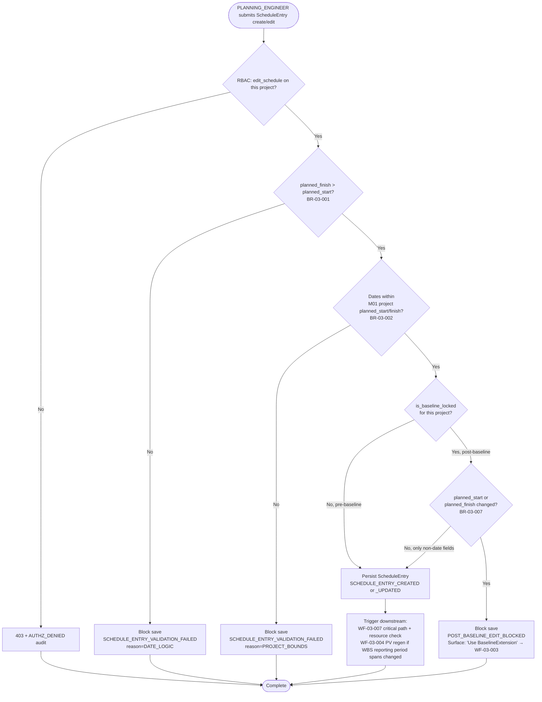
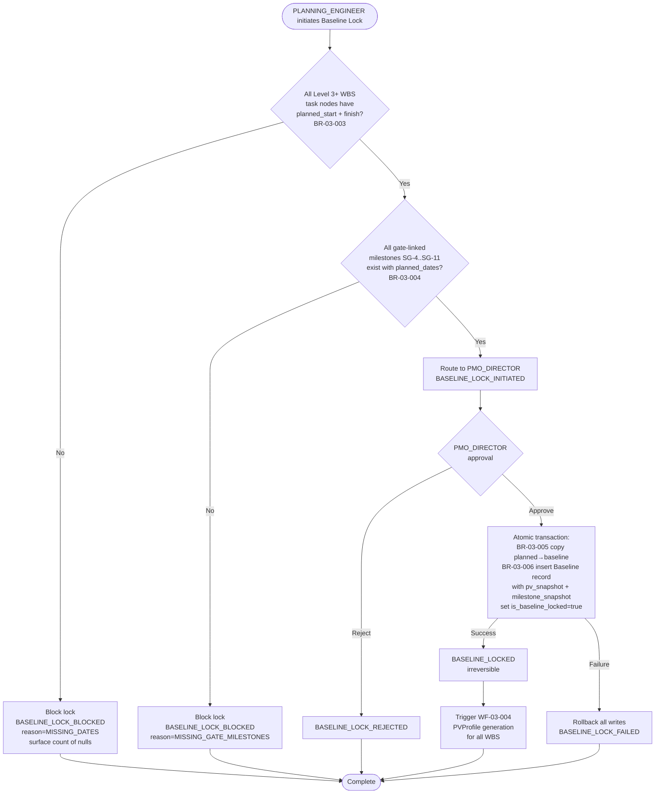
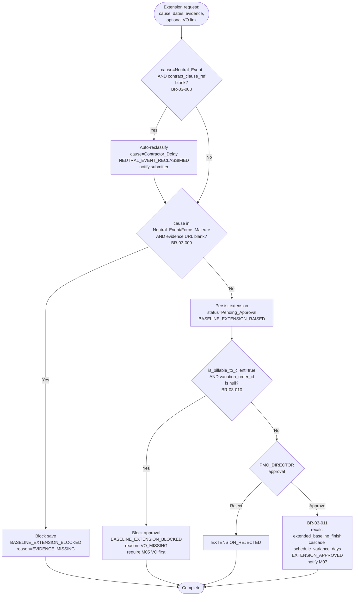
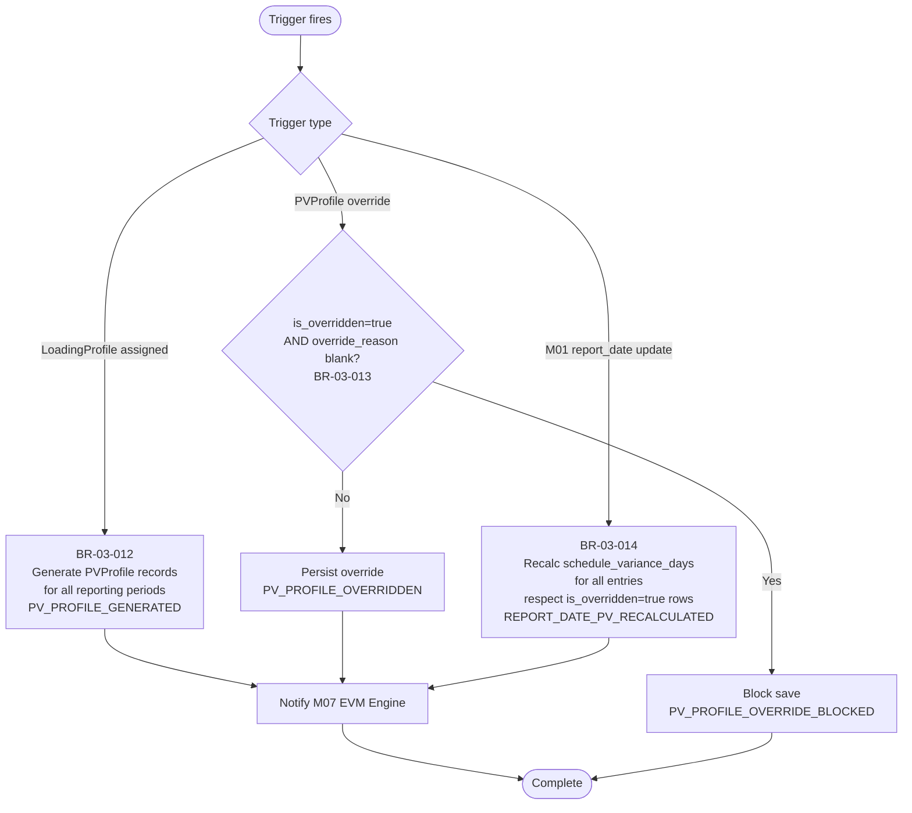
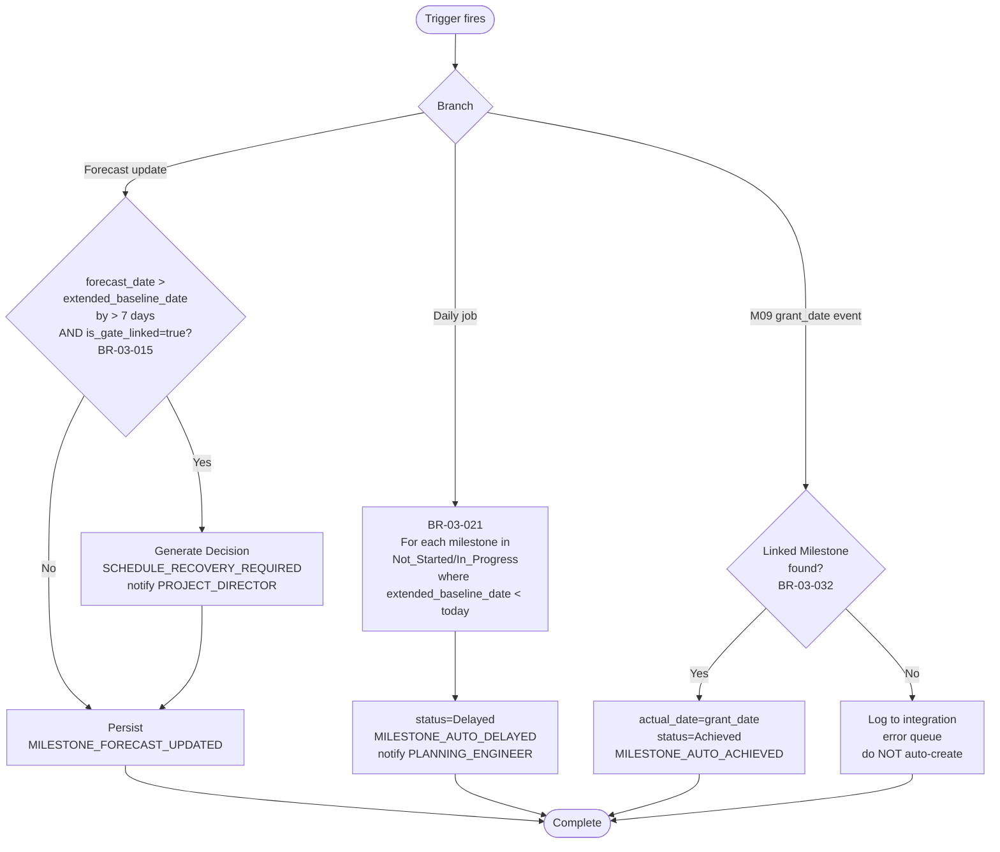
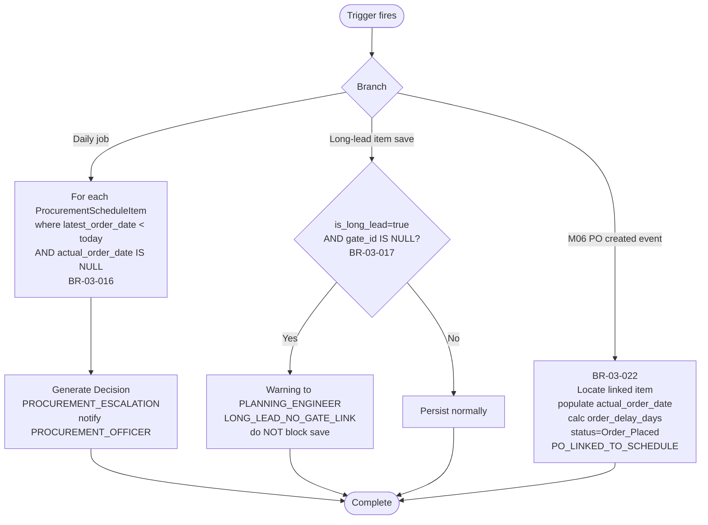
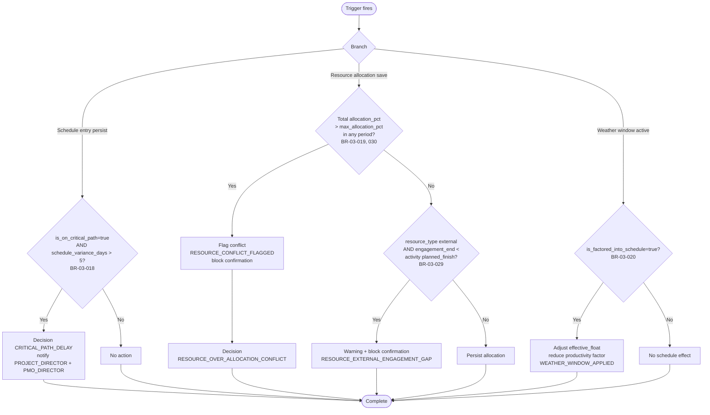
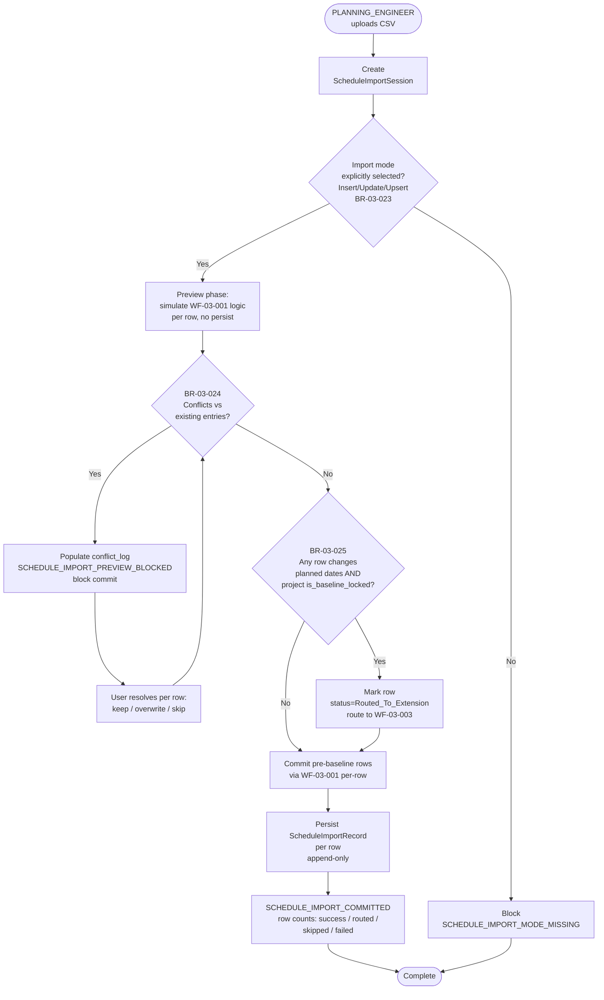
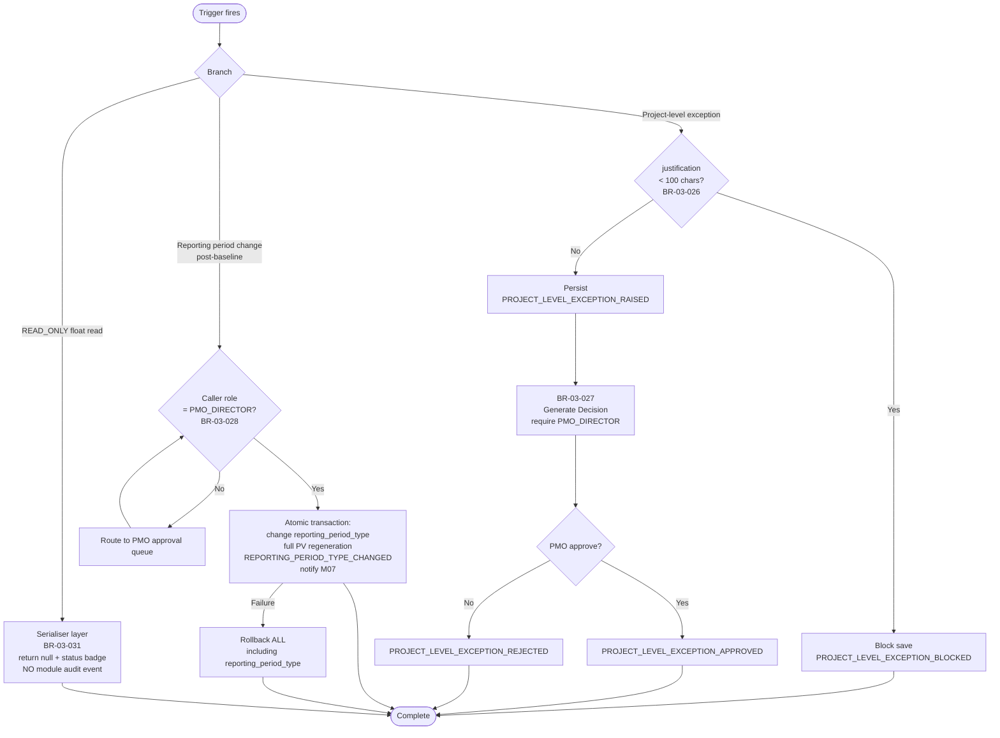

# M03 PlanningMilestones — Workflows v1.0

> **Locked from:** Spec v1.1 (Round 16 base + Round 18 cascade). Wireframes v1.0 (Round 17) referenced for UI touchpoints.
> **Purpose:** Critical runtime flows with BR traceability. Every flow ends with a clear decision or state transition.

---

## Workflow Index

| ID | Name | Trigger | Primary Role | BRs Referenced |
|---|---|---|---|---|
| WF-03-001 | Schedule entry create/edit (pre-baseline) | UI submit or CSV row commit | PLANNING_ENGINEER | 001, 002, 007 |
| WF-03-002 | Baseline lock | PLANNING_ENGINEER initiates → PMO_DIRECTOR approves | PMO_DIRECTOR | 003, 004, 005, 006 |
| WF-03-003 | BaselineExtension (cause-based) | Post-baseline date change need | PROJECT_DIRECTOR (raise) → PMO_DIRECTOR (approve) | 007, 008, 009, 010, 011, 025 |
| WF-03-004 | LoadingProfile → PVProfile generation | LoadingProfile assigned to WBS or report_date update | PLANNING_ENGINEER | 012, 013, 014 |
| WF-03-005 | Milestone forecast / status sweep | Daily scheduled job + forecast update events | System (scheduled) | 015, 021, 032 |
| WF-03-006 | Procurement schedule daily check | Daily scheduled job + M06 PO created event | PROCUREMENT_OFFICER | 016, 017, 022 |
| WF-03-007 | Critical path + resource conflict detection | Schedule entry persist (downstream of WF-001) + resource allocation save | PLANNING_ENGINEER → PROJECT_DIRECTOR / PMO_DIRECTOR | 018, 019, 020, 029, 030 |
| WF-03-008 | Schedule CSV import | PLANNING_ENGINEER initiates import session | PLANNING_ENGINEER | 023, 024, 025 |
| WF-03-009 | Project-level exception + reporting period change | Exception flag set or reporting_period_type change post-baseline | PMO_DIRECTOR | 026, 027, 028, 031 |

**Note on audit event names:** All audit event names referenced across these nine workflows are **LOCKED** in **M03 Spec v1.1 Appendix C — Audit Events Catalogue** (Round 18 cascade). The Spec is the source of truth; references below are canonical. When X3 Audit Event Catalogue is built, names migrate to X3 unchanged.

---

## WF-03-001 — Schedule entry create/edit (pre-baseline)

**Decision answered:** Can this schedule entry be saved given the current baseline state, project bounds, and date logic?
**Trigger:** PLANNING_ENGINEER submits a `ScheduleEntry` create or edit via the WBS Gantt builder UI, OR a row is committed during a Schedule CSV import (entering this flow from WF-03-008 step 5).
**Primary role:** PLANNING_ENGINEER
**BR coverage:** BR-03-001, BR-03-002, BR-03-007
**Touches:** M01 (project planned dates), M02 (WBS node ownership)

### Step-by-step

1. **RBAC check.** Confirm caller has `edit_schedule` permission on the project (per M34 RBAC matrix). Fail → `AUTHZ_DENIED`.
2. **Date logic (BR-03-001).** Reject if `planned_finish ≤ planned_start`. Real-time block.
3. **Project bounds (BR-03-002).** Read M01 `project.planned_start_date` / `planned_finish_date` via M01 internal API (single-owner rule F-005, no direct DB read). Reject if entry dates fall outside.
4. **Baseline state check (BR-03-007).** Read `Baseline.is_baseline_locked` for the project. If locked AND the create/edit changes `planned_start` or `planned_finish`, block save and surface a UI message routing the user to WF-03-003 BaselineExtension. Non-date field edits (e.g., resource assignment, notes) still permitted post-baseline.
5. **Persist (BR-03-033).** Insert/update `ScheduleEntry` within a single DB transaction that **also includes critical-path recomputation** (BR-03-033 locked invariant — anti-stale-read for downstream BR-03-018 firing in WF-03-007). Recompute failure rolls back the persist. Emit `SCHEDULE_ENTRY_CREATED` or `SCHEDULE_ENTRY_UPDATED`.
6. **Downstream cascade.** Persist step triggers (a) WF-03-007 evaluation if entry is on critical path or has named-resource allocations; (b) WF-03-004 PVProfile regen for affected WBS if the entry's date span shifts the LoadingProfile distribution.
7. **No notification on success.** Standard audit only. Failures route to UI inline; no Decision Queue entry (this is a real-time block, not a deferred decision).

### Audit events emitted

| Event | When | Severity | Status |
|---|---|---|---|
| `SCHEDULE_ENTRY_CREATED` | Successful insert | Info | locked |
| `SCHEDULE_ENTRY_UPDATED` | Successful update | Info | locked |
| `SCHEDULE_ENTRY_VALIDATION_FAILED` | BR-001 or BR-002 reject (with reason code) | Low | locked |
| `POST_BASELINE_EDIT_BLOCKED` | BR-007 reject after baseline lock | Medium | locked |
| `AUTHZ_DENIED` | RBAC fail | Medium | locked (M34) |

### Failure modes

| Failure | Detection | Response |
|---|---|---|
| M01 project dates change mid-flight, putting existing schedule entries out of bounds | Subsequent edit triggers BR-002 fail | Edits blocked until M01 dates are corrected OR entry dates re-aligned. No retroactive purge — existing entries are read-only until reconciled. |
| Concurrent baseline lock fires between BR-007 read and persist | DB-level constraint on `ScheduleEntry` post-baseline date change must reject the write | Return 409 Conflict; UI shows "Baseline locked by `{user}` at `{ts}`; use BaselineExtension." |
| CSV import row triggers this flow for a non-existent WBS node | M02 internal API returns 404 on WBS lookup | Reject row in `ScheduleImportRecord.conflict_log` (BR-03-024); commit blocked until resolved. |
| Float read attempted by READ_ONLY in the response payload | API serialiser per BR-03-031 | Float fields returned `null`; status badge populated. Out of scope for this WF — handled at serialiser layer. |

---

## WF-03-002 — Baseline lock

**Decision answered:** Is the schedule complete and gate-aligned enough to seal an irreversible baseline snapshot?
**Trigger:** PLANNING_ENGINEER initiates baseline lock on the project (UI button) → PMO_DIRECTOR approves the irreversible snapshot.
**Primary role:** PMO_DIRECTOR (executes lock); PLANNING_ENGINEER (initiates pre-checks)
**BR coverage:** BR-03-003, BR-03-004, BR-03-005, BR-03-006
**Touches:** M02 (WBS hierarchy depth + Level 3+ enumeration), M08 (gate definitions SG-4..SG-11)

### Step-by-step

1. **Pre-check 1 — Level 3+ completeness (BR-03-003).** Enumerate all WBS task nodes at Level 3 or below via M02 internal API. Reject if any has null `planned_start` or `planned_finish`. Surface the count + first 10 offending nodes to the user.
2. **Pre-check 2 — Gate milestone coverage (BR-03-004).** For each of SG-4 through SG-11, confirm a milestone exists with non-null `planned_date`. Reject if any are missing.
3. **Initiate.** On both pre-checks pass, mark project `baseline_lock_state=Pending_Approval`; route to PMO_DIRECTOR via Decision Queue.
4. **PMO approval.** PMO_DIRECTOR reviews the lock summary (project totals, gate dates, BAC slice) and approves or rejects. Reject path emits `BASELINE_LOCK_REJECTED` and returns the project to editable state.
5. **Atomic execute (BR-03-005, 006).** Single DB transaction: (a) copy `planned_start/planned_finish → baseline_start/baseline_finish` on all `ScheduleEntry` rows; (b) insert one `Baseline` record with full `pv_snapshot` (JSONB) + `milestone_snapshot` (JSONB); (c) set project `is_baseline_locked=true`. Any failure rolls back all three.
6. **Cascade.** On commit, trigger WF-03-004 to generate PVProfile records for all WBS nodes against the locked LoadingProfile assignments.
7. **Notify.** Project Director, PMO, Finance Lead notified on lock. Baseline timestamp + locker user_id captured for governance trail.

### Audit events emitted

| Event | When | Severity | Status |
|---|---|---|---|
| `BASELINE_LOCK_INITIATED` | PLANNING_ENGINEER passes pre-checks, routes to PMO | Info | locked |
| `BASELINE_LOCK_BLOCKED` | BR-003 or BR-004 fail (with `reason` enum) | Medium | locked |
| `BASELINE_LOCK_REJECTED` | PMO declines | High | locked |
| `BASELINE_LOCKED` | Atomic transaction commits | High | locked |
| `BASELINE_LOCK_FAILED` | Atomic transaction rolls back | Critical | locked |

### Failure modes

| Failure | Detection | Response |
|---|---|---|
| WBS hierarchy edited (new Level 3+ node added) between pre-check and PMO approval | Re-validate at execute step (BR-003 inside the atomic transaction) | If new nulls found, abort transaction; emit `BASELINE_LOCK_FAILED` reason=`STALE_PRECHECK`; user must re-initiate. |
| PMO_DIRECTOR session expires mid-approval | Approval signed with idempotency token; expired token rejected | User re-authenticates and re-approves; no double-lock risk. |
| Disk / DB failure during snapshot insert | Transaction rollback (single DB transaction wrapping all three writes) | No partial baseline. Project remains editable. PMO notified to retry. |
| Gate definitions in M08 change post-lock (SG-4..SG-11 redefined) | Out of scope for baseline lock — baseline records the snapshot at time of lock | Historical baselines remain immutable; new gates handled via BaselineExtension (WF-03-003). |

---

## WF-03-003 — BaselineExtension (cause-based)

**Decision answered:** Who pays for this post-baseline date change (client / contractor / no-fault), and is governance approval present?
**Trigger:** Post-baseline date change need raised by PROJECT_DIRECTOR via UI; OR auto-routed from WF-03-001 step 4 (post-baseline edit attempt) or WF-03-008 step 6 (post-baseline import row).
**Primary role:** PROJECT_DIRECTOR (raise) → PMO_DIRECTOR (approve)
**BR coverage:** BR-03-007, BR-03-008, BR-03-009, BR-03-010, BR-03-011, BR-03-025
**Touches:** M05 (VO link for billable extensions), M07 (PV cascade on persisted extension)

### Step-by-step

1. **Receive request.** PROJECT_DIRECTOR submits cause_category, supporting_evidence_url, contract_clause_ref (optional), is_billable_to_client flag, optional variation_order_id, and the new dates being requested.
2. **Neutral event reclassification (BR-03-008).** If cause=`Neutral_Event` and `contract_clause_ref` is blank, auto-reclassify to `Contractor_Delay`. Emit `NEUTRAL_EVENT_RECLASSIFIED` (locked event name from spec). Notify submitter — this is a silent reassignment of cost responsibility.
3. **Evidence requirement (BR-03-009).** If cause is in (`Neutral_Event`, `Force_Majeure`) and `supporting_evidence_url` is blank, block save. These cause categories shift cost away from the contractor — evidence is non-negotiable.
4. **Persist as Pending.** Insert BaselineExtension row with status=`Pending_Approval`. Surface in PMO Decision Queue.
5. **Approval gate (BR-03-010).** Before PMO can approve: if `is_billable_to_client=true` AND `variation_order_id IS NULL`, block. The VO must exist in M05 before billing flows. Surfaces in UI as "Create VO in M05 first."
6. **PMO approval.** PMO_DIRECTOR approves or rejects. On reject: emit `EXTENSION_REJECTED`; PROJECT_DIRECTOR may revise and resubmit.
7. **Cascade on approve (BR-03-011).** Recalc `extended_baseline_finish` for affected WBS + milestones; cascade `schedule_variance_days` updates; emit `EXTENSION_APPROVED`; notify M07 (EVM Engine) for PV recalc.

### Audit events emitted

| Event | When | Severity | Status |
|---|---|---|---|
| `BASELINE_EXTENSION_RAISED` | Pending row inserted | Info | locked |
| `NEUTRAL_EVENT_RECLASSIFIED` | BR-008 auto-reclassify fires | Medium | **locked** (spec BR-008) |
| `BASELINE_EXTENSION_BLOCKED` | BR-009 evidence missing OR BR-010 VO missing | Medium | locked |
| `EXTENSION_APPROVED` | PMO approves; cascade complete | High | locked |
| `EXTENSION_REJECTED` | PMO declines | Medium | locked |

### Failure modes

| Failure | Detection | Response |
|---|---|---|
| VO created in M05 *after* extension already auto-rejected for missing VO | New extension request required (no auto-retry) | Preserves authorization trail — PMO sees the explicit re-submission, not a silent state flip. |
| M07 cascade fails post-approval | Cascade is async; emit `EXTENSION_APPROVED` only when M07 ack received, OR mark extension `cascade_status=Pending` and retry | Until cascade completes, EVM dashboards show RAG=Amber for affected WBS with reason `PV_STALE_PENDING_CASCADE`. |
| Submitter classifies cause as `Force_Majeure` with weak evidence | BR-009 only checks `blank`, not validity | Caught at PMO approval review (qualitative). External Auditor may flag in Round-end audit. Not enforced at save. |
| Extension dates earlier than original baseline (compression, not extension) | Spec doesn't prohibit but workflow name implies extension-only | Allow; emit `EXTENSION_APPROVED` (compression treated as a cause-based date change). Flag as `compression=true` on the row for downstream reporting. |

---

## WF-03-004 — LoadingProfile → PVProfile generation

**Decision answered:** What is the time-phased Planned Value distribution for this WBS across the project's reporting periods, and does it stay consistent when inputs change?
**Trigger:** (a) LoadingProfile assigned to a WBS node (manual or template-cascade); (b) M01 publishes a `report_date` update event; (c) PLANNING_ENGINEER overrides a PVProfile cell.
**Primary role:** PLANNING_ENGINEER (assign / override); System (M01 cascade)
**BR coverage:** BR-03-012, BR-03-013, BR-03-014
**Touches:** M01 (report_date events), M02 (WBS structure + reporting period inheritance), M07 (notify on PV change)

### Step-by-step

1. **Branch A — LoadingProfile assigned (BR-03-012).** When a LoadingProfile is assigned to a WBS node (directly or via three-tier template copy-down per BR-02-035), generate PVProfile rows for every reporting period from project start to project finish using the LoadingProfile's distribution function (Front_Loaded / Linear / Back_Loaded / S_Curve / Custom).
2. **Branch B — Manual PVProfile override (BR-03-013).** A user (PLANNING_ENGINEER) overrides a specific PVProfile cell (period). If `is_overridden=true` and `override_reason` is blank, block save. Else persist with `override_reason` captured.
3. **Branch C — M01 report_date update (BR-03-014).** When M01 changes the active `report_date`, recalc `schedule_variance_days` for all ScheduleEntry rows project-wide and trigger PV recalc cascade. **Override preservation:** rows with `is_overridden=true` retain their manual values during recalc.
4. **Notify M07.** All three branches end with an event payload to M07 EVM Engine so EAC/ETC/CPI/SPI can be recomputed.
5. **Reporting periods come from M03 (post v1.0 cascade).** `reporting_period_type` ownership shifted to M03 per the M01 v1.2 cascade noted in the M03 Spec change log — generation uses M03's setting, not M01's.

### Audit events emitted

| Event | When | Severity | Status |
|---|---|---|---|
| `PV_PROFILE_GENERATED` | LoadingProfile assignment generates rows | Info | locked |
| `PV_PROFILE_OVERRIDDEN` | Manual override persisted with reason | Medium | locked |
| `PV_PROFILE_OVERRIDE_BLOCKED` | BR-013 blank reason | Low | locked |
| `REPORT_DATE_PV_RECALCULATED` | M01 report_date update triggers recalc | Info | locked |

### Failure modes

| Failure | Detection | Response |
|---|---|---|
| Reporting periods misaligned with project start/end (truncation at edges) | Sum check: ΣPVProfile ≠ WBS BAC slice | Surface warning on Planning dashboard; do not block. PLANNING_ENGINEER reconciles via override or LoadingProfile change. |
| Concurrent override + M01 recalc race | Recalc cascade preserves `is_overridden=true` rows; override write tagged with version | Last-write-wins on the same period cell; both events audited so reconciliation trail is intact. |
| M01 report_date update covers a past period that has actuals | Past PV is immutable (already consumed by M07 EVM history) | Recalc only forward-dated periods. Emit `REPORT_DATE_PV_RECALCULATED` with `historical_periods_excluded=true`. |
| LoadingProfile distribution sums ≠ 100% (config error) | Validation at LoadingProfile save (out of scope here) | This WF assumes a valid profile. If invalid profile is assigned, generation produces a skewed distribution; flagged as data-quality issue, not workflow failure. |

---

## WF-03-005 — Milestone forecast / status sweep

**Decision answered:** Is this milestone at risk of slippage, auto-delayed today, or auto-achieved by an external system event?
**Trigger:** (a) PROJECT_DIRECTOR or PLANNING_ENGINEER updates milestone `forecast_date`; (b) Daily scheduled job (system); (c) M09 publishes a compliance permit `grant_date` event.
**Primary role:** System (scheduled job + M09 integration); PROJECT_DIRECTOR (forecast updates)
**BR coverage:** BR-03-015, BR-03-021, BR-03-032
**Touches:** M09 (compliance grant events), M07 (PV impact when status changes)

### Step-by-step

1. **Branch A — Forecast update (BR-03-015).** When `forecast_date` is updated on a milestone where `is_gate_linked=true` AND new forecast exceeds `extended_baseline_date` by more than 7 days, generate a Decision Queue entry `SCHEDULE_RECOVERY_REQUIRED`; notify PROJECT_DIRECTOR. Persist forecast either way.
2. **Branch B — Daily sweep (BR-03-021).** Scheduled job (24hr speed tier). For all milestones with status in (`Not_Started`, `In_Progress`) where `extended_baseline_date < today`, set status=`Delayed`. Idempotent — re-running the job does not re-emit if status is already `Delayed`.
3. **Branch C — M09 grant_date event (BR-03-032).** When M09 publishes a compliance permit grant, look up the linked Milestone via the compliance_permit_id ↔ milestone link table. If found: populate `actual_date=grant_date`, set status=`Achieved`. If not found: do NOT auto-create a milestone (single-owner rule F-005); log the orphaned event to the integration error queue for manual reconciliation.
4. **Notify M07.** Status changes (`Achieved`, `Delayed`) trigger PV impact notifications.

### Audit events emitted

| Event | When | Severity | Status |
|---|---|---|---|
| `MILESTONE_FORECAST_UPDATED` | Forecast persists | Info | locked |
| `SCHEDULE_RECOVERY_REQUIRED` | BR-015 fires | High | locked (Decision Queue trigger) |
| `MILESTONE_AUTO_DELAYED` | Daily sweep flips status | Medium | locked |
| `MILESTONE_AUTO_ACHIEVED` | M09 cascade flips status | Info | locked |
| `M09_GRANT_ORPHANED` | No linked milestone found | Medium | locked (integration) |

### Failure modes

| Failure | Detection | Response |
|---|---|---|
| M09 sends `grant_date` for a permit not linked to any milestone | Lookup returns null | Log to integration error queue; do NOT auto-create milestone. PLANNING_ENGINEER reviews orphan queue weekly. |
| Daily job fails partway through milestone enumeration | Job state stored per-milestone | Resume from last-processed milestone on retry; `MILESTONE_AUTO_DELAYED` is idempotent (no-op if already Delayed). |
| Forecast date set in the past (historical correction) | Spec doesn't prohibit | Persist; emit `MILESTONE_FORECAST_UPDATED`; do not trigger BR-015 recovery decision (recovery only applies to forward-dated overruns). |
| M09 grant_date precedes the milestone's `planned_date` (early completion) | Persist is correct | Set status=`Achieved`; `actual_date` may be < `planned_date` — this is favourable variance, surface in EVM. |

---

## WF-03-006 — Procurement schedule daily check

**Decision answered:** Is procurement tracking against the schedule, and is escalation needed for late or unlinked orders?
**Trigger:** (a) Daily scheduled job (procurement sweep); (b) M06 PO created event; (c) PLANNING_ENGINEER saves a long-lead `ProcurementScheduleItem`.
**Primary role:** PROCUREMENT_OFFICER (recipient of escalations); System (scheduled)
**BR coverage:** BR-03-016, BR-03-017, BR-03-022
**Touches:** M06 (vendor identity, PO events — single-owner per spec)

### Step-by-step

1. **Branch A — Daily sweep (BR-03-016, 2-4hr speed).** For every `ProcurementScheduleItem` where `latest_order_date < today` AND `actual_order_date IS NULL`, generate a Decision Queue entry `PROCUREMENT_ESCALATION`; notify PROCUREMENT_OFFICER. Idempotent across days — only re-emits if escalation status hasn't been acknowledged.
2. **Branch B — Long-lead save (BR-03-017, 2-4hr speed).** When a `ProcurementScheduleItem` is saved with `is_long_lead=true` but no `gate_id`, emit a warning. Do NOT block save — the spec treats this as advisory, not blocking. PLANNING_ENGINEER attaches gate later.
3. **Branch C — M06 PO created (BR-03-022, real-time).** When M06 publishes a PO created event with a procurement_item_id reference, populate the linked item's `actual_order_date`, calculate `order_delay_days = actual_order_date - latest_order_date` (negative if early), set status=`Order_Placed`. Emit `PO_LINKED_TO_SCHEDULE`.
4. **Vendor identity stays in M06.** This WF reads the M06 PO event payload but does not store vendor data — single-owner rule F-005.

### Audit events emitted

| Event | When | Severity | Status |
|---|---|---|---|
| `PROCUREMENT_ESCALATION` | Daily sweep finds late item | High | locked (Decision Queue trigger) |
| `LONG_LEAD_NO_GATE_LINK` | BR-017 warning fires | Low | locked |
| `PO_LINKED_TO_SCHEDULE` | M06 cascade populates actual_order_date | Info | locked |

### Failure modes

| Failure | Detection | Response |
|---|---|---|
| M06 PO event references a procurement item that was soft-deleted | Lookup returns deleted row (is_active=false) | Log integration mismatch; do NOT auto-resurrect. PROCUREMENT_OFFICER reconciles manually. |
| Daily job runs before M06 nightly sync completes | Race produces false-positive escalations | Schedule the procurement sweep AFTER M06's sync window in the daily cron (operational config, not workflow logic). |
| Long-lead item saved with gate_id that doesn't exist in M08 | M08 FK validation should catch this on save (out of scope here) | Defensive: re-validate at next daily sweep; emit `PROCUREMENT_GATE_LINK_INVALID` if found stale. |
| order_delay_days computed as 0 when both dates equal (on-time) | Correct outcome — not a failure | Status=`Order_Placed` with delay=0; no escalation. |

---

## WF-03-007 — Critical path + resource conflict detection

**Decision answered:** Is this activity on the critical path with a delay risk, or is this resource over-allocated / engaged for too short a window?
**Trigger:** (a) `ScheduleEntry` persist (downstream of WF-03-001 step 6); (b) `ResourceAllocation` save; (c) `WeatherWindow` becomes active for an overlapping date range.
**Primary role:** PLANNING_ENGINEER (resource decisions); PROJECT_DIRECTOR + PMO_DIRECTOR (critical-path escalations)
**BR coverage:** BR-03-018, BR-03-019, BR-03-020, BR-03-029, BR-03-030
**Touches:** M07 (CPI/SPI inputs), M34 (role lookup for external resource types)

### Step-by-step

1. **Branch A — Critical-path variance (BR-03-018, BR-03-033).** Triggered after every WF-03-001 persist. If the persisted `ScheduleEntry` is on the critical path (`is_on_critical_path=true`) and `schedule_variance_days > 5`, generate Decision Queue entry `CRITICAL_PATH_DELAY`. Critical-path recomputation runs **inside the same DB transaction** as the persist (BR-03-033 — locked invariant) — no stale-read risk.
2. **Branch B — Resource over-allocation (BR-03-019, 030).** On `ResourceAllocation` save, check per-period sum of `allocation_pct` for the named resource against `max_allocation_pct`. If exceeded, flag conflict + block confirmation (BR-019), AND generate Decision `RESOURCE_OVER_ALLOCATION_CONFLICT` (BR-030). Both BRs share the trigger condition; treat as one detection emitting two artefacts (audit + decision).
3. **Branch B continued — External resource gap (BR-03-029).** If `resource_type IN (Contractor_Resource, Consultant_Resource, Vendor_Resource)` AND `engagement_end < activity.planned_finish`, warn + block confirmation. The contract end leaves the activity uncovered.
4. **Branch C — Weather window (BR-03-020, 24hr speed).** When a `WeatherWindow` becomes active and `is_factored_into_schedule=true`, adjust `effective_float` for affected WBS in the overlap and reduce the productivity factor in the PV distribution for that period. Emit `WEATHER_WINDOW_APPLIED`.

### Audit events emitted

| Event | When | Severity | Status |
|---|---|---|---|
| `CRITICAL_PATH_DELAY` | BR-018 fires on critical path entry | High | locked (Decision Queue trigger) |
| `RESOURCE_CONFLICT_FLAGGED` | BR-019 over-allocation detected | Medium | locked |
| `RESOURCE_OVER_ALLOCATION_CONFLICT` | BR-030 — same trigger as 019, generates Decision | High | locked (Decision Queue trigger) |
| `RESOURCE_EXTERNAL_ENGAGEMENT_GAP` | BR-029 external engagement_end gap | Medium | locked |
| `WEATHER_WINDOW_APPLIED` | BR-020 factored window adjusts float/productivity | Info | locked |
| `WEATHER_WINDOW_REVERSED` | Window de-factored or removed | Info | locked |

### Failure modes

| Failure | Detection | Response |
|---|---|---|
| Critical path recomputed on stale data (recompute happens after persist commit) | Architectural — recompute MUST be inside the persist transaction | If recompute is async, BR-018 may fire on yesterday's path. Mitigate: synchronous critical-path computation in WF-03-001 step 5 transaction. |
| Named resource is renamed (resource_id stays, name changes) | Resource identity is the UUID, not the name | Renaming is permitted; allocation history follows the UUID. Treat name as label, not identity. |
| Weather window `is_factored_into_schedule` toggled false after float was already adjusted | Adjustment was persisted and audited | Reverse the float/productivity adjustment; emit `WEATHER_WINDOW_REVERSED`. Do not silently leave float skewed. |
| Resource engagement_end extended (contract renewed) after BR-029 already blocked | New allocation save retries the check | Re-run BR-029; on pass, allocation persists; previous block is purely advisory and not retained as state. |

---

## WF-03-008 — Schedule CSV import

**Decision answered:** Can this batch of imported schedule rows be committed without overwriting locked baseline data, and which rows must reroute through BaselineExtension?
**Trigger:** PLANNING_ENGINEER initiates a Schedule CSV import session via the import UI.
**Primary role:** PLANNING_ENGINEER
**BR coverage:** BR-03-023, BR-03-024, BR-03-025
**Touches:** M02 (WBS code resolution per row); reuses WF-03-001 (per-row validation); routes to WF-03-003 for post-baseline date conflicts
**Append-only ledger:** `ScheduleImportRecord` (per `naming-folders.md` exemptions list — no soft delete, no `updated_*`)

### Step-by-step

1. **Upload + session.** PLANNING_ENGINEER uploads CSV; system creates a `ScheduleImportSession` row.
2. **Mode validation (BR-03-023).** Import mode (Insert / Update / Upsert) must be explicitly selected. Block if unselected — no implicit default.
3. **Preview (BR-03-024).** For each row, simulate WF-03-001's validations (date logic, project bounds, WBS resolution) without persisting. Detect conflicts: row's WBS already has a ScheduleEntry with different planned dates.
4. **Conflict resolution loop.** Populate `conflict_log` with per-row entries. Block commit until user marks each conflict as keep / overwrite / skip. Commits cannot proceed with unresolved conflicts.
5. **Baseline split (BR-03-025).** For rows that would change `planned_start` or `planned_finish` on a project where `is_baseline_locked=true`, mark `status=Routed_To_Extension` and feed the row data to WF-03-003 BaselineExtension as a pending request. Do NOT direct-overwrite — direct overwrite of locked baseline data is forbidden (BR-007 architectural rule).
6. **Commit pre-baseline rows.** All non-routed rows enter WF-03-001 per-row for actual persist. Each row's outcome is recorded in `ScheduleImportRecord`.
7. **Append-only ledger.** Every row outcome persists in `ScheduleImportRecord` (success / routed / skipped / failed). Per the spec naming-folders exemption list, this ledger has no soft delete and no `updated_*` fields — pure audit trail.
8. **Final emit.** `SCHEDULE_IMPORT_COMMITTED` with the four row counts.

### Audit events emitted

| Event | When | Severity | Status |
|---|---|---|---|
| `SCHEDULE_IMPORT_INITIATED` | Session created | Info | locked |
| `SCHEDULE_IMPORT_MODE_MISSING` | BR-023 reject | Low | locked |
| `SCHEDULE_IMPORT_PREVIEW_BLOCKED` | BR-024 conflicts present | Medium | locked |
| `SCHEDULE_IMPORT_COMMITTED` | Final commit | Info | locked |
| (per-row outcomes recorded in `ScheduleImportRecord` ledger, not as audit events) | — | — | — |

### Failure modes

| Failure | Detection | Response |
|---|---|---|
| CSV references WBS codes that don't resolve in M02 | M02 lookup returns 404 per row | Mark row `status=Failed` in `ScheduleImportRecord` with `reason=WBS_NOT_FOUND`. Other rows commit normally — partial commit allowed because the ledger is immutable. |
| User abandons import session mid-flight | Session TTL (configurable, e.g., 24h) | Session expires; preview state discarded. Any rows already committed (none, since commit is atomic per session) preserved in ledger. |
| Concurrent baseline lock fires during user's resolution loop | Baseline state checked at commit time, not preview time | Rows that would have committed pre-baseline now reroute via BR-025; user notified at commit ("baseline was locked during your session — N rows rerouted"). |
| Same CSV uploaded twice by different users | Session is per-user, not per-file; both create ScheduleImportSessions | Both proceed; second commit's conflict detection (BR-024) catches the first's writes; user resolves. Ledger preserves both attempts. |

---

## WF-03-009 — Project-level exception + reporting period change

**Decision answered:** Does this irregular project state change require PMO_DIRECTOR governance, and does it cascade to PV regeneration or float redaction?
**Trigger:** (a) Extension request flagged with `is_project_level_exception=true`; (b) Anyone attempts `reporting_period_type` change on a baseline-locked project; (c) READ_ONLY API attempts to read float values.
**Primary role:** PMO_DIRECTOR (governance authority for branches A and B)
**BR coverage:** BR-03-026, BR-03-027, BR-03-028, BR-03-031
**Touches:** API serialiser layer (BR-031); M07 (PV regen cascade for BR-028)

### Step-by-step

1. **Branch A — Project-level exception (BR-03-026, 027).** When extension request flag `is_project_level_exception=true`:
   - BR-026: if `project_level_justification < 100 chars`, block save.
   - On save, generate Decision Queue entry; **PMO_DIRECTOR** approval required (BR-027). Approval/rejection emits the corresponding event.
2. **Branch B — Reporting period change post-baseline (BR-03-028, BR-03-034).**
   - If caller role is not PMO_DIRECTOR, route to PMO approval queue (do not silent-block — surface the governance requirement).
   - On PMO approval, run atomic transaction (BR-03-034): change `reporting_period_type` AND trigger full PV regeneration across all WBS in one commit. Emit `REPORTING_PERIOD_TYPE_CHANGED`. Notify M07.
   - If PV regeneration fails, **rollback the reporting_period_type change too** (BR-03-034 atomic rule) — never leave the project in a mixed-period state. Emit `REPORTING_PERIOD_CHANGE_FAILED`.
3. **Branch C — READ_ONLY float read (BR-03-031, OQ-1.10).** This is a serialiser-layer rule, not a workflow with a UI/API entry point. Documented here for BR closure: API serialiser returns `null` for `total_float` / `free_float` fields when caller role is `READ_ONLY` or external-portal; populates `status_badge` (Green / Amber / Red) instead. **No module-level audit event** — the redaction is silent at the serialiser; logged only at API gateway access logs.

### Audit events emitted

| Event | When | Severity | Status |
|---|---|---|---|
| `PROJECT_LEVEL_EXCEPTION_RAISED` | BR-027 — flagged extension persists | High | locked |
| `PROJECT_LEVEL_EXCEPTION_BLOCKED` | BR-026 justification too short | Medium | locked |
| `PROJECT_LEVEL_EXCEPTION_APPROVED` | PMO approves | High | locked |
| `PROJECT_LEVEL_EXCEPTION_REJECTED` | PMO declines | Medium | locked |
| `REPORTING_PERIOD_TYPE_CHANGED` | BR-028 atomic change commits | High | **locked** (spec BR-028) |
| `REPORTING_PERIOD_CHANGE_FAILED` | PV regen fails, rolled back | Critical | locked |
| (no event for BR-031 — serialiser-layer redaction; tracked at API gateway logs) | — | — | — |

### Failure modes

| Failure | Detection | Response |
|---|---|---|
| PMO approves reporting_period_type change but PV regen fails partway | Atomic transaction wraps both | Rollback both. Emit `REPORTING_PERIOD_CHANGE_FAILED`. Project remains on prior reporting_period_type. PMO notified to retry. |
| Justification text passes 100-char check via whitespace / repeated chars | BR-026 only checks length | Caught at PMO qualitative review (Decision Queue entry surfaces full text). External Auditor flags in round-end audit. |
| BR-031 serialiser bug leaks float to READ_ONLY | Runtime check is impractical (serialiser is hot path) | Mitigate via integration tests on serialiser per role × per endpoint × per field. Out of workflow scope; lives in serialiser test suite. |
| Concurrent reporting_period_type change attempts | DB-level row lock on Project record during atomic transaction | Second attempt blocks until first commits/rolls back; second sees current state and re-evaluates. |

---

---

## BR Coverage Matrix

> **Pre-populated from M03 Spec v1.0.** Fill the right column as workflows are defined. Lock criterion: every BR appears in ≥1 workflow OR is marked NON-RUNTIME (data validation only).

| BR | Description (short) | Speed | Workflow(s) covering it |
|---|---|---|---|
| BR-03-001 | Schedule entry create — finish > start | 🔴 RT | WF-03-001 |
| BR-03-002 | Schedule entry create — within project planned dates | 🔴 RT | WF-03-001 |
| BR-03-003 | Baseline lock — all Level 3+ WBS tasks have planned dates | 🔴 RT | WF-03-002 |
| BR-03-004 | Baseline lock — gate-linked milestones SG-4..SG-11 exist | 🔴 RT | WF-03-002 |
| BR-03-005 | Baseline lock execute — copy planned → baseline; snapshot | 🔴 RT | WF-03-002 |
| BR-03-006 | Baseline lock execute — Baseline record with PV+milestone snapshot | 🔴 RT | WF-03-002 |
| BR-03-007 | Post-baseline edit attempt — block; force BaselineExtension | 🔴 RT | WF-03-001, WF-03-003 |
| BR-03-008 | Neutral_Event + blank contract clause → reclassify Contractor_Delay | 🔴 RT | WF-03-003 |
| BR-03-009 | Neutral_Event/Force_Majeure — supporting evidence URL required | 🔴 RT | WF-03-003 |
| BR-03-010 | Billable extension — VO must exist in M05 first | 🔴 RT | WF-03-003 |
| BR-03-011 | Extension approval — recalc extended_baseline_finish; notify M07 | 🔴 RT | WF-03-003 |
| BR-03-012 | LoadingProfile assigned → generate PVProfile records | 🔴 RT | WF-03-004 |
| BR-03-013 | PVProfile override — reason required | 🔴 RT | WF-03-004 |
| BR-03-014 | report_date update from M01 → recalc schedule_variance_days + PV | 🔴 RT | WF-03-004 |
| BR-03-015 | Milestone forecast > extended_baseline + 7d + gate-linked → Decision | 🔴 RT | WF-03-005 |
| BR-03-016 | Daily procurement check — late order → Decision | 🟡 2-4hr | WF-03-006 |
| BR-03-017 | Long-lead item save — gate_id null → warning | 🟡 2-4hr | WF-03-006 |
| BR-03-018 | Critical path activity — variance > 5d → Decision | 🔴 RT | WF-03-007 |
| BR-03-019 | Resource conflict — over-allocation → flag + block confirmation | 🟡 2-4hr | WF-03-007 |
| BR-03-020 | Weather window — adjust effective float + productivity | 🟢 24hr | WF-03-007 |
| BR-03-021 | Daily milestone check — past baseline + not done → Delayed | 🟢 24hr | WF-03-005 |
| BR-03-022 | M06 PO created → populate actual_order_date + status | 🔴 RT | WF-03-006 |
| BR-03-023 | Schedule import — mode must be explicit | 🔴 RT | WF-03-008 |
| BR-03-024 | Schedule import preview — conflict detection blocks commit | 🔴 RT | WF-03-008 |
| BR-03-025 | Schedule import post-baseline → BaselineExtension workflow | 🔴 RT | WF-03-008, WF-03-003 |
| BR-03-026 | Project-level extension — justification ≥ 100 chars | 🔴 RT | WF-03-009 |
| BR-03-027 | Project-level extension approval — PMO_DIRECTOR + Decision | 🔴 RT | WF-03-009 |
| BR-03-028 | reporting_period_type change post-baseline — PMO_DIRECTOR + PV regen | 🔴 RT | WF-03-009 |
| BR-03-029 | External resource — engagement_end < planned_finish → warning + block | 🔴 RT | WF-03-007 |
| BR-03-030 | Resource over-allocation > max → Decision | 🔴 RT | WF-03-007 |
| BR-03-031 | Float read by READ_ONLY → null/redacted; status badge only | 🔴 RT | WF-03-009 (serialiser-layer; documented for closure) |
| BR-03-032 | M09 compliance grant_date → auto-populate Milestone.actual_date | 🔴 RT | WF-03-005 |
| BR-03-033 | Critical-path recompute in same DB transaction as ScheduleEntry persist (anti-stale-read for BR-018) | 🔴 RT | WF-03-001, WF-03-007 |
| BR-03-034 | reporting_period_type + PV regen atomic; rollback on PV regen failure (strengthens BR-028) | 🔴 RT | WF-03-009 |

**Lock criterion:** Every BR from the Spec must appear in at least one workflow OR be explicitly marked NON-RUNTIME (data validation only, etc.) in this matrix.

---

*v1.0 — Workflows LOCKED on 2026-05-03 (Round 18). M03 module COMPLETE (Brief v1.1, Spec v1.1, Wireframes v1.0, Workflows v1.0). CLAUDE.md and EPCC_VersionLog updated this round.*
