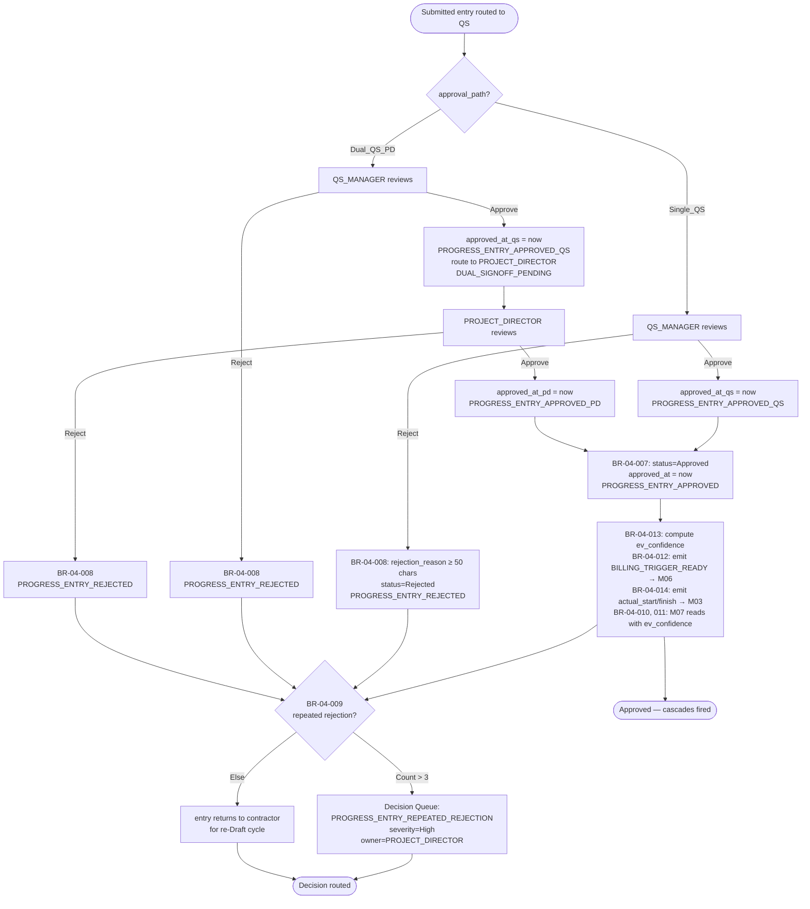
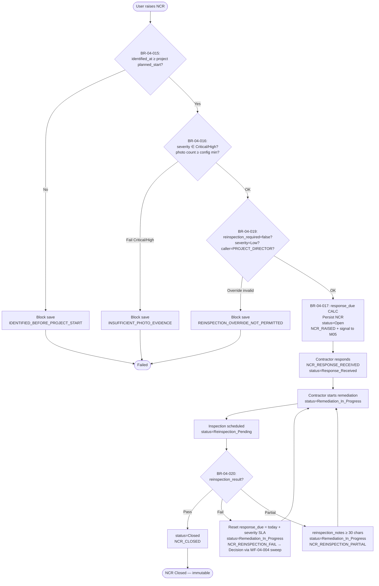
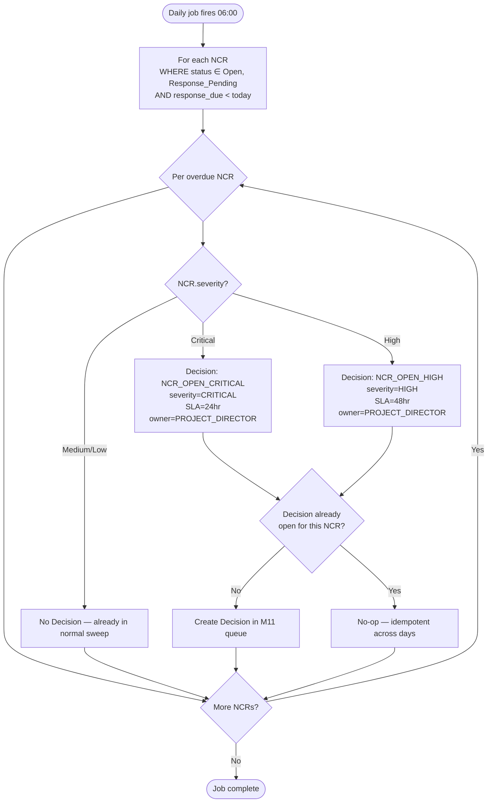
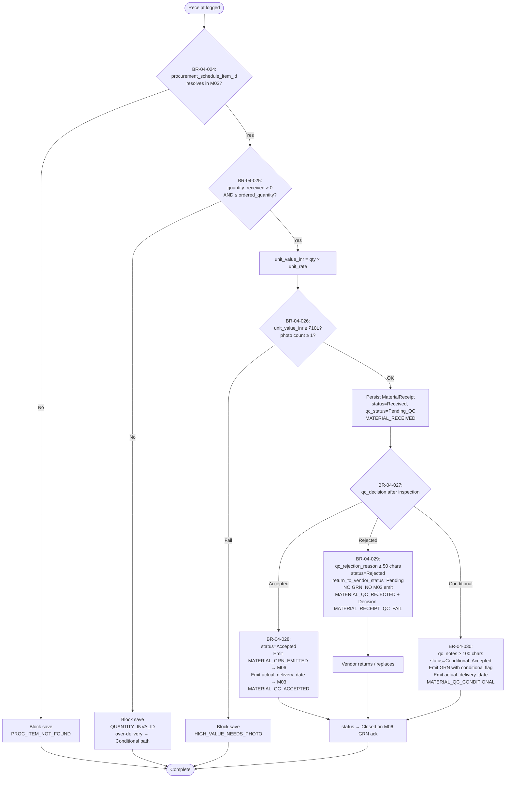
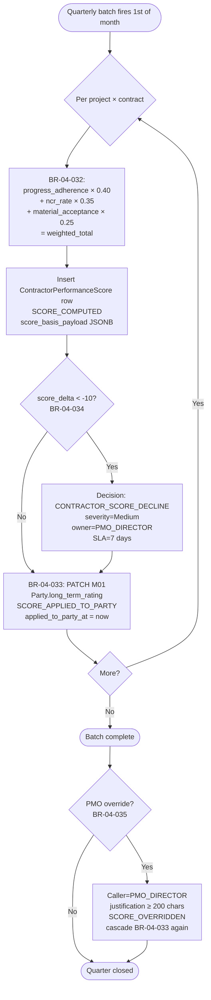
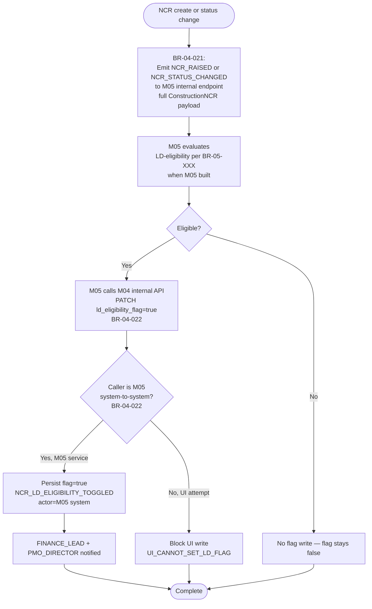

# M04 Execution Capture — Workflows v1.0

> **Locked from:** Spec v1.0 (Round 20) + Wireframes v1.0 (Round 21).
> **Purpose:** Critical runtime flows with BR traceability. Every flow ends with a clear decision or state transition.
> **Audit event names:** All references LOCKED in M04 Spec v1.0 Appendix A + X8 v0.5 §4.12 extension (34 named M04 events including Decision Queue triggers). References below are canonical.

---

## Workflow Index

| ID | Name | Trigger | Primary Role | BRs Referenced |
|---|---|---|---|---|
| WF-04-001 | ProgressEntry create / submit | UI submit by SITE_MANAGER or CSV import row | SITE_MANAGER → QS_MANAGER | 001, 002, 003, 004, 005, 006 |
| WF-04-002 | ProgressEntry approval (single + dual sign-off paths) | Submit transition fires; QS or PD reviews | QS_MANAGER (+ PROJECT_DIRECTOR for Dual_QS_PD) | 007, 008, 009, 010, 011, 012, 013, 014 |
| WF-04-003 | ConstructionNCR lifecycle | NCR raised by SITE_MANAGER, PROJECT_DIRECTOR, or QS_MANAGER | PROJECT_DIRECTOR | 015, 016, 017, 019, 020, 021, 022, 023 |
| WF-04-004 | NCR daily sweep (overdue) | Scheduled daily job (🟢 24hr) | System | 018 |
| WF-04-005 | MaterialReceipt + QC + GRN signal | Receipt logged by SITE_MANAGER or PROCUREMENT_OFFICER | PROCUREMENT_OFFICER | 024, 025, 026, 027, 028, 029, 030 |
| WF-04-006 | ContractorPerformanceScore quarterly batch | Scheduled (1st of month following quarter close) | System → PMO_DIRECTOR | 031, 032, 033, 034, 035 |
| WF-04-007 | ProjectExecutionConfig auto-create + edit | M01 Project Active OR PMO edits config | PMO_DIRECTOR | 036, 037 |
| WF-04-008 | Photo upload (stub) + M12 migration | Photo upload during stub period; one-shot migration when M12 lands | SYSTEM_ADMIN (migration); SITE_MANAGER (upload) | 038, 039 |
| WF-04-009 | NCR → M05 signal + LD eligibility write-back | Every NCR create/status change; M05 sets ld_eligibility_flag | M05 (system-to-system) | 021, 022 |

---

## WF-04-001 — ProgressEntry create / submit

**Decision answered:** Can this progress entry be saved given the WBS measurement-method constraint, and is it ready to hand off to EPCC for approval?
**Trigger:** SITE_MANAGER submits a ProgressEntry create via UI; OR a row is committed during CSV import (out of scope for v1.0 but architected the same way).
**Primary role:** SITE_MANAGER (declared) → SITE_MANAGER or PROJECT_DIRECTOR (submitted)
**BR coverage:** BR-04-001, 002, 003, 004 (a/b/c/d), 005, 006
**Touches:** M02 (WBSNode bac_per_node + ProgressMeasurementConfig), M01 (Project planned_start), M03 (reporting_period_type)

```mermaid
flowchart TD
    Start([SITE_MANAGER submits ProgressEntry]) --> RBAC{RBAC: edit_progress on this project?}
    RBAC -->|No| Deny[403 + AUTHZ_DENIED audit]
    RBAC -->|Yes| ConfigCheck{ProgressMeasurementConfig<br/>exists for wbs_id?<br/>BR-04-001}
    ConfigCheck -->|No| BlockConfig[Block save<br/>reason=MEASUREMENT_METHOD_NOT_CONFIGURED]
    ConfigCheck -->|Yes| RangeCheck{pct_complete_declared<br/>in [0.0000, 1.0000]?<br/>BR-04-003}
    RangeCheck -->|No| BlockRange[Block save<br/>reason=PCT_OUT_OF_RANGE]
    RangeCheck -->|Yes| MethodCheck{Method-specific consistency?<br/>BR-04-004 a/b/c/d}
    MethodCheck -->|Fail| BlockMethod[Block save<br/>reason=METHOD_VALIDATION_FAILED]
    MethodCheck -->|Pass| FirstEntry{First ProgressEntry<br/>for this WBS?}
    FirstEntry -->|Yes| LockConfig[BR-04-002: lock<br/>ProgressMeasurementConfig.is_locked=true<br/>MEASUREMENT_CONFIG_LOCKED]
    FirstEntry -->|No| Persist
    LockConfig --> Persist[Persist ProgressEntry<br/>status=Draft<br/>PROGRESS_ENTRY_DECLARED]
    Persist --> SubmitChoice{User clicks Submit?}
    SubmitChoice -->|No, save as Draft| EndDraft([Complete — Draft])
    SubmitChoice -->|Yes| RBAC2{Caller role ∈<br/>SITE_MANAGER, PROJECT_DIRECTOR?<br/>BR-04-005}
    RBAC2 -->|No| BlockSubmit[Block submit<br/>AUTHZ_DENIED]
    RBAC2 -->|Yes| ComputePath[BR-04-006:<br/>entry_value_inr = pct × bac_per_node<br/>If ≤ threshold → Single_QS<br/>else → Dual_QS_PD]
    ComputePath --> StatusSubmit[status=Submitted<br/>PROGRESS_ENTRY_SUBMITTED<br/>route to QS approval queue]
    StatusSubmit --> EndSubmit([Complete — Submitted, awaiting WF-04-002])
    Deny --> EndDraft
    BlockConfig --> EndDraft
    BlockRange --> EndDraft
    BlockMethod --> EndDraft
    BlockSubmit --> EndDraft
```

### Step-by-step

1. **RBAC check.** Confirm caller has `edit_progress` permission on the project (M34). Fail → `AUTHZ_DENIED`.
2. **Config check (BR-04-001).** Read `ProgressMeasurementConfig` for the WBS via M02 internal API. Reject if missing.
3. **Range check (BR-04-003).** `pct_complete_declared ∈ [0.0000, 1.0000]`.
4. **Method-specific check (BR-04-004 a/b/c/d).**
   - Units: `pct = units_completed / units_total` (4-dec agreement)
   - Steps: `pct = len(steps_completed) / steps_total_count`
   - Milestone: `pct = sum(weights of milestones_achieved)` (must hit defined milestones)
   - Subjective_Estimate: if `pct > config.subjective_basis_threshold_pct` (default 0.25), require `subjective_estimate_basis ≥ 100 chars`
5. **First-entry lock (BR-04-002).** If this is the first ProgressEntry for this WBS, atomically set `ProgressMeasurementConfig.is_locked=true`. Method choice cannot retroactively change.
6. **Persist as Draft.** Insert ProgressEntry; emit `PROGRESS_ENTRY_DECLARED`.
7. **Optional Submit (BR-04-005, 006).** Caller role must be SITE_MANAGER or PROJECT_DIRECTOR. Compute `entry_value_inr = pct_complete_declared × WBSNode.bac_per_node` (read M02 via API per F-005). Compare to `ProjectExecutionConfig.dual_signoff_threshold_inr` → set `approval_path` to Single_QS or Dual_QS_PD. Emit `PROGRESS_ENTRY_SUBMITTED`. Route to WF-04-002.

### Audit events emitted

| Event | When | Severity |
|---|---|---|
| `PROGRESS_ENTRY_DECLARED` | Successful Draft insert | Info |
| `PROGRESS_ENTRY_SUBMITTED` | Submit transition; approval_path computed | Info |
| `MEASUREMENT_CONFIG_LOCKED` | First entry triggers BR-04-002 | Info |
| `AUTHZ_DENIED` | RBAC fail | Medium |
| (validation rejects fall to UI inline; no audit event) | — | — |

### Failure modes

| Failure | Detection | Response |
|---|---|---|
| ProgressMeasurementConfig deleted between read and persist (race) | DB-level FK constraint catches | Reject with `MEASUREMENT_METHOD_NOT_CONFIGURED`; user re-checks config |
| WBSNode.bac_per_node changes mid-flight (M02 BAC update) | `entry_value_inr` recomputed each Submit | If ratio shifts above/below threshold mid-session, the Submit reroutes correctly |
| Method-specific definitions change in ProgressMeasurementConfig | Blocked by is_locked=true after first entry | Method change forbidden post-lock; ProgressMeasurementConfig must be soft-deleted + recreated, with full audit |

---

## WF-04-002 — ProgressEntry approval (single + dual sign-off paths)

**Decision answered:** Should this submitted entry be Approved (consume in EVM/billing) or Rejected (return for re-Draft)?
**Trigger:** WF-04-001 routes Submitted entry; QS_MANAGER opens approvals queue; for Dual_QS_PD path, PROJECT_DIRECTOR receives second-stage queue item.
**Primary role:** QS_MANAGER (always); PROJECT_DIRECTOR (Dual_QS_PD only)
**BR coverage:** BR-04-007, 008, 009, 010, 011, 012, 013, 014
**Touches:** M07 (Approved entry consumed for EV), M06 (BILLING_TRIGGER_READY), M03 (actual_start / actual_finish derivation)



### Step-by-step

1. **Path branch.** Read `approval_path` set by WF-04-001 step 7.
2. **QS review (always).** QS_MANAGER opens entry, reviews declared % vs site evidence (photos, measurement-book references). Approve sets `approved_by_qs` + `approved_at_qs`; emit `PROGRESS_ENTRY_APPROVED_QS`.
3. **Single_QS path:** QS approval is final → status=Approved; cascade.
4. **Dual_QS_PD path:** After QS approves, route to PROJECT_DIRECTOR queue (`DUAL_SIGNOFF_PENDING` Decision Queue trigger if PD doesn't act in 48hr per OQ-2.4). PD approval sets `approved_by_pd` + `approved_at_pd`; only then status=Approved.
5. **Final Approved cascade (BR-04-007, 010, 011, 012, 013, 014).**
   - Set `approved_at = max(approved_at_qs, approved_at_pd)` (single-path: same as QS)
   - BR-04-013: compute `ev_confidence` (High for measurable methods; Low for Subjective_Estimate)
   - BR-04-012: emit `BILLING_TRIGGER_READY` to M06 (when built) with entry_id + entry_value_inr
   - BR-04-014: if first Approved for this WBS, emit `actual_start = period_start` to M03 ScheduleEntry; if `pct_complete_approved=1.0`, emit `actual_finish = period_end`
   - M07 reads filter `WHERE status='Approved'` (BR-04-010); Subjective_Estimate consumed with confidence=Low (BR-04-011)
6. **Reject path (BR-04-008).** Caller (QS or PD) provides `rejection_reason ≥ 50 chars`. Status=Rejected; emit `PROGRESS_ENTRY_REJECTED`.
7. **Repeated rejection check (BR-04-009).** If rejection count for same entry_id > 3, generate Decision `PROGRESS_ENTRY_REPEATED_REJECTION`; PROJECT_DIRECTOR review.

### Audit events emitted

| Event | When | Severity |
|---|---|---|
| `PROGRESS_ENTRY_APPROVED_QS` | QS_MANAGER signs (intermediate Dual / final Single) | Info |
| `PROGRESS_ENTRY_APPROVED_PD` | PROJECT_DIRECTOR signs (Dual only) | Info |
| `PROGRESS_ENTRY_APPROVED` | Final Approved; cascades fire | Info |
| `PROGRESS_ENTRY_REJECTED` | QS or PD rejects | Medium |
| `PROGRESS_ENTRY_REPEATED_REJECTION` | BR-04-009 trigger | High (Decision Queue) |
| `DUAL_SIGNOFF_PENDING` | Dual path waiting for PD > 48hr | Medium (Decision Queue) |
| `PROGRESS_APPROVAL_PENDING` | Submitted > 48hr awaiting QS | Medium (Decision Queue) |

### Failure modes

| Failure | Detection | Response |
|---|---|---|
| QS approves but ProjectExecutionConfig.dual_signoff_threshold_inr changes mid-flight (PMO edit) | approval_path snapshot at Submit; not re-evaluated mid-flight | Submitted entry retains its original path; new threshold applies to future submissions only |
| M06 BILLING_TRIGGER_READY emit fails (M06 down) | Async retry queue | Approved persists; M06 cascade retried with backoff. ProgressEntry.approved_at unchanged. |
| M03 actual_start emit fails | Async retry queue | Same — persist M04 state; M03 cascade retried |
| PD rejects after QS approved (Dual path) | BR-04-008 path | status=Rejected; both QS and PD audit events captured; counts toward BR-04-009 repeat-rejection limit |

---

## WF-04-003 — ConstructionNCR lifecycle

**Decision answered:** Is this construction defect captured, contained, and closed within commercial SLAs?
**Trigger:** SITE_MANAGER, PROJECT_DIRECTOR, or QS_MANAGER raises NCR via UI.
**Primary role:** PROJECT_DIRECTOR (closure authority)
**BR coverage:** BR-04-015, 016, 017, 019, 020, 021, 022, 023
**Touches:** M01 (project planned_start, contract_id), M02 (WBSNode), M05 (NCR signals + ld_eligibility_flag write-back — see WF-04-009)



### Step-by-step

1. **Identification check (BR-04-015).** `identified_at ≥ M01.Project.planned_start_date`. Reject if before.
2. **Photo evidence check (BR-04-016).** Critical NCR ≥ 2 photos (config); High NCR ≥ 1 photo. Block save if missing.
3. **Reinspection-required check (BR-04-019).** Default true. Override to false allowed only if `severity=Low` AND `caller=PROJECT_DIRECTOR` (audited).
4. **response_due CALC (BR-04-017).** Critical = identified_at + 24hr; High = +48hr; Medium/Low = +72hr (configurable via ProjectExecutionConfig).
5. **Persist as Open.** Emit `NCR_RAISED` + signal to M05 via WF-04-009.
6. **Lifecycle transitions.** Open → Response_Pending → Response_Received → Remediation_In_Progress → Reinspection_Pending → Closed (or Disputed). Each transition logs to NCRStatusLog (append-only).
7. **Reinspection result (BR-04-020).** Pass → Closed (immutable). Fail → reset response_due + loop. Partial → require reinspection_notes ≥ 30 chars + loop.
8. **Soft-delete protection (BR-04-023).** NCR cannot be soft-deleted while status ∉ {Closed, Disputed}.

### Audit events emitted

| Event | When | Severity |
|---|---|---|
| `NCR_RAISED` | Successful create; signal to M05 | severity-dependent (Critical NCR → High event-severity; Low → Info) |
| `NCR_RESPONSE_RECEIVED` | Contractor response captured | Info |
| `NCR_REINSPECTION_PASS` | reinspection_result=Pass | Info |
| `NCR_REINSPECTION_FAIL` | reinspection_result=Fail | High |
| `NCR_REINSPECTION_PARTIAL` | reinspection_result=Partial | Medium |
| `NCR_CLOSED` | Final closure | Info |
| `NCR_DISPUTED` | is_disputed=true | Medium |

### Failure modes

| Failure | Detection | Response |
|---|---|---|
| Same physical issue closed then recurs | NCR_CLOSED is final per Block 10 OQ #6 | New NCR with cross-reference in description; old NCR remains Closed |
| Severity changed after open (e.g., Medium → High after inspection) | NCRStatusLog captures severity change | response_due recalc; photo evidence check re-run; emit `NCR_SEVERITY_CHANGED` (subset of NCR_STATUS_CHANGED) |
| Contractor disputes liability mid-flight | is_disputed=true | NCR remains in current status; dispute_resolution_note ≥ 100 chars required; M05 LD logic deferred until resolved |
| M05 not yet built when NCR raised | NCR_RAISED signal queued | NCR proceeds normally; M05 cascade fires when M05 lands |

---

## WF-04-004 — NCR daily sweep (overdue)

**Decision answered:** Are any NCRs past their response_due, and which need escalation?
**Trigger:** Scheduled daily job (🟢 24hr speed tier — runs at configurable hour, default 06:00 site time).
**Primary role:** System (recipient = PROJECT_DIRECTOR via Decision Queue)
**BR coverage:** BR-04-018
**Touches:** M11 ActionRegister (when built — Decision Queue absorber)



### Step-by-step

1. **Job fires daily at configured hour.** Sweeps all active projects.
2. **Filter** for NCRs with status ∈ {Open, Response_Pending} AND `response_due < today`.
3. **Per overdue NCR**, by severity:
   - Critical → `NCR_OPEN_CRITICAL` Decision (severity=CRITICAL, SLA=24hr, owner=PROJECT_DIRECTOR)
   - High → `NCR_OPEN_HIGH` Decision (severity=HIGH, SLA=48hr, owner=PROJECT_DIRECTOR)
   - Medium / Low → no Decision (handled in routine review)
4. **Idempotency.** If a Decision is already open for this (ncr_id, trigger_type), no-op. Re-running the job doesn't duplicate.
5. **Acknowledgement / closure.** Decisions close when NCR transitions to Response_Received (or Closed); separate workflow within M11.

### Audit events emitted

| Event | When | Severity |
|---|---|---|
| `NCR_OPEN_CRITICAL` | Decision created (Critical overdue) | Critical (Decision Queue) |
| `NCR_OPEN_HIGH` | Decision created (High overdue) | High (Decision Queue) |

### Failure modes

| Failure | Detection | Response |
|---|---|---|
| Job fails partway | Job state per-NCR | Resume from last-processed NCR; idempotent re-emit prevents duplicates |
| Time-zone drift (project in different region) | Daily job uses project tenant timezone | KDMC = IST; per-tenant timezone configurable |
| NCR transitioned to Response_Received between filter and emit | Race | Decision still emitted; auto-closes on next idempotency check (within minutes) |

---

## WF-04-005 — MaterialReceipt + QC + GRN signal

**Decision answered:** Was this material delivery acceptable, and does it trigger billing (GRN) downstream?
**Trigger:** SITE_MANAGER or PROCUREMENT_OFFICER logs receipt at site delivery.
**Primary role:** PROCUREMENT_OFFICER (QC decision authority)
**BR coverage:** BR-04-024, 025, 026, 027, 028, 029, 030
**Touches:** M03 (procurement_schedule_item_id linkage; actual_delivery_date emit), M06 (GRN_SIGNAL emit when built)



### Step-by-step

1. **M03 linkage check (BR-04-024).** `procurement_schedule_item_id` must resolve to active M03 row.
2. **Quantity check (BR-04-025).** `> 0 AND ≤ procurement_schedule_item.ordered_quantity`. Over-delivery routes to Conditional flow on QC.
3. **High-value photo check (BR-04-026).** `unit_value_inr ≥ ProjectExecutionConfig.high_value_material_threshold_inr` (default ₹10L) → ≥ 1 photo required. KDMC LINAC/MRI/CT all far above this.
4. **Persist as Received.** `qc_status=Pending_QC`. Emit `MATERIAL_RECEIVED`.
5. **QC inspection.** PROCUREMENT_OFFICER (or PROJECT_DIRECTOR) inspects; sets `qc_decision`.
6. **Accepted (BR-04-028).** status=Accepted; emit `MATERIAL_GRN_EMITTED` to M06 (when built) + `actual_delivery_date = received_at` to M03 ProcurementScheduleItem. M03 closes the procurement loop.
7. **Rejected (BR-04-029).** `qc_rejection_reason ≥ 50 chars`; status=Rejected; `return_to_vendor_status=Pending`; **no GRN, no M03 actual_delivery emit**. Decision Queue: `MATERIAL_RECEIPT_QC_FAIL` (severity=High; owner=PROCUREMENT_OFFICER; SLA=24hr).
8. **Conditional (BR-04-030).** `qc_notes ≥ 100 chars`; status=Conditional_Accepted; emit GRN with conditional flag (M06 handles partial billing logic).
9. **Closure.** status→Closed on M06 GRN ack OR return-to-vendor flow complete.

### Audit events emitted

| Event | When | Severity |
|---|---|---|
| `MATERIAL_RECEIVED` | Receipt persisted | Info |
| `MATERIAL_QC_ACCEPTED` | qc_decision=Accepted | Info |
| `MATERIAL_QC_REJECTED` | qc_decision=Rejected | Medium |
| `MATERIAL_QC_CONDITIONAL` | qc_decision=Conditional_Acceptance | Medium |
| `MATERIAL_GRN_EMITTED` | GRN signal sent to M06 | Info |
| `MATERIAL_RECEIPT_QC_FAIL` | Decision created on Rejected | High (Decision Queue) |

### Failure modes

| Failure | Detection | Response |
|---|---|---|
| M06 GRN ack times out | Async retry | Material remains Conditional_Accepted / Accepted; M06 cascade retried; status→Closed pending ack |
| Vendor disputes rejection | is_disputed flag on receipt (out-of-scope v1.0; deferred to M05/M06) | Receipt status=Rejected stands; commercial dispute handled outside M04 |
| Over-delivery (qty > ordered_quantity) | BR-04-025 enforces ≤ | User must split into two receipts OR force-conditional with PMO override + qc_notes |

---

## WF-04-006 — ContractorPerformanceScore quarterly batch

**Decision answered:** What's each contractor's quarterly performance score, and does it cascade to M01 Party.long_term_rating?
**Trigger:** Scheduled batch on 1st of month following quarter close (e.g., Apr 1 for Q1 Jan–Mar).
**Primary role:** System → PMO_DIRECTOR (review + override authority)
**BR coverage:** BR-04-031, 032, 033, 034, 035
**Touches:** M01 (Party.long_term_rating cascade)



### Step-by-step

1. **Batch fires 1st of month following quarter close.** For each (project_id, contract_id):
2. **Compute components (BR-04-032).**
   - `progress_adherence` = % of declared % complete that was approved without rejection in the quarter
   - `ncr_rate` = `100 − (open_critical × 10 + open_high × 5 + open_medium_low × 1)`, floored at 0
   - `material_acceptance` = % of MaterialReceipts with qc_decision=Accepted
   - `weighted_total = (progress × 0.40) + (ncr × 0.35) + (material × 0.25)`
3. **Persist (BR-04-031).** Insert row with score_basis_payload (full intermediates for audit reproducibility). Emit `SCORE_COMPUTED`.
4. **Decline check (BR-04-034).** If `weighted_total - prior_quarter_score < -10`, generate Decision `CONTRACTOR_SCORE_DECLINE` (severity=Medium; owner=PMO_DIRECTOR; SLA=7 days).
5. **M01 cascade (BR-04-033).** PATCH `M01.Party.long_term_rating` via M01 internal API. Set `applied_to_party_at`. Emit `SCORE_APPLIED_TO_PARTY`.
6. **Manual override (BR-04-035).** PMO_DIRECTOR can override `weighted_total` post-batch. Requires `manual_override_justification ≥ 200 chars`. Emit `SCORE_OVERRIDDEN`; cascade BR-04-033 again with override value.

### Audit events emitted

| Event | When | Severity |
|---|---|---|
| `SCORE_COMPUTED` | Quarterly row created | Info |
| `CONTRACTOR_SCORE_DECLINE` | Decline > 10 points | Medium (Decision Queue) |
| `SCORE_APPLIED_TO_PARTY` | M01 cascade fired | Info |
| `SCORE_OVERRIDDEN` | PMO override applied | High |

### Failure modes

| Failure | Detection | Response |
|---|---|---|
| M01 cascade fails (M01 API down) | Async retry | ContractorPerformanceScore.applied_to_party_at remains null; retry queue |
| Quarter has zero MaterialReceipts (early-stage project) | material_acceptance defaults to 100% (no rejections is "perfect") | Score still computed; weighted_total reflects only progress + NCR signal |
| Override applied then PMO regrets | New override row (no in-place edit per append-only ledger) | Pattern: override-of-override allowed; ContractorPerformanceScoreLog tracks chain |

---

## WF-04-007 — ProjectExecutionConfig auto-create + edit

**Decision answered:** What execution-tunables apply to this project, and who can change them?
**Trigger:** (a) M01 Project transitions to Active → auto-create with defaults; (b) PMO_DIRECTOR edits via UI.
**Primary role:** PMO_DIRECTOR
**BR coverage:** BR-04-036, 037
**Touches:** M01 (Project Active state event)

```mermaid
flowchart TD
    Start{Trigger?} -->|M01 Active| AutoCreate[BR-04-036:<br/>Insert ProjectExecutionConfig<br/>with all defaults<br/>EXEC_CONFIG_CREATED]
    Start -->|PMO edit| RBAC{Caller=PMO_DIRECTOR?}
    RBAC -->|No| Deny[403 + AUTHZ_DENIED]
    RBAC -->|Yes| Justification{BR-04-037:<br/>last_edit_justification ≥ 100 chars?}
    Justification -->|No| BlockJust[Block save<br/>JUSTIFICATION_REQUIRED]
    Justification -->|Yes| BoundsCheck{Numeric values within<br/>sane bounds?<br/>e.g., dual_signoff_threshold ∈ [10K, 10Cr]}
    BoundsCheck -->|No| BlockBounds[Block save<br/>OUT_OF_BOUNDS]
    BoundsCheck -->|Yes| Persist[Update ProjectExecutionConfig<br/>EXEC_CONFIG_EDITED]
    AutoCreate --> Notify[PMO_DIRECTOR notified]
    Persist --> Notify
    Notify --> End([Complete])
    Deny --> End
    BlockJust --> End
    BlockBounds --> End
```

### Step-by-step

1. **Auto-create (BR-04-036).** When M01 emits Project state change to Active, M04 inserts ProjectExecutionConfig with all defaults (per Spec Block 3k). Emit `EXEC_CONFIG_CREATED`. Notify PMO_DIRECTOR.
2. **PMO edit (BR-04-037).** Caller must be PMO_DIRECTOR. `last_edit_justification ≥ 100 chars` required. Numeric values bounded (e.g., `dual_signoff_threshold_inr ∈ [10000, 100000000]`).
3. **Persist.** Emit `EXEC_CONFIG_EDITED`.
4. **No retroactive impact.** Submitted ProgressEntries retain their original `approval_path` (per WF-04-002 failure-modes table).

### Audit events emitted

| Event | When | Severity |
|---|---|---|
| `EXEC_CONFIG_CREATED` | Auto-create on M01 Active | Info |
| `EXEC_CONFIG_EDITED` | PMO edit | Medium |
| `AUTHZ_DENIED` | Non-PMO edit attempt | Medium |

### Failure modes

| Failure | Detection | Response |
|---|---|---|
| M01 Active event fires twice (network retry) | Idempotent: only one ProjectExecutionConfig per project_id | Second insert blocked by uniqueness constraint; first persists |
| PMO edits config while a Submit is in-flight | approval_path snapshot at Submit | New threshold applies only to subsequent Submits |

---

## WF-04-008 — Photo upload (stub) + M12 migration

**Decision answered:** Are photos attached + accessible during stub period, and how do they migrate when M12 lands?
**Trigger:** (a) SITE_MANAGER or PROCUREMENT_OFFICER uploads photo during stub period; (b) M12 v1.0 lock detected → one-shot migration.
**Primary role:** SITE_MANAGER (upload); SYSTEM_ADMIN (migration)
**BR coverage:** BR-04-038, 039
**Touches:** M12 DocumentControl (when built), M34 (RBAC for photo access)

```mermaid
flowchart TD
    Start{Trigger?} -->|Photo upload stub| Validate[Client-side validate<br/>JPEG/PNG, ≤ 10MB, ≤ 4K res<br/>auto-downscale if needed]
    Validate --> Upload[Upload to MinIO<br/>generate signed URL]
    Upload --> Persist[Append URL to entity<br/>photo_urls JSONB array<br/>PHOTO_ATTACHED]
    Persist --> EndStub([Stub upload complete])
    Start -->|M12 v1.0 lock| OneShot[BR-04-039:<br/>One-shot migration script]
    OneShot --> Loop{For each entity<br/>ProgressEntry, ConstructionNCR, MaterialReceipt}
    Loop --> RowLoop{Per row with<br/>non-empty photo_urls}
    RowLoop --> Migrate[Per URL:<br/>m12.create_document with original timestamp<br/>preserve uploaded_by + uploaded_at]
    Migrate --> Update[Update row:<br/>photo_document_ids = [m12.id, ...]<br/>PHOTO_MIGRATED_TO_M12]
    Update --> NextRow{More rows?}
    NextRow -->|Yes| RowLoop
    NextRow -->|No| EntityDone{More entities?}
    EntityDone -->|Yes| Loop
    EntityDone -->|No| Cascade[M04 v1.1 cascade<br/>drops photo_urls column<br/>one-cycle additive safety<br/>per Spec Block 10 OQ #4]
    Cascade --> EndMigration([Migration complete])
```

### Step-by-step

**Stub upload (BR-04-038):**
1. Client validates: JPEG/PNG, ≤ 10MB, ≤ 4K resolution; auto-downscale if needed.
2. Upload to MinIO; generate signed URL.
3. Append URL to entity's `photo_urls` JSONB array. Emit `PHOTO_ATTACHED`.

**M12 migration (BR-04-039):**
1. Trigger detection: M12 v1.0 lock event (manual or detection job).
2. One-shot script `20260XXX_M12_absorb_M04_photo_urls.py` (drafted in M04 Spec Appendix C).
3. For each entity (`progress_entry`, `construction_ncr`, `material_receipt`) with non-empty `photo_urls`:
   - For each URL: call `m12.create_document(...)` preserving original timestamp + uploader
   - Update row: populate `photo_document_ids = [doc.id, ...]`
   - Emit `PHOTO_MIGRATED_TO_M12` per row
4. **Additive safety:** keep `photo_urls` for one cycle (M04 Spec Block 10 OQ #4). M04 v1.1 cascade post-M12 drops the column.

### Audit events emitted

| Event | When | Severity |
|---|---|---|
| `PHOTO_ATTACHED` | Stub URL added | Info |
| `PHOTO_MIGRATED_TO_M12` | One-shot migration per row | Info |

### Failure modes

| Failure | Detection | Response |
|---|---|---|
| MinIO unreachable during stub upload | Client-side error | Block upload; user retries |
| M12 migration fails partway | Per-row idempotent — checks photo_document_ids non-null before re-migrating | Re-run script picks up where it left off |
| MinIO URL no longer valid (expired signature) when migrating | M12 returns 4xx | Log + skip row; manual re-upload required (rare; signed URLs configured for project lifetime) |

---

## WF-04-009 — NCR → M05 signal + LD eligibility write-back

**Decision answered:** Does this NCR contribute to the contractor's LD calculation in M05?
**Trigger:** (a) M04 emits `NCR_RAISED` / `NCR_STATUS_CHANGED` to M05 (when built); (b) M05 sets `ld_eligibility_flag` true via M04 internal API.
**Primary role:** M05 (system-to-system; UI cannot set the flag — BR-04-022)
**BR coverage:** BR-04-021, 022
**Touches:** M05 Risk & Change



### Step-by-step

1. **Emit on NCR change (BR-04-021).** Every NCR create or status change emits `NCR_RAISED` (on create) / `NCR_STATUS_CHANGED` (on transition) to M05 with full payload.
2. **M05 evaluates** (M05 Spec — future). LD-eligibility logic owned entirely by M05 (separation of duties — Brief OQ-1.6=B).
3. **Write-back (BR-04-022).** If eligible, M05 calls M04 internal API to PATCH `ld_eligibility_flag=true`. **UI cannot toggle** — only system-to-system M05 endpoint accepted.
4. **Audit + notify.** Emit `NCR_LD_ELIGIBILITY_TOGGLED` (actor=M05 system); notify FINANCE_LEAD + PMO_DIRECTOR.

### Audit events emitted

| Event | When | Severity |
|---|---|---|
| `NCR_LD_ELIGIBILITY_TOGGLED` | M05 sets flag (true→false also audited) | High |
| `UI_CANNOT_SET_LD_FLAG` (proposed; M34 RBAC enforcement) | UI write attempt blocked | Medium |

### Failure modes

| Failure | Detection | Response |
|---|---|---|
| M05 not yet built | NCR emit queued | NCR proceeds; M05 cascade fires when M05 lands; ld_eligibility_flag remains default false |
| M05 toggles flag, then later un-toggles (LD waived) | Both events audited | Flag history reconstructable via audit log |
| Race: NCR closed while M05 evaluating | M05 should re-check NCR.status before write | M05-side concern — out of M04 scope |

---

## BR Coverage Matrix

> All 39 M04 BRs covered across 9 workflows. No orphans. Confirms M04 Spec → Workflows traceability per spec-protocol I5 (Brief → Spec → Wireframe gating).

| BR | Description (short) | Speed | Workflow(s) covering it |
|---|---|---|---|
| BR-04-001 | ProgressMeasurementConfig must exist | 🔴 | WF-04-001 |
| BR-04-002 | ProgressMeasurementConfig locks after first entry | 🔴 | WF-04-001 |
| BR-04-003 | pct_complete_declared in [0, 1] | 🔴 | WF-04-001 |
| BR-04-004 a/b/c/d | Method-specific consistency check | 🔴 | WF-04-001 |
| BR-04-005 | Submit RBAC | 🔴 | WF-04-001 |
| BR-04-006 | approval_path computation at Submit | 🔴 | WF-04-001 |
| BR-04-007 | Approval transition rules | 🔴 | WF-04-002 |
| BR-04-008 | Reject reason ≥ 50 chars | 🔴 | WF-04-002 |
| BR-04-009 | Repeated rejection > 3 → Decision | 🟡 | WF-04-002 |
| BR-04-010 | M07 reads only Approved | 🔴 | WF-04-002 |
| BR-04-011 | Subjective_Estimate Approved → ev_confidence=Low | 🔴 | WF-04-002 |
| BR-04-012 | Approved → BILLING_TRIGGER_READY to M06 | 🔴 | WF-04-002 |
| BR-04-013 | Compute ev_confidence on Approve | 🔴 | WF-04-002 |
| BR-04-014 | First/last Approved → actual_start/finish to M03 | 🔴 | WF-04-002 |
| BR-04-015 | NCR identified_at ≥ project planned_start | 🔴 | WF-04-003 |
| BR-04-016 | Critical/High NCR photo minimum | 🔴 | WF-04-003 |
| BR-04-017 | response_due CALC by severity | 🔴 | WF-04-003 |
| BR-04-018 | NCR overdue daily sweep → Decision | 🟢 / 🔴 | WF-04-004 (sweep) |
| BR-04-019 | Reinspection-required override (Low only by PD) | 🔴 | WF-04-003 |
| BR-04-020 | Reinspection result Pass/Fail/Partial | 🔴 | WF-04-003 |
| BR-04-021 | NCR_RAISED / _STATUS_CHANGED to M05 | 🔴 | WF-04-003, WF-04-009 |
| BR-04-022 | ld_eligibility_flag — M05 system-to-system only | 🔴 | WF-04-009 |
| BR-04-023 | NCR soft-delete blocked while open | 🔴 | WF-04-003 |
| BR-04-024 | MaterialReceipt requires M03 link | 🔴 | WF-04-005 |
| BR-04-025 | quantity_received bounds | 🔴 | WF-04-005 |
| BR-04-026 | High-value receipt photo minimum | 🔴 | WF-04-005 |
| BR-04-027 | qc_decision ENUM validation | 🔴 | WF-04-005 |
| BR-04-028 | Accepted → GRN to M06 + actual_delivery to M03 | 🔴 | WF-04-005 |
| BR-04-029 | Rejected → no GRN; return-to-vendor | 🔴 | WF-04-005 |
| BR-04-030 | Conditional_Acceptance → qc_notes ≥ 100 chars | 🔴 | WF-04-005 |
| BR-04-031 | Quarterly batch compute | 🟢 | WF-04-006 |
| BR-04-032 | Score formula (40/35/25 weights) | 🟢 | WF-04-006 |
| BR-04-033 | M01 Party.long_term_rating cascade | 🟢 | WF-04-006 |
| BR-04-034 | Score decline > 10 → Decision | 🟢 | WF-04-006 |
| BR-04-035 | PMO override with justification ≥ 200 chars | 🔴 | WF-04-006 |
| BR-04-036 | Auto-create config on M01 Active | 🔴 | WF-04-007 |
| BR-04-037 | Config edit RBAC + justification | 🔴 | WF-04-007 |
| BR-04-038 | Photo upload stub validation | 🔴 | WF-04-008 |
| BR-04-039 | M12 migration one-shot | 🟢 | WF-04-008 |

**Lock criterion met:** Every BR appears in ≥ 1 workflow. Zero orphans.

---

*v1.0 — Workflows LOCKED on 2026-05-03 (Round 22). M04 ExecutionCapture module COMPLETE (Brief v1.0, Spec v1.0, Wireframes v1.0, Workflows v1.0). CLAUDE.md and EPCC_VersionLog updated this round.*
