# M05 — Risk & Change Control — Workflows v1.0

## CHANGE LOG

| Version | Date | Author | Change Summary |
|---|---|---|---|
| v1.0 | 2026-05-04 | Monish (with Claude assist) | Initial workflows lock (Round 36). 5 workflows covering all M05 Spec v1.0 (R33) BRs. WF-05-001 Risk Identification (BR-05-002..008); WF-05-002 VO Lifecycle 7-state (BR-05-009..017); WF-05-003 EOT + EWN combined (BR-05-018..026 — EWN folded into EOT WF since EOT requires EWN per OQ-1.8); WF-05-004 LD Accrual + NCR→LD (BR-05-031..035); WF-05-005 Contingency Pool + Project Activation (BR-05-001, 027..030b). All Mermaid flowcharts validate. C1b batch with M13 Workflows. |

---

## Purpose

Runtime workflows for M05 Risk & Change Control. Each Mermaid diagram describes the **runtime behaviour** of a decision-bearing process. Cross-references to BR codes link runtime to the locked specification (M05 Spec v1.0 Block 6).

5 workflows covered:

| # | Workflow | Decision Answered | Primary Role(s) | BR Coverage |
|---|---|---|---|---|
| **WF-05-001** | Risk Identification and Scoring | Has a project risk been formally identified, scored, and assigned an owner + response strategy? | Any view_project role (raise) → PROJECT_DIRECTOR/PMO_DIRECTOR (accept) | BR-05-002..008 |
| **WF-05-002** | Variation Order Lifecycle (7-state) | Has a scope or cost variation been formally assessed, approved (single OR dual sign-off), and materialised into the BOQ — with full audit trail? | QS_MANAGER (assess) → PMO_DIRECTOR + FINANCE_LEAD (approve) | BR-05-009..017 |
| **WF-05-003** | Extension of Time + Early Warning Notice | Has a contractor's EOT claim been formally assessed (with EWN prerequisite per OQ-1.8) and grant decision cascaded to schedule baseline? | PROJECT_DIRECTOR + PLANNING_ENGINEER (assess) → PMO_DIRECTOR (grant) | BR-05-018..026 |
| **WF-05-004** | LD Accrual + NCR→LD Eligibility | Is the contractor accruing liquidated damages, and which NCRs have been assessed as LD-eligible? | M05 SYSTEM (NCR signal consumer) + FINANCE_LEAD (review) | BR-05-031..035 |
| **WF-05-005** | Contingency Pool Drawdown + Project Activation | Has a contingency drawdown been formally requested and approved with pool balance verified? | PROJECT_DIRECTOR (request) → PMO_DIRECTOR (approve, no self-approval) | BR-05-001, 027..030b |

---

## WF-05-001 — Risk Identification and Scoring

> **Decision:** Has a project risk been formally identified, scored, and assigned an owner + response strategy?
> **Primary Role:** Any view_project role (Draft raise per OQ-2.6 broad-raise pattern) → PROJECT_DIRECTOR or PMO_DIRECTOR (Active accept).
> **BR Coverage:** BR-05-002 (state machine), BR-05-003 (risk_score = P × I), BR-05-004 (rag_band derivation 1-4/5-12/13-25), BR-05-005 (READ_ONLY hides numeric), BR-05-006 (Red band requires response_strategy + 48hr SLA), BR-05-007 (ARTA ENUM), BR-05-008 (Risk closure: residual ≤ 6 + PMO sign-off).

### Mermaid State Diagram

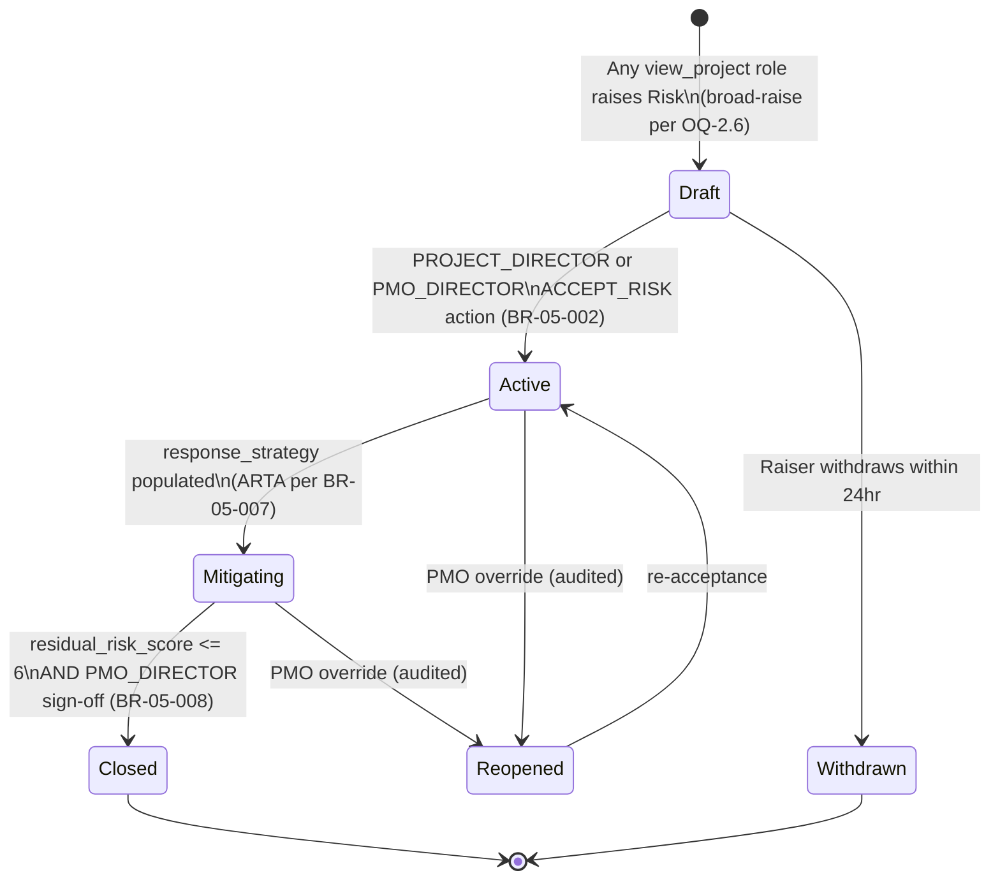

### Runtime Flow

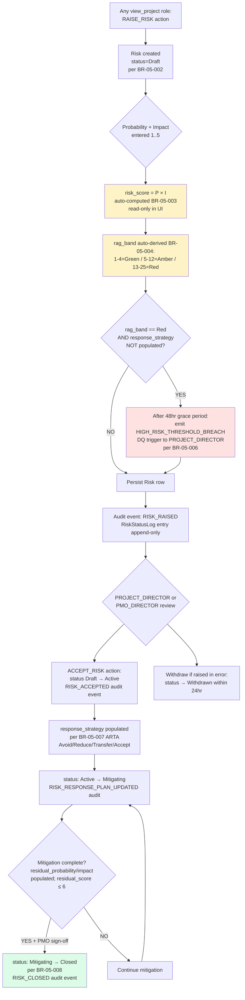

### READ_ONLY Render Rule (BR-05-005)

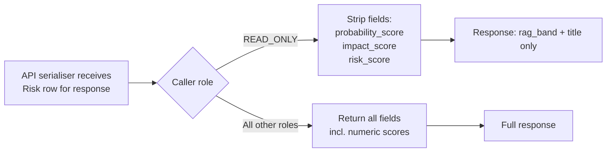

### Periodic Risk Review (per OQ-2.5)

`ProjectRiskConfig.risk_review_cadence_days` (default 90 — quarterly) drives a sweep:
- Daily background job checks `Risk` rows with `status IN (Active, Mitigating)` AND `last_reviewed_at + risk_review_cadence_days < today`.
- Emits `RISK_REVIEW_DUE` notification to risk owner (no DQ trigger; informational).

### Audit Events Emitted

| Event | Trigger BR | Severity |
|---|---|---|
| `RISK_RAISED` | BR-05-002 (Draft create) | Info |
| `RISK_ACCEPTED` | BR-05-002 (Draft → Active) | Info |
| `RISK_SCORE_CHANGED` | BR-05-003 + BR-05-004 (P or I edit) | Medium (severity-dependent on rag_band) |
| `RISK_RESPONSE_PLAN_UPDATED` | BR-05-007 (response_strategy set) | Info |
| `RISK_CLOSED` | BR-05-008 (closure) | Info |
| `RISK_WITHDRAWN` | BR-05-002 (Draft → Withdrawn) | Info |

### Decision Queue Triggers Emitted

| Trigger | Severity | Owner | SLA | Source BR |
|---|---|---|---|---|
| `HIGH_RISK_THRESHOLD_BREACH` | High | PROJECT_DIRECTOR | 48 hr | BR-05-006 |

### Failure Modes

| Failure | Behaviour |
|---|---|
| Caller attempts to set `risk_score` directly | API rejects 422 — read-only field per BR-05-003 |
| Red band Risk saved without response_strategy after 48hr | `HIGH_RISK_THRESHOLD_BREACH` DQ trigger fires per BR-05-006 |
| Closure attempted with residual_score > 6 | Block transition with reason `RESIDUAL_SCORE_EXCEEDS_GREEN_THRESHOLD` per BR-05-008 |
| Closure attempted by non-PMO_DIRECTOR | Block with reason `CLOSURE_REQUIRES_PMO_SIGNOFF` per BR-05-008 |

---

## WF-05-002 — Variation Order Lifecycle (7-state)

> **Decision:** Has a scope or cost variation been formally assessed, approved (with appropriate dual sign-off where required), and materialised into the BOQ — with full audit trail?
> **Primary Role:** QS_MANAGER (assess + submit) → PMO_DIRECTOR / FINANCE_LEAD (approve; dual above ₹50L) → SYSTEM (Materialise on M02 confirmation).
> **BR Coverage:** BR-05-009 (state machine), BR-05-010 (Draft → Assessed), BR-05-011 (Assessed → Submitted + DQ trigger), BR-05-012 (Submitted → Approved single/dual), BR-05-013 (Approved → emit VO_APPROVED to M02), BR-05-014 (Materialised system action), BR-05-015 (M02 failure handling), BR-05-016 (EWN required if Delay/Scope_Increase), BR-05-017 (VO Materialised → emit VO_APPROVED_COST_IMPACT to M06).

### State Machine (7 states per Brief v1.0a OQ-1.5)

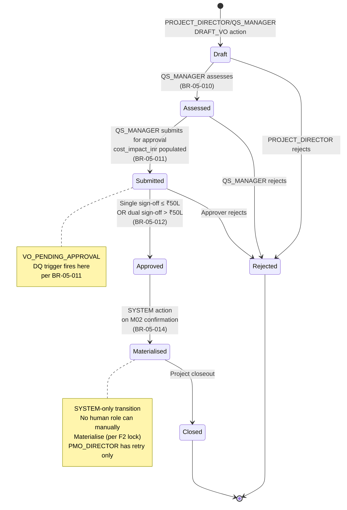

### Runtime Flow

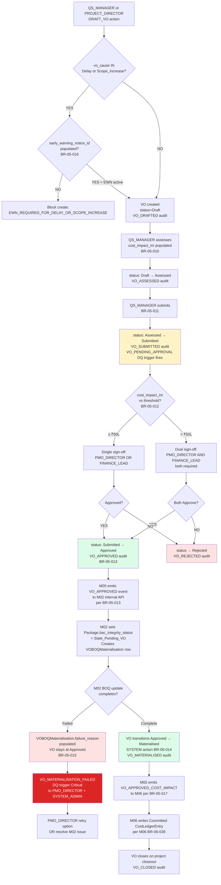

### Dual Sign-Off Sub-Flow (BR-05-012)

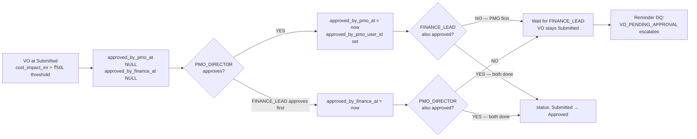

**Anti-self-approval rule:** Same user cannot populate both `approved_by_pmo_at` AND `approved_by_finance_at` (different `user_id` required). System validates at second-approval time.

### Audit Events Emitted

| Event | Trigger BR | Severity |
|---|---|---|
| `VO_DRAFTED` | BR-05-009 | Info |
| `VO_ASSESSED` | BR-05-010 | Info |
| `VO_SUBMITTED` | BR-05-011 | Info |
| `VO_APPROVED` | BR-05-012 + BR-05-013 | High |
| `VO_REJECTED` | BR-05-009 | Medium |
| `VO_MATERIALISED` | BR-05-014 + BR-05-017 | High |
| `VO_MATERIALISATION_FAILED` | BR-05-015 | Critical |
| `VO_CLOSED` | BR-05-009 | Info |

### Decision Queue Triggers Emitted

| Trigger | Severity | Owner | SLA | Source BR |
|---|---|---|---|---|
| `VO_PENDING_APPROVAL` | Medium | QS_MANAGER (assessor) → PMO_DIRECTOR/FINANCE_LEAD (approvers) | 7 days assess + 7 days approve | BR-05-011 |
| `VO_MATERIALISATION_FAILED` | Critical | PMO_DIRECTOR + SYSTEM_ADMIN | Real-time | BR-05-015 |

### Cross-Module Events

| Direction | Event | Target | Trigger | Speed |
|---|---|---|---|---|
| OUT | `VO_APPROVED` | M02 (BOQ update) | VO Submitted → Approved | 🔴 Real-time |
| IN | M02 confirmation `materialisation_status=Complete OR Failed` | M05 | M02 finishes BOQ update | 🔴 Real-time |
| OUT | `VO_APPROVED_COST_IMPACT` | M06 (CostLedgerEntry) | VO Approved → Materialised | 🔴 Real-time |

---

## WF-05-003 — Extension of Time + Early Warning Notice

> **Decision:** Has a contractor's EOT claim been formally assessed (with EWN prerequisite per OQ-1.8 NEC4/FIDIC alignment) and a grant decision (full / partial / rejected) cascaded to the schedule baseline?
> **Primary Role:** SITE_MANAGER / PROJECT_DIRECTOR (raise EWN) → PLANNING_ENGINEER + PROJECT_DIRECTOR (assess EOT claim) → PMO_DIRECTOR (grant or reject).
> **BR Coverage:** BR-05-018 (EOT requires EWN), BR-05-019 (partial grant requires reason ≥100 chars), BR-05-020 (PMO grant authority), BR-05-021 (EOT_GRANTED → M03 cascade), BR-05-022 (M03 cascade failure), BR-05-023 (EWN create min chars), BR-05-024 (EOT/VO references EWN → close), BR-05-025 (EWN auto-lapse sweep), BR-05-026 (EWN lapse approaching DQ trigger).

### EWN State Machine

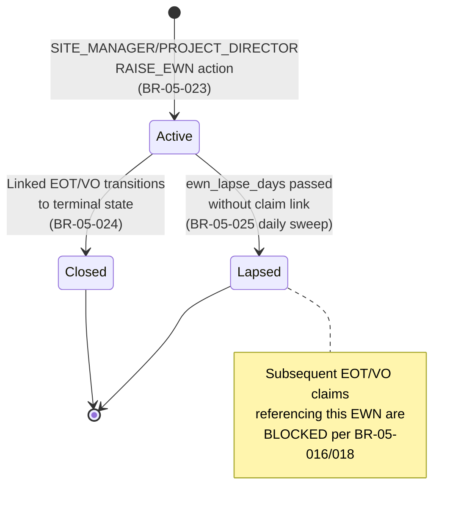

### EOT State Machine

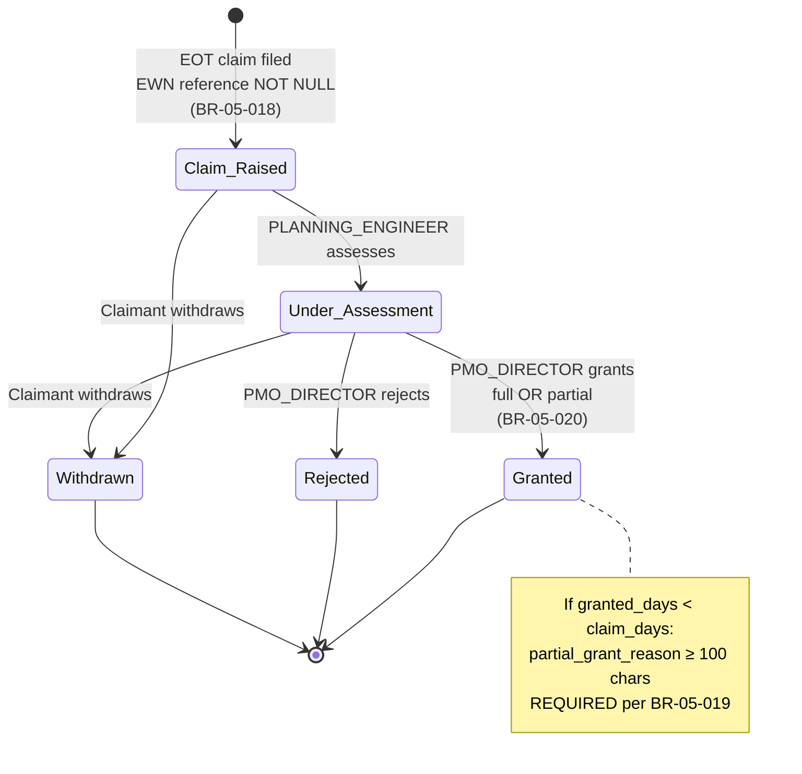

### Runtime Flow

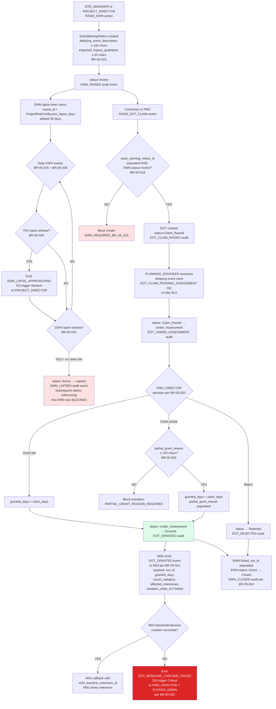

### Audit Events Emitted

| Event | Trigger BR | Severity |
|---|---|---|
| `EWN_RAISED` | BR-05-023 | Info |
| `EWN_CLOSED` | BR-05-024 | Info |
| `EWN_LAPSED` | BR-05-025 | Medium |
| `EOT_CLAIM_RAISED` | BR-05-018 | Info |
| `EOT_UNDER_ASSESSMENT` | (state transition) | Info |
| `EOT_GRANTED` | BR-05-020 + BR-05-021 | High |
| `EOT_REJECTED` | (state transition) | Medium |
| `EOT_BASELINE_CASCADE_FAILED` | BR-05-022 | Critical |

### Decision Queue Triggers Emitted

| Trigger | Severity | Owner | SLA | Source BR |
|---|---|---|---|---|
| `EWN_LAPSE_APPROACHING` | Medium | PROJECT_DIRECTOR | 7 days before lapse | BR-05-026 |
| `EOT_CLAIM_PENDING_ASSESSMENT` | Medium | PLANNING_ENGINEER | 14 days | (Block 4a action SLA) |
| `EOT_BASELINE_CASCADE_FAILED` | Critical | PMO_DIRECTOR + SYSTEM_ADMIN | Real-time | BR-05-022 |

### Cross-Module Events

| Direction | Event | Target | Trigger | Speed |
|---|---|---|---|---|
| OUT | `EOT_GRANTED` | M03 (BaselineExtension creation) | EOT Under_Assessment → Granted | 🔴 Real-time |
| IN | M03 callback `baseline_extension_id` OR cascade failure | M05 | Async after M03 receives EOT_GRANTED | 🔴 Real-time |

---

## WF-05-004 — LD Accrual + NCR→LD Eligibility

> **Decision:** Is the contractor accruing liquidated damages, and which NCRs have been assessed as LD-eligible (with the M04 system-to-system flag write per BR-04-022)?
> **Primary Role:** M05 SYSTEM (NCR signal consumer + daily aging sweep) + FINANCE_LEAD (review LD exposure dashboard).
> **BR Coverage:** BR-05-031 (LD amount calculation + cap), BR-05-032 (Daily NCR aging sweep), BR-05-033 (M05_SYSTEM actor for ld_eligibility_flag write — UI blocked at M04 API), BR-05-034 (LD cap approaching 80% DQ), BR-05-035 (LD cap reached 100% DQ + accrual block).

### NCR→LD Eligibility Flow (System-to-System per BR-04-022)

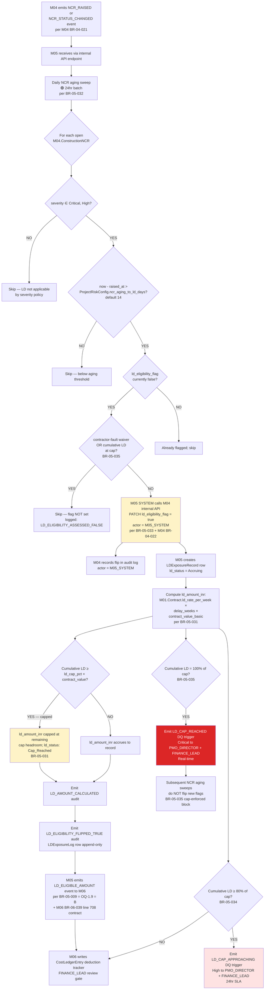

### NCR→LD Eligibility Reversal (per BR-05-013 audited override)

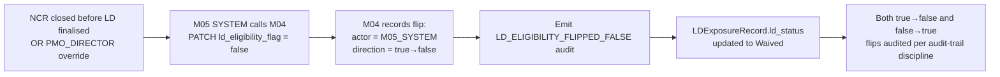

### Audit Events Emitted

| Event | Trigger BR | Severity |
|---|---|---|
| `LD_ELIGIBILITY_FLIPPED_TRUE` | BR-05-032 + BR-05-033 | High |
| `LD_ELIGIBILITY_FLIPPED_FALSE` | BR-05-032 (NCR closed before LD finalised) | Medium |
| `LD_AMOUNT_CALCULATED` | BR-05-031 | Info |
| `LD_CAP_REACHED` | BR-05-035 | Critical |

### Decision Queue Triggers Emitted

| Trigger | Severity | Owner | SLA | Source BR |
|---|---|---|---|---|
| `LD_CAP_APPROACHING` | High | PMO_DIRECTOR + FINANCE_LEAD | 24 hr | BR-05-034 |
| `LD_CAP_REACHED` | Critical | PMO_DIRECTOR + FINANCE_LEAD | 24 hr | BR-05-035 |

### Cross-Module Events

| Direction | Event | Target | Trigger | Speed |
|---|---|---|---|---|
| IN | `NCR_RAISED` / `NCR_STATUS_CHANGED` | M05 | M04 NCR create + status change | 🔴 Real-time (per M04 BR-04-021) |
| OUT | `ld_eligibility_flag = true` (system-to-system) | M04 | NCR aging crosses threshold | 🔴 Real-time (per M04 BR-04-022 + BR-05-033) |
| OUT | `LD_ELIGIBLE_AMOUNT` | M06 | LD eligibility flip true OR cumulative recalc | 🔴 Real-time |

### Failure Modes

| Failure | Behaviour |
|---|---|
| M04 internal API unavailable for `ld_eligibility_flag` write | M05 retries with exponential backoff (5 attempts); after exhaustion raises `LD_FLAG_WRITEBACK_FAILED` DQ Critical |
| UI attempts to set `ld_eligibility_flag` directly via M04 API | M04 API rejects per BR-04-022 (only M05 internal API allowed) |
| Cumulative LD exceeds cap mid-calculation | Cap enforcement clamps to remaining headroom; `LD_CAP_REACHED` DQ fires per BR-05-035 |

---

## WF-05-005 — Contingency Pool Drawdown + Project Activation

> **Decision:** Has a contingency drawdown been formally requested and approved — with the pool balance verified before release and the depletion thresholds enforced?
> **Primary Role:** PROJECT_DIRECTOR or PMO_DIRECTOR (request) → PMO_DIRECTOR (approve; no self-approval per BR-05-028).
> **BR Coverage:** BR-05-001 (Project Activation auto-creates ContingencyPool + ProjectRiskConfig), BR-05-027 (Drawdown create), BR-05-028 (PMO approval no self-approval), BR-05-029 (Pool depletion HIGH 80%), BR-05-030 (Pool depletion CRITICAL 95%), BR-05-030b (CONTINGENCY_DRAWDOWN_GATE_REQUEST to M08).

### Project Activation Sub-Flow (BR-05-001)

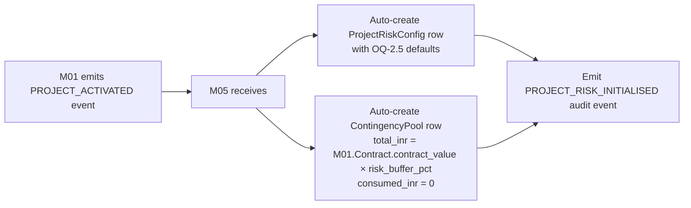

### Drawdown Approval Flow

```mermaid
flowchart TD
    A[PROJECT_DIRECTOR or PMO_DIRECTOR<br/>REQUEST_CONTINGENCY_DRAWDOWN action] --> B{Required fields<br/>per BR-05-027?}
    B -->|missing| C[Block save with reason<br/>FIELDS_MISSING]
    B -->|all present| D{Exactly one of<br/>linked_risk_id /<br/>linked_vo_id /<br/>linked_change_id?<br/>BR-05-027 CHECK constraint}
    D -->|NO — zero or multiple| E[Block save:<br/>EXACTLY_ONE_LINK_REQUIRED]
    D -->|YES — exactly one| F[ContingencyDrawdownLog row<br/>status = Requested<br/>amount_inr > 0<br/>justification ≥ 100 chars]
    F --> G[CONTINGENCY_DRAWDOWN_REQUESTED<br/>audit event]
    G --> H{requested_amount ≤<br/>ContingencyPool.available_inr?}
    H -->|NO| I[Auto-reject:<br/>INSUFFICIENT_BALANCE<br/>status → Rejected]
    H -->|YES| J{Above stage-gate threshold?<br/>BR-05-030b]
    J -->|YES| K[Emit CONTINGENCY_DRAWDOWN_GATE_REQUEST<br/>to M08 stub<br/>per Brief §10 forward constraint]
    J -->|NO| L[Direct to PMO_DIRECTOR approval]
    K --> L
    L --> M[Decision Queue:<br/>CONTINGENCY_DRAWDOWN_APPROVAL_REQUIRED<br/>to PMO_DIRECTOR]
    M --> N{PMO_DIRECTOR review:<br/>BR-05-028 anti-self-approval}
    N --> O{requested_by_user_id ==<br/>approved_by_user_id?}
    O -->|YES — self-approval| P[Block: SELF_APPROVAL_FORBIDDEN<br/>per BR-05-028]
    O -->|NO — different user| Q{PMO_DIRECTOR<br/>decision}
    Q -->|Approve| R[ContingencyDrawdownLog.status<br/>= Approved<br/>approved_by_user_id + approved_at set]
    Q -->|Reject| S[status = Rejected<br/>rejection_reason ≥ 100 chars]
    R --> T[Atomically update:<br/>ContingencyPool.consumed_inr += amount_inr<br/>ContingencyPool.consumed_pct re-derived]
    T --> U[CONTINGENCY_DRAWDOWN_APPROVED audit event]
    U --> V{Check depletion thresholds<br/>per BR-05-029 / BR-05-030}
    V --> W{consumed_pct ≥ 0.80?<br/>BR-05-029}
    W -->|YES| X[Emit CONTINGENCY_POOL_DEPLETION_HIGH<br/>DQ trigger High to PMO_DIRECTOR<br/>24hr SLA]
    V --> Y{consumed_pct ≥ 0.95?<br/>BR-05-030}
    Y -->|YES| Z[Emit CONTINGENCY_POOL_DEPLETION_CRITICAL<br/>DQ trigger Critical to PMO_DIRECTOR<br/>Real-time]
    S --> AA[CONTINGENCY_DRAWDOWN_REJECTED audit]

    style I fill:#fee2e2
    style P fill:#fee2e2
    style R fill:#dcfce7
    style X fill:#fee2e2
    style Z fill:#dc2626,color:#fff
```

### Reversal via Compensating Entry (per M06 precedent)

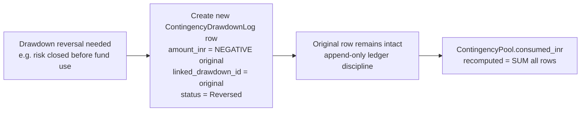

### Audit Events Emitted

| Event | Trigger BR | Severity |
|---|---|---|
| `PROJECT_RISK_INITIALISED` | BR-05-001 | Info |
| `CONTINGENCY_DRAWDOWN_REQUESTED` | BR-05-027 | Info |
| `CONTINGENCY_DRAWDOWN_APPROVED` | BR-05-028 | High |
| `CONTINGENCY_DRAWDOWN_REJECTED` | (state transition) | Medium |

### Decision Queue Triggers Emitted

| Trigger | Severity | Owner | SLA | Source BR |
|---|---|---|---|---|
| `CONTINGENCY_POOL_DEPLETION_HIGH` | High | PMO_DIRECTOR | 24 hr | BR-05-029 |
| `CONTINGENCY_POOL_DEPLETION_CRITICAL` | Critical | PMO_DIRECTOR | Real-time | BR-05-030 |
| `CONTINGENCY_DRAWDOWN_GATE_REQUEST` | (M08-defined) | M08 (when built) | (M08-defined) | BR-05-030b |

### Cross-Module Events

| Direction | Event | Target | Trigger | Speed |
|---|---|---|---|---|
| IN | `PROJECT_ACTIVATED` | M05 | M01 Project state transitions | 🔴 Real-time |
| IN | `M01.Contract.contract_value` + `risk_buffer_pct` | M05 | Read at Activation | 🔴 Real-time |
| OUT | `CONTINGENCY_DRAWDOWN_GATE_REQUEST` | M08 stub (when built) | Drawdown above stage-gate threshold | 🔴 Real-time |

---

## BR Coverage Matrix — M05

Every BR in M05 Spec v1.0 (R33) Block 6 mapped to at least one workflow. **0 coverage gaps.**

| BR Code | BR Summary | WF-05-001 Risk | WF-05-002 VO | WF-05-003 EOT+EWN | WF-05-004 LD | WF-05-005 Contingency |
|---|---|---|---|---|---|---|
| BR-05-001 | Project Activation auto-create | | | | | ✓ |
| BR-05-002 | Risk state machine | ✓ | | | | |
| BR-05-003 | risk_score = P × I | ✓ | | | | |
| BR-05-004 | rag_band derivation 1-4/5-12/13-25 | ✓ | | | | |
| BR-05-005 | READ_ONLY hides numeric scores | ✓ | | | | |
| BR-05-006 | Red band requires response_strategy + 48hr | ✓ | | | | |
| BR-05-007 | ARTA ENUM | ✓ | | | | |
| BR-05-008 | Risk closure (residual ≤ 6 + PMO) | ✓ | | | | |
| BR-05-009 | VO 7-state machine | | ✓ | | | |
| BR-05-010 | VO Draft → Assessed (QS_MANAGER) | | ✓ | | | |
| BR-05-011 | VO Assessed → Submitted + DQ trigger | | ✓ | | | |
| BR-05-012 | VO Submitted → Approved single/dual | | ✓ | | | |
| BR-05-013 | VO Approved → emit VO_APPROVED to M02 | | ✓ | | | |
| BR-05-014 | VO Materialised SYSTEM action | | ✓ | | | |
| BR-05-015 | M02 materialisation failure handling | | ✓ | | | |
| BR-05-016 | EWN required if vo_cause Delay/Scope_Increase | | ✓ | | | |
| BR-05-017 | VO Materialised → emit VO_APPROVED_COST_IMPACT | | ✓ | | | |
| BR-05-018 | EOT requires EWN | | | ✓ | | |
| BR-05-019 | Partial grant requires reason ≥100 chars | | | ✓ | | |
| BR-05-020 | EOT Granted by PMO_DIRECTOR | | | ✓ | | |
| BR-05-021 | EOT_GRANTED → M03 BaselineExtension | | | ✓ | | |
| BR-05-022 | M03 baseline cascade failure | | | ✓ | | |
| BR-05-023 | EWN create min description chars | | | ✓ | | |
| BR-05-024 | EOT/VO references EWN → close | | | ✓ | | |
| BR-05-025 | Daily EWN sweep — Lapsed transition | | | ✓ | | |
| BR-05-026 | EWN sweep — Lapse approaching DQ | | | ✓ | | |
| BR-05-027 | ContingencyDrawdown create | | | | | ✓ |
| BR-05-028 | PMO approval no self-approval | | | | | ✓ |
| BR-05-029 | Pool depletion HIGH 80% | | | | | ✓ |
| BR-05-030 | Pool depletion CRITICAL 95% | | | | | ✓ |
| BR-05-030b | CONTINGENCY_DRAWDOWN_GATE_REQUEST to M08 | | | | | ✓ |
| BR-05-031 | LD amount calculation + cap | | | | ✓ | |
| BR-05-032 | Daily NCR aging sweep | | | | ✓ | |
| BR-05-033 | M05_SYSTEM actor for ld_eligibility_flag | | | | ✓ | |
| BR-05-034 | LD cap approaching 80% DQ | | | | ✓ | |
| BR-05-035 | LD cap reached 100% DQ + accrual block | | | | ✓ | |

**Coverage:** 36 / 36 BR codes covered. **0 gaps.**

---

*v1.0 — Workflows LOCKED 2026-05-04 (Round 36). C1b batch with M13 Workflows. M05 build-ready after this round.*
