# M06 Financial Control — Workflows v1.0

> **Locked from:** Spec v1.0 (Round 24) + Wireframes v1.0 (Round 25).
> **Purpose:** Critical runtime flows with BR + audit-event + Decision-Queue traceability. Every flow ends with a clear decision or state transition.
> **Audit event names:** All references LOCKED in M06 Spec v1.0 Appendix A (43 named events) + X8 v0.6 cascade (12 Decision Queue triggers + 13 new ENUMs). References below are canonical.
> **Speed-tier legend:** T1 (transactional, real-time, single API call) · T2 (event-driven sweep / heavyweight regen) · T3 (daily / hourly batch sweep).

---

## Workflow Index

| ID | Name | Trigger | Primary Role | BRs Referenced | Speed Tier |
|---|---|---|---|---|---|
| WF-06-001 | M06FinancialConfig auto-create + edit | M01 Project → Active OR PMO_DIRECTOR edits config | PMO_DIRECTOR | 045, 046 | T1 |
| WF-06-002 | Budgeted CostLedgerEntry seed | M02 Package created OR `M02_BAC_RECONCILED` event received | System | 001, 002, 003 | T1 |
| WF-06-003 | PurchaseOrder lifecycle (issue / amend / cancel) → Committed CostLedgerEntry | PROCUREMENT_OFFICER drafts/issues/cancels PO | PROCUREMENT_OFFICER → FINANCE_LEAD | 005, 006, 007, 008, 035, 037, 047 | T1 |
| WF-06-004 | Progress-driven RABill generation + approval (dual sign-off) | Period close cron OR explicit user trigger after M04 `BILLING_TRIGGER_READY` events buffer | QS_MANAGER + FINANCE_LEAD | 009, 011, 012, 013, 015, 016, 037, 038 | T1 + T2 |
| WF-06-005 | Milestone-driven RABill generation + approval | M03 `MILESTONE_ACHIEVED_FINANCIAL` event | QS_MANAGER + FINANCE_LEAD | 010, 013, 014, 015, 016, 038 | T1 |
| WF-06-006 | GRN intake from M04 + Accrued CostLedgerEntry | M04 `MATERIAL_GRN_EMITTED` event | System → PROCUREMENT_OFFICER | 017, 035, 037 | T1 |
| WF-06-007 | VendorInvoice intake + 2/3-way match + PMO override | PROCUREMENT_OFFICER / FINANCE_LEAD records invoice | PROCUREMENT_OFFICER → FINANCE_LEAD → PMO_DIRECTOR (override) | 018, 019, 020, 021, 022, 035, 037, 038 | T1 |
| WF-06-008 | PaymentEvidence assembly + handover + Confirmed_Paid (Paid CostLedgerEntry) | FINANCE_LEAD assembles evidence on passing match | FINANCE_LEAD | 023, 024, 002, 047 | T1 |
| WF-06-009 | Retention tranche release (Substantial Completion + DLP End) with dual sign-off | M08 `SG_9_PASSAGE` (tranche 1 — Substantial Completion) + M15 `DLP_RETENTION_RELEASE_ELIGIBLE` & M09 zero-counts (tranche 2 — DLP End, may also accompany M08 `SG_11_PASSAGE`) | FINANCE_LEAD + PMO_DIRECTOR | 026, 027, 028, 029, 030, 044 | T1 + T2 |
| WF-06-010 | Forex rate entry + 24h lock + PMO deviation approval + ForexVariation period-end | Daily RBI seed cron + ad-hoc Bank_Transaction entry + period-end variation sweep | FINANCE_LEAD + PMO_DIRECTOR | 006, 033, 034, 035, 036, 047 | T1 + T2 + T3 |
| WF-06-011 | CashflowForecast regeneration | M03 `reporting_period_type` change OR new Approved progress OR new commitment OR explicit regen | System (FINANCE_LEAD initiates manual) | 040, 041 | T2 |
| WF-06-012 | Capital headroom + cost overrun + payment SLA daily sweeps | T3 daily cron | System | 004, 025, 042, 043 | T3 |
| WF-06-013 | BGStub create + expiry sweeps + M23 migration | FINANCE_LEAD creates BG; daily sweep flips expired; one-shot migration when M23 lands | FINANCE_LEAD; SYSTEM_ADMIN (migration) | 031, 032, 047 | T1 + T3 |
| WF-06-014 | M05 VO_APPROVED_COST_IMPACT + M02 BAC_INTEGRITY + M09 COMPLIANCE_HOLD inbound stubs | Stub event handlers from M05 / M02 / M09 (active when those modules land) | System | 037, 038, 039 | T1 |

**Total workflows: 14.** Coverage proof in matrices at the end.

---

## WF-06-001 — M06FinancialConfig auto-create + edit

**Decision answered:** Are this project's per-tenant financial thresholds configured and PMO-edited with audit?
**Trigger:** (a) M01 emits Project state change to Active; (b) PMO_DIRECTOR edits config in admin UI.
**Primary role:** PMO_DIRECTOR (edit); System (auto-create)
**Secondary roles:** FINANCE_LEAD (read)
**BR coverage:** BR-06-045 (default seed for M01.Contract.dlp_retention_split_pct cascade), BR-06-046 (config edit)
**Speed tier:** T1
**Idempotent:** Yes — uniqueness constraint on (tenant_id, project_id) blocks duplicate auto-create.
**Touches:** M01 (Project state event; Contract default seed), M34 (RBAC PMO_DIRECTOR-only)

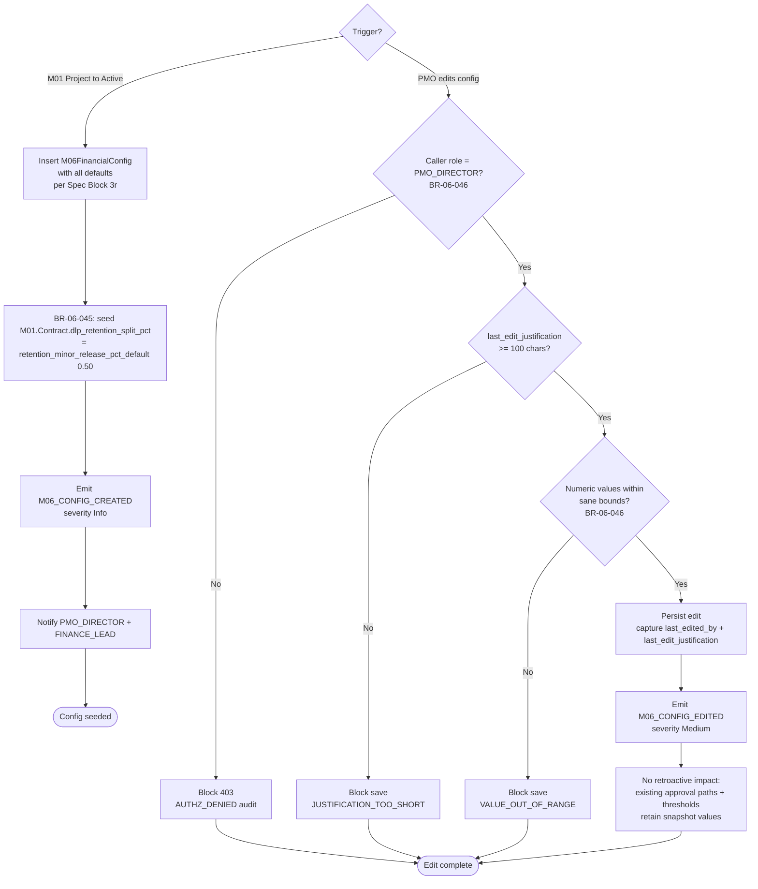

### Step-by-step

1. **Auto-create branch.** On M01 `PROJECT_STATE_CHANGED` (state → Active) event, insert M06FinancialConfig with defaults from Spec Block 3r. Bounded by uniqueness constraint (tenant_id, project_id).
2. **Cascade seed (BR-06-045).** Call M01 internal API to seed `Contract.dlp_retention_split_pct = retention_minor_release_pct_default` (default 0.50) on the project's default Contract row.
3. **Emit `M06_CONFIG_CREATED`** (severity Info). Notify PMO_DIRECTOR + FINANCE_LEAD.
4. **Edit branch (BR-06-046).** Caller must be PMO_DIRECTOR (M34 RBAC). `last_edit_justification ≥ 100 chars`. Numeric bounds: `capital_headroom_*_pct ∈ [0.50, 1.20]`, `payment_sla_warn_days ∈ [1, 90]`, tolerance pcts `∈ [0.0, 0.10]`.
5. **Persist with audit fields.** Set `last_edited_by`, `last_edit_justification`, standard `updated_*`.
6. **Emit `M06_CONFIG_EDITED`** (severity Medium).
7. **No retroactive impact.** Approval paths and thresholds previously snapshotted (e.g., on a Submitted RABill) retain their original values; new threshold applies to subsequent operations only (mirrors M04 WF-04-007).

### Audit events emitted

| Event | When | Severity | Payload |
|---|---|---|---|
| `M06_CONFIG_CREATED` | Auto-create on M01 Active | Info | project_id, defaults snapshot |
| `M06_CONFIG_EDITED` | PMO edit | Medium | project_id, before/after diff, last_edit_justification |
| `AUTHZ_DENIED` (M34 shell) | Non-PMO edit attempt | Medium | actor_id, attempted_field |

### Failure modes

| Failure | Detection | Response |
|---|---|---|
| M01 Project Active event fires twice (network retry) | Uniqueness on (tenant_id, project_id) | Second insert blocked; first persists; idempotent |
| PMO edits config while a RABill Approval is in-flight | `payment_sla_warn_days` and headroom thresholds snapshotted at relevant compute time | Existing in-flight transitions unaffected; new threshold applies forward |
| M01 Contract default seed fails (M01 down) | Async retry queue | Config row persists; cascade retried with backoff |

### Cross-module touches

- **Reads from:** M01 Project + Contract (`is_active=true`).
- **Writes to:** M01 Contract (`dlp_retention_split_pct` seed via internal API).
- **Publishes to:** M11 ActionRegister (notifications), M34 audit shell.

---

## WF-06-002 — Budgeted CostLedgerEntry seed

**Decision answered:** Has the AC backbone for this package been initialised at Budgeted state so funnel maths is well-formed?
**Trigger:** M02 Package INSERT event OR M02 `BAC_RECONCILED` event received.
**Primary role:** System (event-driven; no UI initiation)
**Secondary roles:** FINANCE_LEAD (read)
**BR coverage:** BR-06-001 (state Accrued/Paid require wbs_id), BR-06-002 (state-transition validity), BR-06-003 (BAC integrity warning flag snapshot)
**Speed tier:** T1
**Idempotent:** Yes — composite uniqueness on (tenant_id, project_id, source_entity_type, source_entity_id, state) — repeat M02 events can't re-seed Budgeted for the same Package.
**Touches:** M02 (Package, BAC_INTEGRITY_STATUS via internal API)

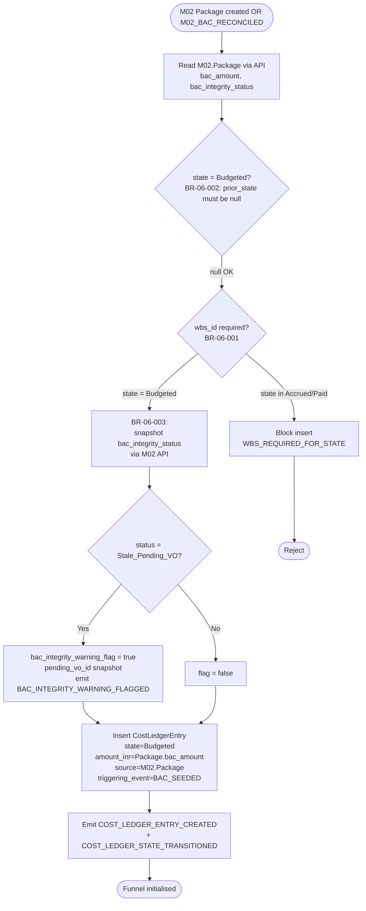

### Step-by-step

1. **Read M02 Package.** `Package.bac_amount`, `Package.bac_integrity_status` via M02 internal API (F-005 — never DB read).
2. **State validation (BR-06-002).** Initial Budgeted entry has `prior_state = null`. Reject any inbound INSERT that violates the transition table.
3. **wbs_id check (BR-06-001).** For Budgeted, wbs_id is optional. (Enforced for Accrued/Paid in WF-06-006 and WF-06-008.)
4. **BAC integrity snapshot (BR-06-003).** Read `Package.bac_integrity_status`; if `Stale_Pending_VO`, set `bac_integrity_warning_flag=true` and copy `pending_vo_id`. **Do not block** (per OQ-1.4=B). Emit `BAC_INTEGRITY_WARNING_FLAGGED`.
5. **INSERT** CostLedgerEntry row with `state=Budgeted`, `amount_inr=Package.bac_amount`, `source_entity_type=M02.Package`, `triggering_event=BAC_SEEDED`.
6. **Emit `COST_LEDGER_ENTRY_CREATED` + `COST_LEDGER_STATE_TRANSITIONED`** (logical alias).

### Audit events emitted

| Event | When | Severity | Payload |
|---|---|---|---|
| `COST_LEDGER_ENTRY_CREATED` | Successful INSERT | Info | entry_id, state, amount_inr, source |
| `COST_LEDGER_STATE_TRANSITIONED` | Logical alias | Info | prior_state=null, new_state=Budgeted |
| `BAC_INTEGRITY_WARNING_FLAGGED` | Stale_Pending_VO at write | Medium | package_id, pending_vo_id |

### Failure modes

| Failure | Detection | Response |
|---|---|---|
| M02 event fires twice (retry) | Composite uniqueness | Second insert blocked; idempotent |
| `Package.bac_integrity_status` read returns API error | Async retry; default flag=false on read fail with warning | Insert proceeds with flag=false; M02 reconcile event will re-flag if needed (BR-06-037, WF-06-014) |
| Package created before M02 confirms BAC | Enforced upstream — M02 only emits after BAC confirmed | Out of scope |

### Cross-module touches

- **Reads from:** M02 (Package, bac_integrity_status).
- **Writes:** CostLedgerEntry (own-module append-only).
- **Publishes:** COST_LEDGER_ENTRY_CREATED → M07 (when built; M07 reads via API per Block 7).

---

## WF-06-003 — PurchaseOrder lifecycle → Committed CostLedgerEntry

**Decision answered:** Is this purchase order issued / amended / cancelled cleanly, with the Committed funnel state recorded (or reversed) and M03 procurement schedule back-filled?
**Trigger:** PROCUREMENT_OFFICER drafts a PO; FINANCE_LEAD or PROCUREMENT_OFFICER issues / cancels.
**Primary role:** PROCUREMENT_OFFICER (Draft → Issued); FINANCE_LEAD (Cancel)
**Secondary roles:** SYSTEM_ADMIN (rare PO amendment audit)
**BR coverage:** BR-06-005, 006, 007, 008, 035 (forex lock check), 037 (BAC integrity flag at Committed write), 047 (document stub)
**Speed tier:** T1
**Idempotent:** Yes for Issued (state-transition guard); No for Draft amendments (each is a distinct audit event).
**Touches:** M01 (Contract), M02 (Package, bac_integrity_status), M03 (ProcurementScheduleItem back-fill), ForexRateMaster (if non-INR)

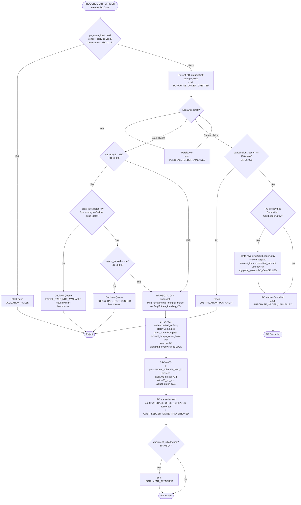

### Step-by-step

1. **Draft create.** PROCUREMENT_OFFICER validates basic fields; persist `status=Draft`, `po_code` auto-generated. Emit `PURCHASE_ORDER_CREATED`.
2. **Draft amendments.** Each pre-Issued edit emits `PURCHASE_ORDER_AMENDED`.
3. **Issue path — forex pre-checks (BR-06-006, BR-06-035).** If `currency_code != INR`, require ForexRateMaster row on/before `issue_date` AND `is_locked=true`. On miss, raise Decision Queue trigger and block.
4. **BAC integrity snapshot (BR-06-037 + BR-06-003).** Call M02 API for Package.bac_integrity_status; on `Stale_Pending_VO` set flag on the Committed CostLedgerEntry.
5. **Committed write (BR-06-007).** Insert CostLedgerEntry `state=Committed`, `prior_state=Budgeted`, `amount_inr` converted to INR via ForexRateMaster if foreign, `source_entity_type=M06.PurchaseOrder`, `triggering_event=PO_ISSUED`. Emit `COST_LEDGER_ENTRY_CREATED` + `COST_LEDGER_STATE_TRANSITIONED`.
6. **M03 back-fill (BR-06-005).** If `procurement_schedule_item_id` set, call M03 internal API: `actual_order_date = issue_date`, `m06_po_id = po_id`. Triggers M03 BR-03-022.
7. **Status flip.** PO `status=Issued`.
8. **Document attach (BR-06-047).** If `document_url` JSONB array non-empty, emit `DOCUMENT_ATTACHED`.
9. **Cancel path (BR-06-008).** `cancellation_reason ≥ 100 chars`. If PO had a Committed ledger row, write reversing CostLedgerEntry (negative amount, state=Budgeted). Emit `PURCHASE_ORDER_CANCELLED`.

### Audit events emitted

| Event | When | Severity | Payload |
|---|---|---|---|
| `PURCHASE_ORDER_CREATED` | Draft INSERT and Issued status flip | Info | po_id, po_value_basic, currency_code |
| `PURCHASE_ORDER_AMENDED` | Pre-Issued edit | Info | po_id, before/after diff |
| `PURCHASE_ORDER_CANCELLED` | status=Cancelled with reversing CL | Medium | po_id, cancellation_reason, reversed_amount |
| `COST_LEDGER_ENTRY_CREATED` | Committed write at Issued; Budgeted reversal at Cancel | Info | entry_id, state, source |
| `COST_LEDGER_STATE_TRANSITIONED` | Logical alias | Info | prior_state, new_state |
| `BAC_INTEGRITY_WARNING_FLAGGED` | Stale_Pending_VO at PO Issue | Medium | po_id, pending_vo_id |
| `DOCUMENT_ATTACHED` | document_url array populated | Info | po_id, url count |
| **DQ:** `FOREX_RATE_NOT_AVAILABLE` | No rate row for currency | High | po_id, currency_code, issue_date |
| **DQ:** `FOREX_RATE_NOT_LOCKED` | Rate row exists but is_locked=false | High | po_id, rate_id |

### Failure modes

| Failure | Detection | Response |
|---|---|---|
| M03 back-fill API call fails (M03 down) | Async retry queue | PO Issued persists; M03 cascade retried with backoff. PO row unchanged. |
| ForexRateMaster row locked between read and write (race) | Re-read on write tx | If it locked OK during tx → proceed. If raced to unlocked-then-changed (impossible after lock) → reject. |
| Reversal CostLedgerEntry would violate composite uniqueness | Composite key allows because state=Budgeted-reversal coexists with state=Committed for same source | Insert succeeds; net Budgeted = original − committed when both rows summed |
| PO cancelled while RABill drafted against it | RABill creation reads PO.status; rejects if Cancelled | Cancel flow checks for active downstream RABill; warns user before commit |

### Cross-module touches

- **Reads from:** M01 (Contract.gst_rate, payment_credit_days, dlp_retention_split_pct), M02 (Package.bac_integrity_status), M03 (ProcurementScheduleItem.planned_delivery_date), ForexRateMaster (when foreign).
- **Writes to:** M03 (back-fill m06_po_id + actual_order_date).
- **Publishes:** CostLedgerEntry rows → M07; PO state → M10 (when built); DQ trigger → M11.

---

## WF-06-004 — Progress-driven RABill generation + approval (dual sign-off)

**Decision answered:** For each (Package × Period), can a progress-based RABill be generated, signed off by QS + Finance, and recorded as Accrued?
**Trigger:** (a) M04 emits `BILLING_TRIGGER_READY` per BR-04-012 — buffered; (b) Period close cron (or explicit user trigger) consumes the buffer per BR-06-009.
**Primary role:** SITE_MANAGER or QS_MANAGER (Submit) → QS_MANAGER (Approve QS) → FINANCE_LEAD (Approve Finance)
**Secondary roles:** PMO_DIRECTOR (read), PROJECT_DIRECTOR (read)
**BR coverage:** BR-06-009, 011, 012, 013, 015, 016, 037 (cascade flag), 038 (compliance hold)
**Speed tier:** T2 (period-close generation), T1 (each approval transition)
**Idempotent:** Yes — composite uniqueness on (tenant_id, project_id, package_id, period_start, trigger_source=Progress).
**Touches:** M04 (ProgressEntry, BILLING_TRIGGER_READY event), M02 (BOQItem.actual_rate, WBSNode.bac), M01 (Contract.retention_pct, mobilisation_advance_pct, material_advance_pct, gst_rate), M03 (LookAheadConfig.reporting_period_type), M09 (compliance_hold_flag stub)

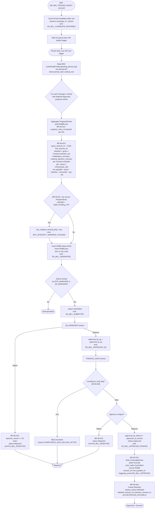

### Step-by-step

1. **Buffer (per Spec Block 4 row).** On every `BILLING_TRIGGER_READY`, insert candidate row keyed on (package_id, period). Emit `RA_BILL_CANDIDATE_BUFFERED`.
2. **Period close trigger.** Cron at period end OR explicit user trigger fires. Read `M03.LookAheadConfig.reporting_period_type` via M03 API per OQ-2.4.
3. **Aggregate (BR-06-012).** For each (package_id, period), assemble RABillLines: one per Approved ProgressEntry; `progress_entry_id` required. Snapshot `unit_rate` from M02.BOQItem.actual_rate; snapshot `pct_complete_approved` from M04.ProgressEntry.
4. **Compute amounts (BR-06-013).** gross_amount_inr = SUM(line_amount_inr); retention = gross × M01.Contract.retention_pct; mobilisation_recovery per M01.Contract.mobilisation_advance_pct schedule; material_advance_recovery per material_advance_pct; gst = gross × M01.Contract.gst_rate; net_payable.
5. **BAC integrity flag (BR-06-011).** If any source ProgressEntry's package is `Stale_Pending_VO`, set RABill.bac_integrity_warning_flag=true. Emit `BAC_INTEGRITY_WARNING_FLAGGED`. **Do not block** (per OQ-1.4=B).
6. **Persist Draft (BR-06-009).** Insert RABill (`status=Draft`, `trigger_source=Progress`, auto-`ra_bill_code`); insert RABillLines. Emit `RA_BILL_GENERATED`.
7. **Submit.** SITE_MANAGER or QS_MANAGER flips `status=Submitted`. Emit `RA_BILL_SUBMITTED`.
8. **QS approval (BR-06-015).** QS_MANAGER approves → set `approved_by_qs`, `approved_at_qs`; emit `RA_BILL_APPROVED_QS`. Reject → `rejection_reason ≥ 50 chars`; emit `RA_BILL_REJECTED`.
9. **Compliance hold (BR-06-038).** Before Finance review, if `compliance_hold_flag=true`, block with `COMPLIANCE_HOLD_BILLING_ACTIVE`. (Stub until M09 lands.)
10. **Finance approval (BR-06-015).** FINANCE_LEAD approves → set `approved_by_finance`, `approved_at_finance`; flip `status=Approved`; emit `RA_BILL_APPROVED_FINANCE`.
11. **Accrued CostLedgerEntry (BR-06-015).** Write CostLedgerEntry `state=Accrued`, `prior_state=Committed`, `wbs_id` populated (per RABillLine wbs_id; one entry per WBS slice), `source=M06.RABill`. Emit `COST_LEDGER_ENTRY_CREATED` + `COST_LEDGER_STATE_TRANSITIONED`.
12. **Withhold retention (BR-06-016).** Create Retention row, `release_status=Withheld`. Emit `RETENTION_WITHHELD`.

### Audit events emitted

| Event | When | Severity |
|---|---|---|
| `RA_BILL_CANDIDATE_BUFFERED` | M04 BILLING_TRIGGER_READY received | Info |
| `RA_BILL_GENERATED` | RABill Draft INSERT | Info |
| `RA_BILL_SUBMITTED` | Draft → Submitted | Info |
| `RA_BILL_APPROVED_QS` | QS signs | Info |
| `RA_BILL_APPROVED_FINANCE` | Finance signs; status=Approved | Info |
| `RA_BILL_REJECTED` | QS or Finance rejects | Medium |
| `BAC_INTEGRITY_WARNING_FLAGGED` | Source progress is Stale_Pending_VO | Medium |
| `COMPLIANCE_HOLD_APPLIED` | M09 hold flag observed at Finance review | High (DQ) |
| `RETENTION_WITHHELD` | Retention row created at Approved | Info |
| `COST_LEDGER_ENTRY_CREATED` | Accrued ledger row at Approved | Info |
| `COST_LEDGER_STATE_TRANSITIONED` | Logical alias | Info |

### Failure modes

| Failure | Detection | Response |
|---|---|---|
| Period close cron runs while M04 still emitting late entries | Buffer accepts late entries until period_end + grace; cron has cutoff | Late entries roll into next period's bill |
| `M01.Contract.retention_pct` updated mid-flight | RABill snapshots at compute time | New rate applies to next bill only |
| Finance approves but Accrued CostLedgerEntry write fails | TX rollback | RABill remains in Submitted+QS-approved; user retries Finance approval |
| Compliance hold cleared between read and write | Re-read flag inside tx | Resolved per latest read; no retroactive Approved blocked |

### Cross-module touches

- **Reads from:** M04 (ProgressEntry), M02 (BOQItem, WBSNode), M01 (Contract), M03 (LookAheadConfig), M09 (compliance_hold_flag stub).
- **Writes:** RABill, RABillLine, RABillAuditLog (each transition), CostLedgerEntry (Accrued), Retention (Withheld).
- **Publishes:** RABill state → M10; Retention created → WF-06-009; DQ COMPLIANCE_HOLD_APPLIED → M11.

---

## WF-06-005 — Milestone-driven RABill generation + approval

**Decision answered:** When a Financial milestone is achieved in M03, can a milestone-tranche RABill be generated, signed off, and accrued?
**Trigger:** M03 emits `MILESTONE_ACHIEVED_FINANCIAL` for `Milestone.milestone_type=Financial AND status=Achieved`.
**Primary role:** System (auto-generate Draft) → QS_MANAGER (Approve QS) → FINANCE_LEAD (Approve Finance)
**Secondary roles:** PMO_DIRECTOR (read)
**BR coverage:** BR-06-010, 013, 014, 015, 016, 038
**Speed tier:** T1
**Idempotent:** Yes — composite uniqueness on (tenant_id, project_id, package_id, period_start, trigger_source=Milestone) plus `triggering_milestone_id` non-null.
**Touches:** M03 (Milestone), M01 (Contract.payment_terms milestone-tranche schedule)

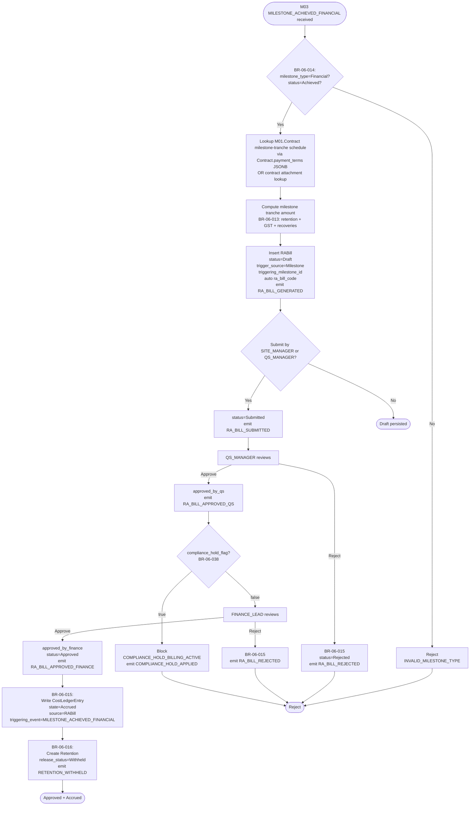

### Step-by-step

1. **Validate (BR-06-014).** Inbound event must reference a Milestone with `milestone_type=Financial AND status=Achieved`.
2. **Lookup tranche.** Read `M01.Contract.payment_terms` JSONB (or attachment) for the milestone tranche amount. RABill has no progress lines (line constructed from milestone tranche).
3. **Compute (BR-06-013).** retention, mobilisation_recovery (typically zero on milestone bills), material_advance_recovery, gst, net_payable.
4. **Persist Draft (BR-06-010).** Insert RABill (`trigger_source=Milestone`, `triggering_milestone_id`). Emit `RA_BILL_GENERATED`.
5. **Submit + QS Approve (BR-06-015).** Same as WF-06-004 steps 7–8.
6. **Compliance hold check (BR-06-038).** Same as WF-06-004 step 9.
7. **Finance Approve (BR-06-015).** Same as WF-06-004 step 10.
8. **Accrued + Retention withhold (BR-06-015, 016).** Same as WF-06-004 steps 11–12.

### Audit events emitted

| Event | When | Severity |
|---|---|---|
| `RA_BILL_GENERATED` | Milestone-trigger Draft INSERT | Info |
| `RA_BILL_SUBMITTED` / `RA_BILL_APPROVED_QS` / `RA_BILL_APPROVED_FINANCE` / `RA_BILL_REJECTED` | Each transition | Info / Medium |
| `COMPLIANCE_HOLD_APPLIED` | Hold blocks Finance approval | High (DQ) |
| `RETENTION_WITHHELD` | Retention row created | Info |
| `COST_LEDGER_ENTRY_CREATED` + `COST_LEDGER_STATE_TRANSITIONED` | Accrued written | Info |

### Failure modes

| Failure | Detection | Response |
|---|---|---|
| M03 emits achievement for non-Financial milestone | BR-06-014 reject at validate | No RABill created; warn caller |
| Milestone tranche schedule absent in Contract | Lookup returns null | RABill blocked; PMO_DIRECTOR notified to add tranche to Contract |
| Two milestones achieved same period (rare) | Composite uniqueness on (..., period_start, trigger_source=Milestone) violated | Second triggers an additional RABill row in next period OR is rejected per uniqueness — Spec Block 3d note. Exception path raises Decision Queue. |

### Cross-module touches

- **Reads from:** M03 (Milestone), M01 (Contract.payment_terms), M09 (compliance flag).
- **Writes:** RABill, RABillLine, RABillAuditLog, CostLedgerEntry (Accrued), Retention (Withheld).

---

## WF-06-006 — GRN intake from M04 + Accrued CostLedgerEntry (material path)

**Decision answered:** When materials are received against a PO, is the GRN row persisted, linked to the PO, and the Accrued state recorded?
**Trigger:** M04 emits `MATERIAL_GRN_EMITTED` (per BR-04-028).
**Primary role:** System (event-driven); PROCUREMENT_OFFICER (manual PO linkage when auto-resolution fails)
**Secondary roles:** FINANCE_LEAD (review)
**BR coverage:** BR-06-017, 035 (forex check on Accrued), 037 (BAC integrity flag)
**Speed tier:** T1
**Idempotent:** Yes — composite uniqueness on (tenant_id, m04_receipt_id) blocks re-creation; subsequent identical events are no-ops.
**Touches:** M04 (MaterialReceipt — qc_decision ∈ {Accepted, Conditional_Acceptance}), M02 (Package, BOQItem rate fallback), M03 (ProcurementScheduleItem.unit_rate)

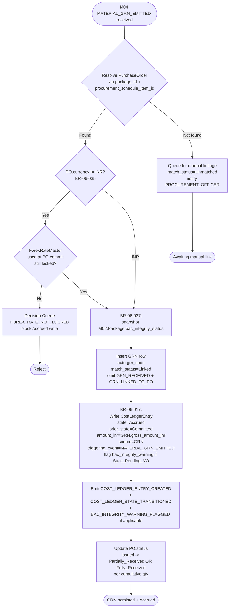

### Step-by-step

1. **PO resolution.** Resolve PurchaseOrder via `(package_id, procurement_schedule_item_id)`. On miss, queue for manual linkage by PROCUREMENT_OFFICER (`match_status=Unmatched`).
2. **Forex check (BR-06-035).** If PO currency != INR, the ForexRateMaster row used at the PO's Committed write must still be locked. Otherwise raise DQ `FOREX_RATE_NOT_LOCKED`.
3. **BAC integrity snapshot (BR-06-037).** Read `Package.bac_integrity_status`; flag if `Stale_Pending_VO`.
4. **Insert GRN.** Auto `grn_code`; mirror M04 fields; `match_status=Linked`. Emit `GRN_RECEIVED` + `GRN_LINKED_TO_PO`.
5. **Accrued write (BR-06-017).** CostLedgerEntry `state=Accrued`, `prior_state=Committed`, `wbs_id` from M03 ProcurementScheduleItem (or PO line), `source=M06.GRN`, `triggering_event=MATERIAL_GRN_EMITTED`. Emit `COST_LEDGER_ENTRY_CREATED` + `COST_LEDGER_STATE_TRANSITIONED`. Emit `BAC_INTEGRITY_WARNING_FLAGGED` if flag set.
6. **PO status update.** PO.status flips Issued → Partially_Received or Fully_Received based on cumulative GRN quantity vs PO line quantity.

### Audit events emitted

| Event | When | Severity |
|---|---|---|
| `GRN_RECEIVED` | INSERT GRN | Info |
| `GRN_LINKED_TO_PO` | Auto-resolved PO link | Info |
| `COST_LEDGER_ENTRY_CREATED` | Accrued write | Info |
| `COST_LEDGER_STATE_TRANSITIONED` | Logical alias | Info |
| `BAC_INTEGRITY_WARNING_FLAGGED` | Stale_Pending_VO at write | Medium |
| **DQ:** `FOREX_RATE_NOT_LOCKED` | Forex pre-condition fail | High |

### Failure modes

| Failure | Detection | Response |
|---|---|---|
| M04 receipt has qc_decision=Rejected | M04 BR-04-029 forbids GRN emit | No event reaches M06; out of scope |
| PO is Cancelled when GRN arrives | Resolve step finds PO but status=Cancelled | Reject + DQ; M04 must reverse receipt |
| GRN duplicate event (M04 retry) | Composite uniqueness on m04_receipt_id | Idempotent; second insert blocked |

### Cross-module touches

- **Reads from:** M04 (MaterialReceipt), M02 (Package, BOQItem), M03 (ProcurementScheduleItem).
- **Writes:** GRN, CostLedgerEntry (Accrued), PurchaseOrder.status update.
- **Publishes:** Accrued ledger → M07.

---

## WF-06-007 — VendorInvoice intake + 2/3-way match + PMO override

**Decision answered:** Does this vendor invoice match the PO + GRN within tolerance, and if not, is a PMO override applied?
**Trigger:** PROCUREMENT_OFFICER or FINANCE_LEAD records VendorInvoice receipt.
**Primary role:** PROCUREMENT_OFFICER (intake) → System (auto-match) → PMO_DIRECTOR (override on fail)
**Secondary roles:** FINANCE_LEAD (review match outcome)
**BR coverage:** BR-06-018, 019, 020, 021, 022, 035 (forex), 037 (flag), 038 (compliance hold)
**Speed tier:** T1
**Idempotent:** Yes — invoice_id unique 1:1 with InvoiceMatchResult.
**Touches:** M01 (Party — vendor identity), M02 (BOQItem.actual_rate), M09 (compliance hold stub)

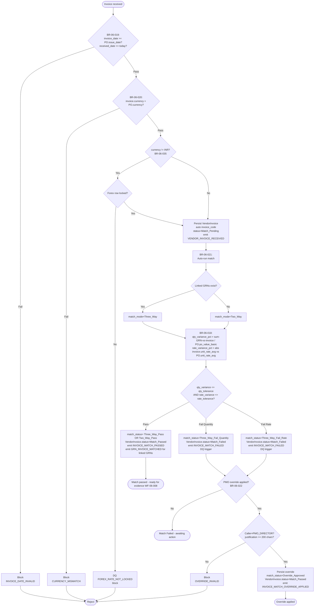

### Step-by-step

1. **Date validation (BR-06-019).** `invoice_date ≥ PO.issue_date AND received_date ≥ invoice_date AND received_date ≤ today`.
2. **Currency match (BR-06-020).** `invoice.currency_code = PO.currency_code`.
3. **Forex pre-check (BR-06-035).** If non-INR, ForexRateMaster row must be locked.
4. **Persist invoice.** `status=Match_Pending`, auto `invoice_code`. Emit `VENDOR_INVOICE_RECEIVED`.
5. **Auto-run match (BR-06-021).** `match_mode=Three_Way` if linked GRNs exist; else `Two_Way`.
6. **Compute variances (BR-06-018).** `qty_variance_pct = (sum(GRN.gross_amount_inr) − invoice.gross_amount_inr)/PO.po_value_basic`; `rate_variance_pct = abs((invoice.unit_rate_avg − PO.unit_rate_avg)/PO.unit_rate_avg)`. Compare to `M06FinancialConfig.invoice_match_qty_tolerance_pct` (0.02) and `invoice_match_rate_tolerance_pct` (0.005).
7. **Pass path.** `match_status` = `Three_Way_Pass` / `Two_Way_Pass`; VendorInvoice.status=`Match_Passed`. Emit `INVOICE_MATCH_PASSED`. For each linked GRN, set `match_status=Matched` and emit `GRN_INVOICE_MATCHED`.
8. **Fail path.** `match_status=Three_Way_Fail_Quantity` or `Three_Way_Fail_Rate`. VendorInvoice.status=`Match_Failed`. Emit `INVOICE_MATCH_FAILED` (DQ trigger).
9. **PMO override (BR-06-022).** Caller=PMO_DIRECTOR; `pmo_override_justification ≥ 200 chars`; only allowed when `match_status ∈ {Three_Way_Fail_Quantity, Three_Way_Fail_Rate}`. Persist override; flip `match_status=Override_Approved`; flip VendorInvoice.status=Match_Passed. Emit `INVOICE_MATCH_OVERRIDE_APPLIED`.

### Audit events emitted

| Event | When | Severity |
|---|---|---|
| `VENDOR_INVOICE_RECEIVED` | Invoice INSERT | Info |
| `INVOICE_MATCH_PASSED` | Pass match | Info |
| `INVOICE_MATCH_FAILED` | Fail match (DQ trigger) | High |
| `INVOICE_MATCH_OVERRIDE_APPLIED` | PMO override | High |
| `GRN_INVOICE_MATCHED` | Per-GRN flag flip on Pass | Info |

### Failure modes

| Failure | Detection | Response |
|---|---|---|
| Vendor sends invoice for partially-received PO with all qty | qty_variance fails; match_status=Three_Way_Fail_Quantity | DQ; PMO can override OR procurement re-checks GRN |
| Same vendor_invoice_number sent twice (duplicate) | Uniqueness on (project_id, vendor_party_id, vendor_invoice_number) | Reject second |
| GRN linked AFTER invoice received (order race) | Match re-run can be triggered by PROCUREMENT_OFFICER on GRN link | Two_Way → Three_Way upgrade re-run |
| Compliance hold prevents downstream evidence (BR-06-038) | Flag on VendorInvoice.compliance_hold_flag | Match still computed; evidence assembly blocked in WF-06-008 |

### Cross-module touches

- **Reads from:** M01 (Party for vendor identity), M02 (BOQItem.actual_rate), M09 (compliance hold), ForexRateMaster.
- **Writes:** VendorInvoice, InvoiceMatchResult, GRN.match_status update.
- **Publishes:** INVOICE_MATCH_FAILED → M11 (DQ); state → M10.

---

## WF-06-008 — PaymentEvidence assembly + handover + Confirmed_Paid

**Decision answered:** Has the payment evidence bundle been assembled, handed to external accounting, and confirmed paid (Paid CostLedgerEntry written)?
**Trigger:** FINANCE_LEAD initiates evidence assembly on a passing match; later flips Confirmed_Paid manually after bank advice receipt.
**Primary role:** FINANCE_LEAD (entire flow)
**Secondary roles:** PMO_DIRECTOR (read), EXTERNAL_AUDITOR (read)
**BR coverage:** BR-06-023, 024, 002 (state-transition validity), 047 (bank debit advice doc stub)
**Speed tier:** T1
**Idempotent:** Yes — evidence_id unique 1:1 with VendorInvoice; PaymentEvidenceLedger captures every transition.
**Touches:** External accounting system (handoff sink — no API contract in v1.0)

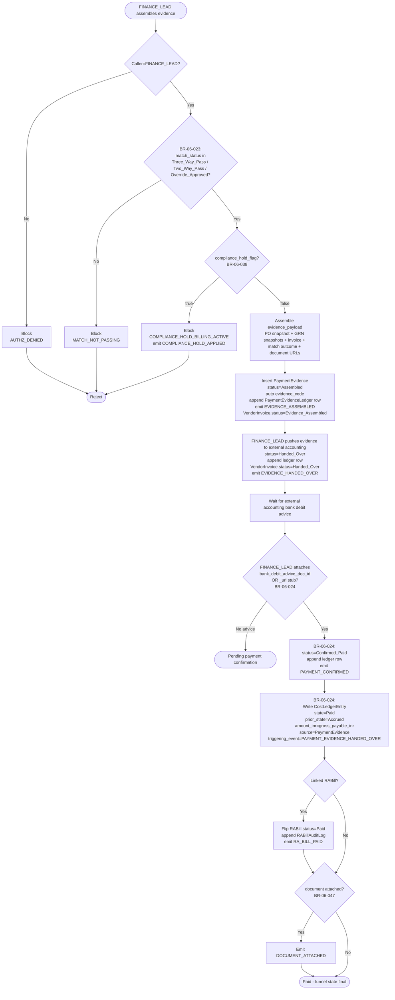

### Step-by-step

1. **RBAC.** Caller must be FINANCE_LEAD.
2. **Match gate (BR-06-023).** `match_result.match_status ∈ {Three_Way_Pass, Two_Way_Pass, Override_Approved}`.
3. **Compliance hold check (BR-06-038).** Block if `compliance_hold_flag=true`.
4. **Bundle.** Snapshot PO + GRN(s) + invoice + match outcome + document URLs into `evidence_payload` JSONB.
5. **Persist Assembled.** Insert PaymentEvidence (`status=Assembled`); append PaymentEvidenceLedger (`event_type=EVIDENCE_ASSEMBLED`). Flip VendorInvoice.status=`Evidence_Assembled`. Emit `EVIDENCE_ASSEMBLED`.
6. **Handover.** FINANCE_LEAD pushes bundle to external accounting system. Flip `status=Handed_Over`; append ledger row (`EVIDENCE_HANDED_OVER`). VendorInvoice.status=`Handed_Over`. Emit `EVIDENCE_HANDED_OVER`.
7. **Confirmed_Paid (BR-06-024).** FINANCE_LEAD attaches `bank_debit_advice_doc_id` (or `_url` stub per OQ-2.5). Flip `status=Confirmed_Paid`; append ledger (`PAYMENT_CONFIRMED`). Manual per OQ-1.7=C — no automation.
8. **Paid CostLedgerEntry (BR-06-024).** Write `state=Paid`, `prior_state=Accrued`, `wbs_id` from invoice line, `source=M06.PaymentEvidence`. Emit `COST_LEDGER_ENTRY_CREATED` + `COST_LEDGER_STATE_TRANSITIONED`.
9. **RABill linkage (if any).** If invoice traces back to an RABill, flip RABill.status=`Paid`; emit `RA_BILL_PAID`.
10. **Document attach (BR-06-047).** Emit `DOCUMENT_ATTACHED` if bank advice URL captured.

### Audit events emitted

| Event | When | Severity |
|---|---|---|
| `EVIDENCE_ASSEMBLED` | Assembled INSERT | Info |
| `EVIDENCE_HANDED_OVER` | Handed_Over flip | Info |
| `PAYMENT_CONFIRMED` | Confirmed_Paid flip | Info |
| `COST_LEDGER_ENTRY_CREATED` | Paid write | Info |
| `COST_LEDGER_STATE_TRANSITIONED` | Logical alias | Info |
| `RA_BILL_PAID` | Linked RABill flipped | Info |
| `DOCUMENT_ATTACHED` | Bank advice URL added | Info |
| `COMPLIANCE_HOLD_APPLIED` | Hold blocks assembly | High (DQ) |

### Failure modes

| Failure | Detection | Response |
|---|---|---|
| External accounting rejects evidence (bad payload) | Manual; no auto-feedback in v1.0 | FINANCE_LEAD edits PaymentEvidence (mutable until Confirmed_Paid); re-handover |
| FINANCE_LEAD flips Confirmed_Paid prematurely (no real bank advice) | Manual integrity; bank advice URL required at flip per BR-06-024 | EXTERNAL_AUDITOR review; edit blocked once Confirmed_Paid (immutable per Spec Block 8b) |
| Race: invoice linked to two RABills (data error) | Single-FK constraint on linked RABill | Schema prevents |

### Cross-module touches

- **Reads from:** VendorInvoice + InvoiceMatchResult + PurchaseOrder + GRN.
- **Writes:** PaymentEvidence, PaymentEvidenceLedger, CostLedgerEntry (Paid), RABill.status (Paid).
- **External:** Hand evidence to external accounting (Tally / SAP / Zoho per OQ-1.7=C; no API contract — manual / documented integration).

---

## WF-06-009 — Retention tranche release (Substantial Completion + DLP End)

**Decision answered:** Are the pre-conditions met to release this retention tranche, and have both signatures been captured for the Released transition?
**Trigger:** (a) M08 emits `SG_9_PASSAGE` (tranche 1 — Substantial / Practical Completion) — stub until M08 lands; (b) M15 emits `DLP_RETENTION_RELEASE_ELIGIBLE` AND M09 zero-counts (tranche 2 — DLP End; M08 also emits `SG_11_PASSAGE` for the gate passage itself) — stubs until those land.
**Primary role:** FINANCE_LEAD (Approved_Finance) → PMO_DIRECTOR (Released)
**Secondary roles:** EXTERNAL_AUDITOR (read)
**BR coverage:** BR-06-026, 027, 028, 029, 030, 044
**Speed tier:** T1 + T2 (event-driven sweeps)
**Idempotent:** Yes — once `release_status=Released`, immutable; tranche %s sum to 1.0 across all rows for (contract, ra_bill).
**Touches:** M08 (`SG_9_PASSAGE` event stub for Substantial Completion + `SG_11_PASSAGE` for DLP End), M15 (DLP defects signal stub), M09 (open non-compliance signal stub), M01 (Contract.dlp_retention_split_pct via M01 v1.3 cascade), Stage Gates SG-9 / SG-11

**Stage Gate Coupling:** M06 consumes **SG-9** (Substantial Completion / Practical Completion gate) and **SG-11** (DLP End / Project Closure gate). M06 does NOT decide gate passage (that's M08); M06 reacts to gate-passage events as eligibility triggers.

```mermaid
flowchart TD
    Start{Trigger?} -->|RABill Approved| Withhold[BR-06-026:<br/>auto-create on RABill Approved<br/>release_status=Withheld<br/>release_type=null<br/>emit RETENTION_WITHHELD]
    Withhold --> Wait[Awaiting eligibility trigger]
    Wait --> SubsPath{SG-9 Passage event<br/>(Substantial Completion)<br/>received from M08?}
    SubsPath -->|Yes| FlipSubs[BR-06-027:<br/>release_type=Substantial_Completion<br/>release_tranche_pct = M01.Contract.dlp_retention_split_pct<br/>release_status=Eligible<br/>eligible_at=now<br/>populate eligibility_basis<br/>emit DLP_RELEASE_PRECONDITION_MET]
    Start -->|DLP_RETENTION_RELEASE_ELIGIBLE from M15<br/>+ M09 zero-counts| DLPCheck{BR-06-028:<br/>M15.open_defect_count=0?<br/>AND M09.open_noncompliance_count=0?}
    DLPCheck -->|Both zero| FlipDLP[release_type=DLP_End<br/>release_tranche_pct = 1.0 - prior released<br/>release_status=Eligible<br/>emit DLP_RELEASE_PRECONDITION_MET]
    DLPCheck -->|Either non-zero| BlockDLP[release_status=Blocked<br/>block_reason >= 100 chars<br/>emit DLP_RELEASE_PRECONDITION_BLOCKED]
    FlipSubs --> Approve
    FlipDLP --> Approve[FINANCE_LEAD reviews]
    Approve --> FinanceSig{FINANCE_LEAD signs?}
    FinanceSig -->|Yes| ApprFin[approved_by_finance + approved_at_finance<br/>release_status=Approved_Finance]
    FinanceSig -->|Reject| EndRej([Stays Eligible - PMO can override])
    ApprFin --> PMOSig{PMO_DIRECTOR co-signs?<br/>BR-06-029 dual sign-off}
    PMOSig -->|Yes| Released[approved_by_pmo + approved_at_pmo<br/>release_status=Released<br/>released_at=now]
    PMOSig -->|No| EndPending([Awaiting PMO])
    Released --> WriteCL[BR-06-029:<br/>Write CostLedgerEntry<br/>state=Paid<br/>prior_state=Accrued<br/>amount_inr=released_amount_inr<br/>source=Retention<br/>triggering_event=RETENTION_TRANCHE_RELEASED]
    WriteCL --> Emit[Emit RETENTION_TRANCHE_RELEASED<br/>+ COST_LEDGER_ENTRY_CREATED<br/>+ COST_LEDGER_STATE_TRANSITIONED]
    Emit --> EndOK([Tranche released])
    BlockDLP --> OverrideGate{BR-06-030:<br/>PMO override applied?}
    OverrideGate -->|Yes| OverrideValid{Caller=PMO_DIRECTOR?<br/>justification >= 200 chars?}
    OverrideValid -->|Yes| ForceEligible[release_type=PMO_Override<br/>release_status=Eligible<br/>pmo_override_applied=true<br/>emit DLP_RELEASE_PMO_OVERRIDE]
    OverrideValid -->|No| BlockOR[Block<br/>OVERRIDE_INVALID]
    OverrideGate -->|No| StaleSweep[BR-06-044:<br/>T3 daily sweep checks Eligible-stale<br/>>retention_release_stale_days days]
    ForceEligible --> Approve
    StaleSweep --> EndStale([Stale DQ raised])
    BlockOR --> EndErr([Reject])
```

### Step-by-step

1. **Withhold (BR-06-026).** Auto-create on RABill Approved (per WF-06-004 step 12 / WF-06-005 step 8). `release_status=Withheld`, `release_type=null`. Emit `RETENTION_WITHHELD`.
2. **Substantial completion eligibility (BR-06-027).** On M08 `SG_9_PASSAGE` event (stub): set `release_type=Substantial_Completion`, `release_tranche_pct=M01.Contract.dlp_retention_split_pct` (default 0.50 — KDMC = ₹1.71 Cr at SG-9), `release_status=Eligible`, populate `eligibility_basis = {sg9_passed:true, sg11_passed:false, m15_open_defects:n/a, m09_open_noncompliance:n/a}`. Emit `DLP_RELEASE_PRECONDITION_MET`.

   *Stage Gate coupling:* SG-9 = Substantial / Practical Completion. M06 reads passage signal; in v1.0 stub period, the trigger is a manual M08 stub event posted to `POST /api/m06/v1/events/sg9-passage`.
3. **DLP-end eligibility (BR-06-028).** On M15 `DLP_RETENTION_RELEASE_ELIGIBLE` event AND M09 zero-counts: validate `M15.open_defect_count=0 AND M09.open_noncompliance_count=0`. On pass: set `release_type=DLP_End`, `release_tranche_pct=(1.0 − prior_released_pct)`, `release_status=Eligible`. On fail: `release_status=Blocked`, `block_reason ≥ 100 chars`. Emit `DLP_RELEASE_PRECONDITION_MET` or `DLP_RELEASE_PRECONDITION_BLOCKED`.

   *Stage Gate coupling:* SG-11 = DLP End / Project Closure.
4. **Finance approval.** FINANCE_LEAD signs; set `approved_by_finance`, `approved_at_finance`; `release_status=Approved_Finance`.
5. **PMO co-sign (BR-06-029 — dual sign-off per OQ-1.8=C).** PMO_DIRECTOR co-signs; set `approved_by_pmo`, `approved_at_pmo`; `release_status=Released`, `released_at=now`.
6. **Paid CostLedgerEntry (BR-06-029).** Write `state=Paid`, `prior_state=Accrued`, `source=M06.Retention`, `triggering_event=RETENTION_TRANCHE_RELEASED`. Emit `RETENTION_TRANCHE_RELEASED` + `COST_LEDGER_ENTRY_CREATED` + `COST_LEDGER_STATE_TRANSITIONED`.
7. **PMO override (BR-06-030).** When pre-conditions blocked, PMO can force release: `pmo_override_applied=true`, `pmo_override_justification ≥ 200 chars`, `release_type=PMO_Override`, `release_status=Eligible`. Emit `DLP_RELEASE_PMO_OVERRIDE`. Then proceeds through standard Finance + PMO sign-off.
8. **Stale check (BR-06-044).** T3 daily sweep: for Retention rows in `Eligible` for more than `M06FinancialConfig.retention_release_stale_days` (default 30): DQ `RETENTION_RELEASE_BLOCKED_DLP` severity Medium.

### Audit events emitted

| Event | When | Severity |
|---|---|---|
| `RETENTION_WITHHELD` | Auto-create on RABill Approved | Info |
| `DLP_RELEASE_PRECONDITION_MET` | Eligibility flip Substantial / DLP_End | Info |
| `DLP_RELEASE_PRECONDITION_BLOCKED` | DLP_End fails open-counts check | Medium |
| `DLP_RELEASE_PMO_OVERRIDE` | PMO override applied | High |
| `RETENTION_TRANCHE_RELEASED` | Released transition | Info |
| `COST_LEDGER_ENTRY_CREATED` + `COST_LEDGER_STATE_TRANSITIONED` | Paid ledger write | Info |
| **DQ:** `RETENTION_RELEASE_BLOCKED_DLP` | Stale Eligible | Medium |

### Failure modes

| Failure | Detection | Response |
|---|---|---|
| M08 / M15 / M09 not yet built | Stub endpoints documented per Spec Block 7; events queue | Manual eligibility flip allowed by PMO_DIRECTOR via override path |
| FINANCE_LEAD signs but PMO doesn't act for >30 days | BR-06-044 stale sweep | DQ raised; PMO escalation |
| Tranche pct sum exceeds 1.0 (data error) | App-layer guard in BR-06-029 | Reject; warn integrity error |
| Sign-off race (FINANCE + PMO simultaneous) | DB tx serialises; second signer reads latest state | Both signatures captured; no lost updates |

### Cross-module touches

- **Reads from:** M01 (Contract.dlp_retention_split_pct), M08 (`SG_9_PASSAGE` stub for Substantial Completion + `SG_11_PASSAGE` stub for DLP End), M15 (DLP defect count stub), M09 (non-compliance count stub), RABill, BGStub (if BG substitute used per `bg_stub_id`).
- **Writes:** Retention, CostLedgerEntry (Paid).
- **Publishes:** Decision Queue + audit shell.

---

## WF-06-010 — Forex rate entry + 24h lock + PMO deviation approval + ForexVariation period-end

**Decision answered:** Are forex rates entered, locked, deviation-approved (when needed), and is period-end variation computed against open foreign-currency POs?
**Trigger:** (a) Daily 06:00 IST cron seeds RBI_Reference rates; (b) FINANCE_LEAD enters Bank_Transaction rate ad-hoc; (c) hourly lock sweep; (d) period-end variation sweep.
**Primary role:** System (cron); FINANCE_LEAD (Bank_Transaction entry); PMO_DIRECTOR (deviation approval)
**Secondary roles:** EXTERNAL_AUDITOR (read all)
**BR coverage:** BR-06-006 (rate availability — referenced in WF-06-003 too), BR-06-033, 034, 035, 036, 047 (FEMA Form A2 doc stub)
**Speed tier:** T1 (entry + PMO approval) + T2 (period-end variation) + T3 (hourly lock + daily seed)
**Idempotent:** Yes — composite uniqueness on (currency_code, rate_date, rate_tier); ForexRateLog append-only captures every entry/lock/approval.
**Touches:** M06FinancialConfig (forex_deviation_pct, fema_form_a2_threshold_usd), all PurchaseOrder + VendorInvoice + CostLedgerEntry (foreign-currency)

```mermaid
flowchart TD
    Start{Trigger?} -->|Daily 06:00 IST cron| Seed[Fetch RBI ref rates for active currencies<br/>INSERT ForexRateMaster rows<br/>rate_tier=RBI_Reference<br/>actor=SYSTEM<br/>append ForexRateLog<br/>emit FOREX_RATE_ENTERED per row]
    Seed --> EndSeed([Seeded])
    Start -->|FINANCE_LEAD enters Bank_Transaction rate| Manual[FINANCE_LEAD INSERT<br/>rate_tier=Bank_Transaction<br/>source_reference=bank advice]
    Manual --> Threshold{BR-06-034:<br/>deviation vs RBI_Reference for same currency_code+rate_date?<br/>>forex_deviation_pct (default 0.05)?}
    Threshold -->|Yes| FEMACheck{Amount > fema_form_a2_threshold_usd?}
    FEMACheck -->|Yes| ReqDoc[Require fema_form_a2_doc_id<br/>or _url stub<br/>BR-06-047]
    FEMACheck -->|No| RaiseDQ
    ReqDoc --> RaiseDQ[pmo_approval_required=true<br/>raise Decision Queue<br/>FOREX_DEVIATION_APPROVAL<br/>emit FOREX_DEVIATION_REVIEW<br/>severity High]
    Threshold -->|No| InsertNoFEMA[pmo_approval_required=false<br/>append ForexRateLog<br/>emit FOREX_RATE_ENTERED]
    RaiseDQ --> PMOReview[PMO_DIRECTOR reviews]
    PMOReview --> PMODecide{Approve?<br/>change_reason >= 100 chars}
    PMODecide -->|Yes| PMOApprove[BR-06-034:<br/>set pmo_approved_by + pmo_approved_at<br/>append ForexRateLog<br/>emit FOREX_RATE_PMO_APPROVED]
    PMODecide -->|No| EndRej([Reject - rate not used])
    PMOApprove --> InsertNoFEMA
    InsertNoFEMA --> EmitDocStub{document attached?<br/>BR-06-047}
    EmitDocStub -->|Yes| EmitDoc[Emit DOCUMENT_ATTACHED]
    EmitDocStub -->|No| EndEntry([Entered])
    EmitDoc --> EndEntry
    Start -->|Hourly lock sweep| LockSweep[BR-06-033:<br/>For rows where created_at + 24h < now<br/>AND is_locked=false:<br/>set is_locked=true, locked_at=now<br/>append ForexRateLog<br/>emit FOREX_RATE_LOCKED]
    LockSweep --> AppGuard[App-layer guard:<br/>BR-06-035: any UPDATE on rate_to_inr<br/>after lock blocked at API layer]
    AppGuard --> EndLock([Locked])
    Start -->|Period-end variation sweep| Variation[BR-06-036:<br/>For each open PO with currency != INR:<br/>committed_amount_foreign x rate_at_period_end - rate_at_commit<br/>= variation_inr<br/>INSERT ForexVariation row<br/>emit FOREX_VARIATION_COMPUTED]
    Variation --> EndVar([Variation computed])
```

### Step-by-step

1. **Daily RBI seed (BR-06-033 / Block 4 row).** Cron at 06:00 IST: fetch RBI reference rates for active currencies; INSERT ForexRateMaster (`rate_tier=RBI_Reference`, `actor=SYSTEM`); append ForexRateLog (`event_type=FOREX_RATE_ENTERED`); emit `FOREX_RATE_ENTERED` per row.
2. **Bank_Transaction entry by FINANCE_LEAD.** Insert with `source_reference` = bank advice number.
3. **Deviation check (BR-06-034).** Compute deviation against most recent `RBI_Reference` for same `(currency_code, rate_date)`. If deviation > `M06FinancialConfig.forex_deviation_pct` (default 0.05): set `pmo_approval_required=true`; raise DQ `FOREX_DEVIATION_APPROVAL`; emit `FOREX_DEVIATION_REVIEW` (alias to `FOREX_DEVIATION_APPROVAL` per Spec Appendix A).
4. **FEMA evidence (BR-06-047, M06FinancialConfig.fema_form_a2_threshold_usd).** If amount > threshold (default 25,000 USD), require `fema_form_a2_doc_id` (or `_url` stub).
5. **PMO approval (BR-06-034).** Caller=PMO_DIRECTOR; `change_reason ≥ 100 chars`; set `pmo_approved_by`, `pmo_approved_at`; append ForexRateLog (`FOREX_RATE_PMO_APPROVED`).
6. **Hourly lock sweep (BR-06-033).** For rows with `created_at + 24h < now AND is_locked=false`: set `is_locked=true`, `locked_at=now`; append log row (`FOREX_RATE_LOCKED`); emit `FOREX_RATE_LOCKED`.
7. **App-layer guard (BR-06-035).** After `is_locked=true`, API rejects any UPDATE on `rate_to_inr`. The DB-level append-only enforcement applies to `ForexRateLog`; the master row immutability is enforced at app layer per Spec Block 8b.
8. **Period-end variation sweep (BR-06-036).** Quarterly (or per `reporting_period_type`): for each open PO with `currency_code != INR`, compute `variation_inr = committed_amount_foreign × (rate_at_period_end − rate_at_commit)`. Insert ForexVariation row; emit `FOREX_VARIATION_COMPUTED`.
9. **Document attach (BR-06-047).** Emit `DOCUMENT_ATTACHED` when FEMA Form A2 URL captured.

### Audit events emitted

| Event | When | Severity |
|---|---|---|
| `FOREX_RATE_ENTERED` | Daily seed + ad-hoc Bank_Transaction entry | Info |
| `FOREX_RATE_LOCKED` | Hourly sweep flips is_locked | Info |
| `FOREX_RATE_PMO_APPROVED` | PMO approves deviated rate | Medium |
| `FOREX_DEVIATION_REVIEW` | Deviation > threshold (DQ trigger; alias `FOREX_DEVIATION_APPROVAL`) | High |
| `FOREX_VARIATION_COMPUTED` | Period-end variation sweep | Info |
| `DOCUMENT_ATTACHED` | FEMA Form A2 URL captured | Info |
| **DQ:** `FOREX_RATE_NOT_AVAILABLE` (raised by WF-06-003 step 3) | No row for currency at PO Issue | High |
| **DQ:** `FOREX_RATE_NOT_LOCKED` (raised by WF-06-003 / -006 / -007) | Foreign-currency write hits unlocked rate | High |

### Failure modes

| Failure | Detection | Response |
|---|---|---|
| RBI feed unavailable at 06:00 IST | Cron retry at 06:30 / 07:00 IST | Stale rates from prior day used; DQ on prolonged miss |
| FINANCE_LEAD enters wrong rate within 24h | Editable while is_locked=false | Edit re-runs deviation check; ForexRateLog captures every change |
| Lock sweep slow (>1hr) | Monitoring on cron runtime | Manual sweep trigger by SYSTEM_ADMIN; rate stays editable until lock written |
| Period-end variation runs against PO closed mid-period | Filter on PO.status NOT IN (Closed, Cancelled) at sweep time | Closed POs excluded |

### Cross-module touches

- **Reads from:** M06FinancialConfig.
- **Writes:** ForexRateMaster, ForexRateLog (append-only), ForexVariation.
- **Publishes:** Forex DQs to M11; rates consumed by WF-06-003, -006, -007.

---

## WF-06-011 — CashflowForecast regeneration

**Decision answered:** Has the per-WBS-per-period cashflow forecast been atomically recomputed against the latest commitments, accruals, payments, and PV?
**Trigger:** (a) M03 emits `reporting_period_type` change (BR-06-041); (b) Approved progress / commitment / payment changes (debounced); (c) explicit FINANCE_LEAD trigger.
**Primary role:** System (sweep); FINANCE_LEAD (manual trigger)
**Secondary roles:** PMO_DIRECTOR (read), PROJECT_DIRECTOR (read)
**BR coverage:** BR-06-040, 041
**Speed tier:** T2 (heavyweight)
**Idempotent:** Yes — atomic transaction; row-level locks on `(project_id, wbs_id, period_start_date)`; uniqueness constraint blocks duplicates.
**Touches:** M03 (PVProfile, ProcurementScheduleItem, LookAheadConfig.reporting_period_type), M01 (Contract.payment_credit_days), CostLedgerEntry sums

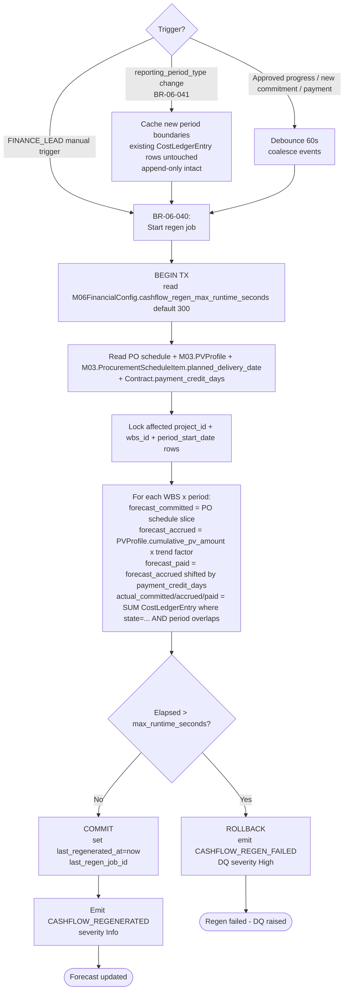

### Step-by-step

1. **Trigger consolidation.** Three trigger sources converge: M03 `reporting_period_type` change (BR-06-041), Approved progress / new PO / new payment (debounced 60s to coalesce), or explicit FINANCE_LEAD manual trigger.
2. **reporting_period_type change handling (BR-06-041).** Cache new boundaries. **Existing CostLedgerEntry rows are NOT mutated** (append-only invariant). Future writes use new boundaries. Emit `CASHFLOW_REGENERATED` after sweep completes.
3. **Begin TX (BR-06-040).** Read `M06FinancialConfig.cashflow_regen_max_runtime_seconds` (default 300).
4. **Read inputs.** PO schedule, M03 PVProfile.cumulative_pv_amount per (WBS × period), M03 ProcurementScheduleItem.planned_delivery_date, M01.Contract.payment_credit_days.
5. **Row-level lock.** Lock affected `(project_id, wbs_id, period_start_date)` rows.
6. **Recompute.**
   - `forecast_committed_inr` = PO schedule slice (planned PO commitments per period).
   - `forecast_accrued_inr` = PVProfile.cumulative_pv_amount × actual-progress trend factor.
   - `forecast_paid_inr` = forecast_accrued shifted forward by Contract.payment_credit_days.
   - `actual_*_inr` = SUM(CostLedgerEntry.amount_inr) per state per period.
7. **Runtime guard.** If elapsed > max_runtime_seconds: ROLLBACK; emit `CASHFLOW_REGEN_FAILED` (DQ trigger, severity High).
8. **Commit.** Set `last_regenerated_at=now`, `last_regen_job_id`. Emit `CASHFLOW_REGENERATED`.

### Audit events emitted

| Event | When | Severity |
|---|---|---|
| `CASHFLOW_REGENERATED` | Successful commit | Info |
| `CASHFLOW_REGEN_FAILED` | Runtime exceeded or commit failed (DQ trigger) | High |

### Failure modes

| Failure | Detection | Response |
|---|---|---|
| Regen runtime exceeded for very-large project (>1080 rows) | max_runtime_seconds guard | ROLLBACK + DQ; PMO can edit M06FinancialConfig to raise budget per BR-06-046 |
| Trigger storm (many events per second) | 60s debounce window | Single regen handles batched changes |
| M03 PVProfile API timeout | Async retry with backoff | Regen aborts; retry in next debounce window |
| Concurrent regen for same project | Row-level locks serialise | Second regen waits |

### Cross-module touches

- **Reads from:** M03 (PVProfile, ProcurementScheduleItem, LookAheadConfig), M01 (Contract.payment_credit_days), CostLedgerEntry (own).
- **Writes:** CashflowForecast (own).
- **Publishes:** CASHFLOW_REGEN_FAILED → M11.

---

## WF-06-012 — Capital headroom + cost overrun + payment SLA daily sweeps

**Decision answered:** Are projects approaching headroom limits, packages over-running cost, or invoices breaching payment SLA?
**Trigger:** T3 daily cron (typically 02:00 IST off-peak).
**Primary role:** System (cron)
**Secondary roles:** FINANCE_LEAD + PMO_DIRECTOR receive resulting Decisions
**BR coverage:** BR-06-004 (capital headroom integrity), BR-06-025 (payment SLA), BR-06-042 (capital headroom advisory), BR-06-043 (cost overrun)
**Speed tier:** T3
**Idempotent:** Yes — DQ trigger creation is keyed on (trigger_type, scope, period); duplicate suppressed within window.
**Touches:** M01 (Project + Contract), M02 (Package.bac_amount), M11 (DQ sink — when built; emits to audit shell + notification queue until then)

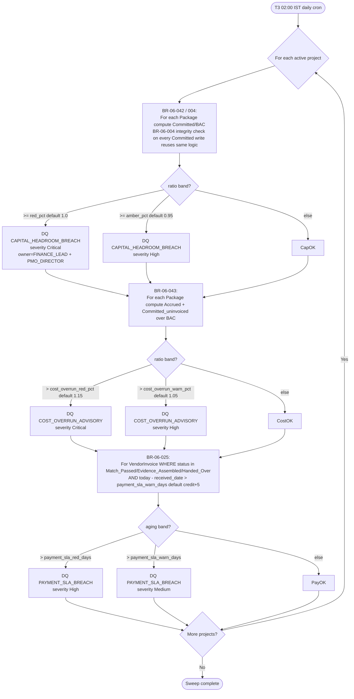

### Step-by-step

1. **Capital headroom (BR-06-042).** Per (project, package): compute `Committed/BAC`. If ≥ `capital_headroom_amber_pct` (default 0.95): DQ `CAPITAL_HEADROOM_BREACH` severity High. If ≥ `capital_headroom_red_pct` (default 1.0): severity Critical. **BR-06-004 reuses same logic** as a real-time integrity check on every Committed write (T2) — when over-committing is forbidden by config.
2. **Cost overrun (BR-06-043).** Per (project, package): compute `(Accrued + Committed_uninvoiced)/BAC`. If > `cost_overrun_warn_pct` (default 1.05): DQ severity High. If > `cost_overrun_red_pct` (default 1.15): severity Critical.
3. **Payment SLA (BR-06-025).** For VendorInvoice WHERE `status ∈ {Match_Passed, Evidence_Assembled, Handed_Over} AND (today − invoice.received_date) > M06FinancialConfig.payment_sla_warn_days`: DQ `PAYMENT_SLA_BREACH` severity Medium. If beyond `payment_sla_red_days`: severity High.

### Audit events emitted (Decision Queue triggers — not separate audit events; they are themselves DQ rows. The audit shell records the DQ creation event under M34 audit conventions.)

| DQ Event | When | Severity |
|---|---|---|
| `CAPITAL_HEADROOM_BREACH` | Amber/Red threshold hit | High / Critical |
| `COST_OVERRUN_ADVISORY` | Warn/Red threshold hit | High / Critical |
| `PAYMENT_SLA_BREACH` | Aging > warn / red days | Medium / High |

### Failure modes

| Failure | Detection | Response |
|---|---|---|
| Sweep runtime > 30min | Monitoring on cron runtime | Split sweep by tenant; defer non-critical projects |
| Threshold edits between sweeps | Snapshot at sweep start | Next sweep picks up new thresholds |
| Same DQ raised twice for same (package, period) | Dedup in DQ table on (trigger_type, scope, period) | Idempotent within 24hr window |

### Cross-module touches

- **Reads from:** M02 (Package.bac_amount), CostLedgerEntry sums, VendorInvoice, M01 (Contract).
- **Writes:** Decision Queue rows + audit shell.

---

## WF-06-013 — BGStub create + expiry sweeps + M23 migration

**Decision answered:** Are bank guarantees tracked for expiry, warned at 90/30/7-day thresholds, and migrated cleanly when M23 lands?
**Trigger:** (a) FINANCE_LEAD creates BG; (b) daily T3 sweeps; (c) one-shot M23 v1.0 migration when M23 lands.
**Primary role:** FINANCE_LEAD (create); System (sweeps); SYSTEM_ADMIN (migration)
**Secondary roles:** PMO_DIRECTOR (read)
**BR coverage:** BR-06-031, 032, 047
**Speed tier:** T1 (create) + T3 (daily sweeps) + T3 one-time (migration)
**Idempotent:** Yes — `bg_number` unique within `(tenant_id, contract_id)`; warning idempotency markers (`expiry_warning_emitted_*`).
**Touches:** M01 (Contract), M23 BGInsuranceTracker (Phase 2), M12 DocumentControl (Phase 2)

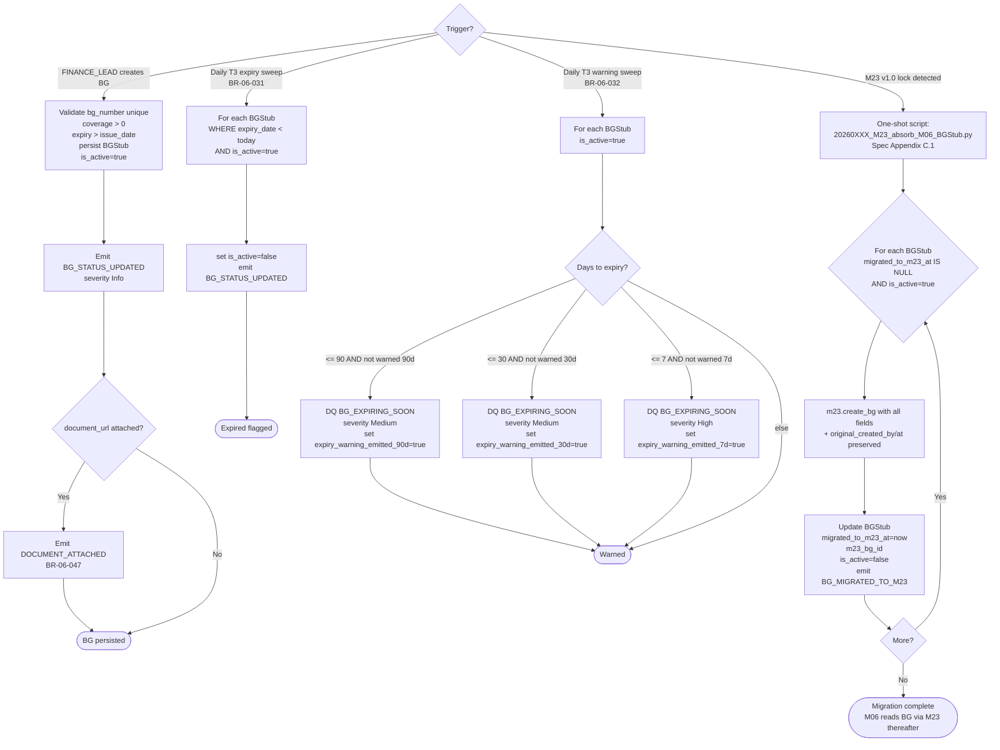

### Step-by-step

**BG create (FINANCE_LEAD):**
1. Validate `bg_number` unique within `(tenant_id, contract_id)`; `coverage_amount_inr > 0`; `expiry_date > issue_date`; `bg_type ∈ BGType ENUM`.
2. Persist BGStub; `is_active=true`. Emit `BG_STATUS_UPDATED`.
3. Document attach (BR-06-047): if `document_url` present, emit `DOCUMENT_ATTACHED`.

**Daily expiry sweep (BR-06-031):**
4. For each BGStub `WHERE expiry_date < today AND is_active=true`: set `is_active=false`. Emit `BG_STATUS_UPDATED`.

**Daily warning sweep (BR-06-032):**
5. For each `is_active=true` BGStub, compute days-to-expiry. At 90/30/7-day thresholds, emit DQ `BG_EXPIRING_SOON` (severity Medium for 90/30; High for 7) and set respective `expiry_warning_emitted_*=true`.

**M23 migration (one-shot — Spec Appendix C.1):**
6. On M23 v1.0 lock detection, run script. For each BGStub `migrated_to_m23_at IS NULL AND is_active=true`, push to M23 preserving original timestamps.
7. Mark `migrated_to_m23_at=now`, `m23_bg_id`, flip `is_active=false` (M23 owns active state thereafter). Emit `BG_MIGRATED_TO_M23`.

**M12 document migration (one-shot — Spec Appendix C.2 — analogous pattern, included here for traceability):**
8. On M12 v1.0 lock detection, run sibling script `20260XXX_M12_absorb_M06_document_urls.py` (Spec Appendix C.2). For each entity row across M06 with `document_url` populated AND `document_id IS NULL` (BGStub, VendorInvoice, PaymentEvidence, ForexRateMaster Bank_Transaction tier, etc.): call `m12.create_document(...)` preserving original `created_by` + `created_at`; populate `document_id = m12.id`; emit `DOCUMENT_MIGRATED_TO_M12` per row. Same SYSTEM_ADMIN-driven one-shot model as the BG migration — pattern-identical, separate concern. Additive safety: keep `document_url` for one cycle; M06 v1.1 cascade post-M12 drops the column (per Spec OQ-2.5 stub-pattern).

### Audit events emitted

| Event | When | Severity |
|---|---|---|
| `BG_STATUS_UPDATED` | Create + auto-flip on expiry | Info |
| `BG_EXPIRING_SOON` | 90/30/7-day warning (DQ trigger) | Medium / High |
| `BG_MIGRATED_TO_M23` | One-shot migration per row | Info |
| `DOCUMENT_ATTACHED` | document_url populated | Info |

### Failure modes

| Failure | Detection | Response |
|---|---|---|
| Sweep misses a day (cron failure) | Idempotency markers re-fire as soon as next sweep runs | Once-per-row guarantee preserved |
| BG renewed (new BG replaces old) | New BG row inserted; old BG's expiry stands; both audit-trailed | No automatic replacement; FINANCE_LEAD manages explicitly |
| M23 migration partial failure | Per-row idempotent — migrated_to_m23_at marker | Re-run script picks up where it left off |
| BG marked claimed (out of v1.0 scope) | Phase 2 / M23 concern | M06 v1.0 doesn't track claim workflow |

### Cross-module touches

- **Reads from:** M01 (Contract).
- **Writes:** BGStub.
- **Migration:** M23 (Phase 2 — Spec Appendix C.1).

---

## WF-06-014 — Inbound stub event handlers (M05 / M02 / M09)

**Decision answered:** When an upstream module emits a financial-impact event, is the M06 ledger / flag updated correctly?
**Trigger:** (a) M05 emits `VO_APPROVED_COST_IMPACT` (when M05 lands); (b) M02 emits `BAC_INTEGRITY_STATUS_CHANGED` (live); (c) M09 emits `COMPLIANCE_HOLD_BILLING` (when M09 lands).
**Primary role:** System (event handlers); FINANCE_LEAD + PMO_DIRECTOR notified
**Secondary roles:** —
**BR coverage:** BR-06-037 (BAC integrity received), BR-06-038 (compliance hold), BR-06-039 (VO approved cost impact)
**Speed tier:** T1
**Idempotent:** Yes — each handler keyed on source event ID; duplicate events suppressed.
**Touches:** M02 BAC integrity status, M05 VO impact (stub), M09 compliance hold (stub)

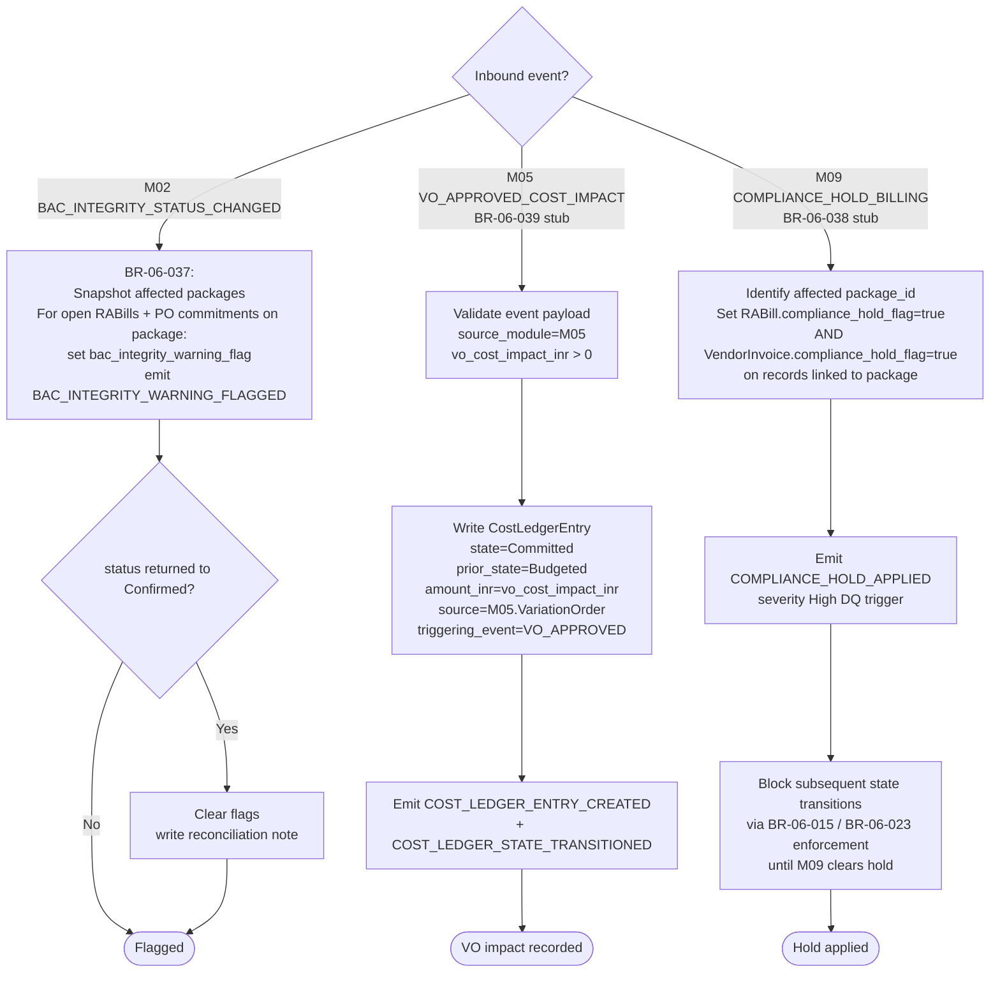

### Step-by-step

**M02 BAC integrity (BR-06-037 — live):**
1. On `BAC_INTEGRITY_STATUS_CHANGED` event from M02: snapshot affected packages.
2. For each open RABill / PO commitment on the package, set `bac_integrity_warning_flag=true` (per OQ-1.4=B). Emit `BAC_INTEGRITY_WARNING_FLAGGED`.
3. On status return to `Confirmed`: clear flags; write reconciliation note in audit log.

**M05 VO approved cost impact (BR-06-039 — stub until M05 builds):**
4. Validate event: `source_module=M05`, `vo_cost_impact_inr > 0`.
5. Write CostLedgerEntry `state=Committed`, `prior_state=Budgeted`, `source_entity_type=M05.VariationOrder`, `triggering_event=VO_APPROVED`. Respects BACIntegrityLedger contract (M02 owns; M06 never DB-reads M02 ledger). Emit `COST_LEDGER_ENTRY_CREATED` + `COST_LEDGER_STATE_TRANSITIONED`.

**M09 compliance hold (BR-06-038 — stub until M09 builds):**
6. Identify affected `package_id`.
7. Set `compliance_hold_flag=true` on RABill rows and VendorInvoice rows linked to the package.
8. Emit `COMPLIANCE_HOLD_APPLIED` (DQ trigger, severity High).
9. Block all subsequent state transitions on those rows (enforced by BR-06-015 in WF-06-004/005 and BR-06-023 in WF-06-008) until M09 clears the hold.

### Audit events emitted

| Event | When | Severity |
|---|---|---|
| `BAC_INTEGRITY_WARNING_FLAGGED` | M02 status change to Stale_Pending_VO | Medium |
| `COST_LEDGER_ENTRY_CREATED` + `COST_LEDGER_STATE_TRANSITIONED` | M05 VO impact recorded | Info |
| `COMPLIANCE_HOLD_APPLIED` | M09 hold flag set (DQ trigger) | High |

### Failure modes

| Failure | Detection | Response |
|---|---|---|
| M05 / M09 not yet built | Stub endpoints documented per Spec Block 7 | Events queue until module lands; M06 v1.0 handler ready |
| M02 status flips back-and-forth rapidly | Idempotent flag write; reconciliation note on each cycle | Audit trail captures full cycle; no double-flag |
| Compliance hold cleared by M09 | Inbound event sets flag=false | RABill / Invoice transitions un-blocked; hold history audited |

### Cross-module touches

- **Reads from:** M02 (BAC_INTEGRITY_STATUS_CHANGED), M05 (VO_APPROVED_COST_IMPACT stub), M09 (COMPLIANCE_HOLD_BILLING stub).
- **Writes:** RABill.bac_integrity_warning_flag, RABill.compliance_hold_flag, VendorInvoice.compliance_hold_flag, CostLedgerEntry (Committed VO).
- **Publishes:** Audit shell + DQ.

---

## Stage Gate Coupling

M06 consumes (does not own) the following Stage Gate signals:

| Gate | Owner | M06 use |
|---|---|---|
| **SG-9 Substantial Completion / Practical Completion** | M08 GateControl (when built) | Trigger for **WF-06-009 step 2** — `release_type=Substantial_Completion` retention tranche becomes Eligible. Stub endpoint: `POST /api/m06/v1/events/sg9-passage` (event name `SG_9_PASSAGE` per audit-corrected naming Round 26). |
| **SG-11 DLP End / Project Closure** | M08 GateControl (when built); M15 HandoverManagement contributes DLP defect signal; M09 ComplianceTracker contributes non-compliance signal | Trigger for **WF-06-009 step 3** — `release_type=DLP_End` retention tranche becomes Eligible only when both M15 + M09 zero-counts confirmed. Stub endpoint: `POST /api/m06/v1/events/dlp-retention-release-eligible`. |

M06 does **not** decide gate passage; it reacts to gate-passage signals as eligibility triggers. PMO override path (BR-06-030) bypasses gate signals when justified.

---

## BR Coverage Matrix

> All 47 M06 BRs covered across 14 workflows. Zero orphans, zero NON_RUNTIME (every BR is runtime per the spec — no DB CHECK constraints carry decision logic). Confirms M06 Spec → Workflows traceability per spec-protocol I5.

| BR | Description (short) | Speed | Workflow(s) covering it |
|---|---|---|---|
| BR-06-001 | CostLedgerEntry: state ∈ {Accrued,Paid} → wbs_id required | T1 | WF-06-002, WF-06-006, WF-06-008 |
| BR-06-002 | CostLedgerEntry: state-transition validity | T1 | WF-06-002, WF-06-003, WF-06-004, WF-06-005, WF-06-006, WF-06-008 (all CL writes) |
| BR-06-003 | BAC integrity warning flag at Budgeted write | T1 | WF-06-002 |
| BR-06-004 | Capital headroom integrity (real-time on Committed write) | T2 | WF-06-012 (logic shared with BR-06-042 sweep; real-time invocation on every Committed via WF-06-003 / WF-06-014 step 5) |
| BR-06-005 | M03 ProcurementScheduleItem back-fill on PO Issued | T1 | WF-06-003 |
| BR-06-006 | PO foreign-currency requires ForexRateMaster row | T1 | WF-06-003, WF-06-010 |
| BR-06-007 | PO Issued → Committed CostLedgerEntry | T1 | WF-06-003 |
| BR-06-008 | PO Cancelled → cancellation_reason ≥100 chars + reversal | T1 | WF-06-003 |
| BR-06-009 | Progress-RABill auto-generation | T2 | WF-06-004 |
| BR-06-010 | Milestone-RABill auto-generation | T1 | WF-06-005 |
| BR-06-011 | RABill BAC integrity flag on Stale_Pending_VO source | T1 | WF-06-004 |
| BR-06-012 | RABillLine progress_entry_id required for Progress trigger | T1 | WF-06-004 |
| BR-06-013 | RABill compute (retention, recoveries, GST) | T1 | WF-06-004, WF-06-005 |
| BR-06-014 | Milestone-RABill triggering_milestone_id required + type=Financial + status=Achieved | T1 | WF-06-005 |
| BR-06-015 | RABill Draft → Submitted → Approved with QS + Finance signatures | T1 | WF-06-004, WF-06-005 |
| BR-06-016 | RABill Approved → withhold Retention | T1 | WF-06-004, WF-06-005 |
| BR-06-017 | M04 GRN_EMITTED → GRN row + Accrued CostLedgerEntry | T1 | WF-06-006 |
| BR-06-018 | InvoiceMatchResult compute + 2/3-way variance | T1 | WF-06-007 |
| BR-06-019 | VendorInvoice date validity | T1 | WF-06-007 |
| BR-06-020 | VendorInvoice currency = PO currency | T1 | WF-06-007 |
| BR-06-021 | Auto-run match on VendorInvoice INSERT | T1 | WF-06-007 |
| BR-06-022 | InvoiceMatchResult PMO override (≥200 chars + Failed states only) | T1 | WF-06-007 |
| BR-06-023 | PaymentEvidence assemble (match must pass) | T1 | WF-06-008 |
| BR-06-024 | PaymentEvidence Confirmed_Paid → Paid CostLedgerEntry | T1 | WF-06-008 |
| BR-06-025 | Payment SLA daily sweep | T3 | WF-06-012 |
| BR-06-026 | Retention auto-create on RABill Approved | T1 | WF-06-004, WF-06-005 (BR-06-016 cascade) + WF-06-009 step 1 |
| BR-06-027 | Substantial completion eligibility on SG-9 passage | T2 | WF-06-009 |
| BR-06-028 | DLP-end eligibility on M15 + M09 zero-counts | T2 | WF-06-009 |
| BR-06-029 | Retention dual sign-off → Released → Paid CostLedgerEntry | T1 | WF-06-009 |
| BR-06-030 | Retention PMO override (≥200 chars) | T1 | WF-06-009 |
| BR-06-031 | BGStub daily expiry sweep | T3 | WF-06-013 |
| BR-06-032 | BGStub expiry warning at 90/30/7 days | T3 | WF-06-013 |
| BR-06-033 | ForexRateMaster 24-hour lock | T2 | WF-06-010 |
| BR-06-034 | Bank_Transaction deviation > threshold → PMO approval | T1 | WF-06-010 |
| BR-06-035 | CostLedgerEntry / VendorInvoice non-INR requires locked rate | T1 | WF-06-003, WF-06-006, WF-06-007, WF-06-010 |
| BR-06-036 | ForexVariation period-end compute | T2 | WF-06-010 |
| BR-06-037 | M02 BAC_INTEGRITY_STATUS_CHANGED received → flag updates | T1 | WF-06-003, WF-06-004, WF-06-006, WF-06-014 |
| BR-06-038 | M09 COMPLIANCE_HOLD_BILLING received → block transitions | T1 | WF-06-004, WF-06-005, WF-06-007, WF-06-008, WF-06-014 |
| BR-06-039 | M05 VO_APPROVED_COST_IMPACT received → Committed CostLedgerEntry | T1 | WF-06-014 |
| BR-06-040 | CashflowForecast atomic regen | T2 | WF-06-011 |
| BR-06-041 | reporting_period_type change → cashflow regen | T2 | WF-06-011 |
| BR-06-042 | Capital headroom advisory daily sweep | T3 | WF-06-012 |
| BR-06-043 | Cost overrun advisory daily sweep | T3 | WF-06-012 |
| BR-06-044 | Retention release stale check | T3 | WF-06-009 |
| BR-06-045 | M01 v1.3 cascade: Contract.dlp_retention_split_pct seed + edit | T1 | WF-06-001 |
| BR-06-046 | M06FinancialConfig edit RBAC + ≥100 chars justification | T1 | WF-06-001 |
| BR-06-047 | Document upload stub (BR-06-047) | T1 | WF-06-003, WF-06-008, WF-06-010, WF-06-013 |

**Lock criterion met:** Every BR appears in ≥ 1 workflow. Zero orphans. Zero NON_RUNTIME exemptions.

---

## Audit Event Coverage Matrix

> All 43 M06 audit events from Spec Appendix A emitted by ≥ 1 workflow. Zero orphans.

| Event Name | Workflow(s) emitting it |
|---|---|
| `COST_LEDGER_ENTRY_CREATED` | WF-06-002, WF-06-003, WF-06-004, WF-06-005, WF-06-006, WF-06-008, WF-06-009, WF-06-014 |
| `COST_LEDGER_STATE_TRANSITIONED` | WF-06-002, WF-06-003, WF-06-004, WF-06-005, WF-06-006, WF-06-008, WF-06-009, WF-06-014 |
| `PURCHASE_ORDER_CREATED` | WF-06-003 |
| `PURCHASE_ORDER_AMENDED` | WF-06-003 |
| `PURCHASE_ORDER_CANCELLED` | WF-06-003 |
| `RA_BILL_CANDIDATE_BUFFERED` | WF-06-004 |
| `RA_BILL_GENERATED` | WF-06-004, WF-06-005 |
| `RA_BILL_SUBMITTED` | WF-06-004, WF-06-005 |
| `RA_BILL_APPROVED_QS` | WF-06-004, WF-06-005 |
| `RA_BILL_APPROVED_FINANCE` | WF-06-004, WF-06-005 |
| `RA_BILL_REJECTED` | WF-06-004, WF-06-005 |
| `RA_BILL_PAID` | WF-06-008 |
| `GRN_RECEIVED` | WF-06-006 |
| `GRN_LINKED_TO_PO` | WF-06-006 |
| `GRN_INVOICE_MATCHED` | WF-06-007 |
| `VENDOR_INVOICE_RECEIVED` | WF-06-007 |
| `INVOICE_MATCH_PASSED` | WF-06-007 |
| `INVOICE_MATCH_FAILED` | WF-06-007 |
| `INVOICE_MATCH_OVERRIDE_APPLIED` | WF-06-007 |
| `EVIDENCE_ASSEMBLED` | WF-06-008 |
| `EVIDENCE_HANDED_OVER` | WF-06-008 |
| `PAYMENT_CONFIRMED` | WF-06-008 |
| `RETENTION_WITHHELD` | WF-06-004, WF-06-005, WF-06-009 |
| `RETENTION_TRANCHE_RELEASED` | WF-06-009 |
| `DLP_RELEASE_PRECONDITION_MET` | WF-06-009 |
| `DLP_RELEASE_PRECONDITION_BLOCKED` | WF-06-009 |
| `DLP_RELEASE_PMO_OVERRIDE` | WF-06-009 |
| `FOREX_RATE_ENTERED` | WF-06-010 |
| `FOREX_RATE_LOCKED` | WF-06-010 |
| `FOREX_RATE_PMO_APPROVED` | WF-06-010 |
| `FOREX_DEVIATION_REVIEW` | WF-06-010 |
| `FOREX_VARIATION_COMPUTED` | WF-06-010 |
| `CASHFLOW_REGENERATED` | WF-06-011 |
| `CASHFLOW_REGEN_FAILED` | WF-06-011 |
| `M06_CONFIG_CREATED` | WF-06-001 |
| `M06_CONFIG_EDITED` | WF-06-001 |
| `BG_STATUS_UPDATED` | WF-06-013 |
| `BG_EXPIRING_SOON` | WF-06-013 |
| `BG_MIGRATED_TO_M23` | WF-06-013 |
| `BAC_INTEGRITY_WARNING_FLAGGED` | WF-06-002, WF-06-003, WF-06-004, WF-06-006, WF-06-014 |
| `COMPLIANCE_HOLD_APPLIED` | WF-06-004, WF-06-005, WF-06-007, WF-06-008, WF-06-014 |
| `DOCUMENT_ATTACHED` | WF-06-003, WF-06-008, WF-06-010, WF-06-013 |
| `DOCUMENT_MIGRATED_TO_M12` | WF-06-013 step 8 (one-shot M12 document migration — same SYSTEM_ADMIN one-shot pattern as BG migration; per-row idempotent; emits per row) |

**Total:** 43 events / 43 emitted. Zero orphans.

---

## Decision Queue Trigger Coverage Matrix

> All 12 M06 Decision Queue triggers from Spec Block 8 / Appendix A raised by ≥ 1 workflow.

| DQ Trigger | Workflow(s) raising it |
|---|---|
| `CAPITAL_HEADROOM_BREACH` | WF-06-012 (and WF-06-003 / WF-06-014 step 5 real-time per BR-06-004 when over-commit forbidden) |
| `COST_OVERRUN_ADVISORY` | WF-06-012 |
| `PAYMENT_SLA_BREACH` | WF-06-012 |
| `INVOICE_MATCH_FAILED` | WF-06-007 |
| `FOREX_DEVIATION_APPROVAL` (alias `FOREX_DEVIATION_REVIEW`) | WF-06-010 |
| `FOREX_RATE_NOT_AVAILABLE` | WF-06-003 |
| `FOREX_RATE_NOT_LOCKED` | WF-06-003, WF-06-006, WF-06-007 |
| `BG_EXPIRING_SOON` | WF-06-013 |
| `RETENTION_RELEASE_BLOCKED_DLP` | WF-06-009 |
| `BAC_INTEGRITY_WARNING` | WF-06-002, WF-06-003, WF-06-004, WF-06-006, WF-06-014 |
| `CASHFLOW_REGEN_FAILED` | WF-06-011 |
| `COMPLIANCE_HOLD_APPLIED` | WF-06-004, WF-06-005, WF-06-007, WF-06-008, WF-06-014 |

**Total:** 12 triggers / 12 raised. Zero orphans.

---

*v1.0 — Workflows DRAFT. M06 FinancialControl pipeline ready for Round 26 audit pass: 14 workflows, 47/47 BRs covered (zero NON_RUNTIME), 43/43 audit events emitted, 12/12 Decision Queue triggers raised, SG-9 + SG-11 stage-gate couplings documented.*
