# M13 — Correspondence & Meeting Register — Workflows v1.0

## CHANGE LOG

| Version | Date | Author | Change Summary |
|---|---|---|---|
| v1.0 | 2026-05-04 | Monish (with Claude assist) | Initial workflows lock (Round 36). 4 workflows covering all M13 Spec v1.0 (R34) BRs. WF-13-001 Correspondence Lifecycle + Site Instruction + Distribution (BR-13-001..008, 022..024); WF-13-002 M05 Trigger + Risk_Noted Promotion + RFI Impact (BR-13-009..012); WF-13-003 Meeting Management + Action Items (BR-13-013..017); WF-13-004 RFI Lifecycle (BR-13-018..021). All Mermaid flowcharts validate. C1b batch with M05 Workflows. |

---

## Purpose

Runtime workflows for M13 Correspondence & Meeting Register. Each Mermaid diagram describes the **runtime behaviour** of a decision-bearing process. Cross-references to BR codes link runtime to the locked specification (M13 Spec v1.0 Block 6).

4 workflows covered:

| # | Workflow | Decision Answered | Primary Role(s) | BR Coverage |
|---|---|---|---|---|
| **WF-13-001** | Correspondence Lifecycle + Site Instruction + Distribution | Has incoming correspondence been acknowledged, responded within contractual timelines, and appropriately escalated where overdue? Are Site Instructions complied with? Are distributions acknowledged? | PROJECT_DIRECTOR (manages) + COMPLIANCE_MANAGER (regulatory) + recipients (acknowledge) | BR-13-001..008, 022..024 |
| **WF-13-002** | M05 Correspondence Trigger + Risk_Noted Promotion + RFI Impact | Has correspondence been correctly flagged as triggering an M05 action (EWN, VO, EOT, Risk)? | PROJECT_DIRECTOR or PMO_DIRECTOR (only roles authorised per BR-13-009) | BR-13-009..012 |
| **WF-13-003** | Meeting Management + Minutes + Action Items | Have meeting minutes been recorded, circulated, and approved with all action items assigned and tracked? | Meeting chairperson + PMO_DIRECTOR/PROJECT_DIRECTOR (approve minutes) | BR-13-013..017 |
| **WF-13-004** | RFI Lifecycle | Has the contractor's RFI received a timely documented response, with cost/design/schedule impact escalated appropriately? | QS_MANAGER + PROJECT_DIRECTOR (respond) + PMO_DIRECTOR (close/reopen) | BR-13-018..021 |

---

## WF-13-001 — Correspondence Lifecycle + Site Instruction + Distribution

> **Decision:** Has incoming correspondence been acknowledged, responded to within contractual timelines, and appropriately escalated where overdue? Are Site Instructions complied with by the deadline? Are distribution recipients acknowledging receipt?
> **Primary Role:** PROJECT_DIRECTOR (manages register) + COMPLIANCE_MANAGER (regulatory subset) + recipients (acknowledge).
> **BR Coverage:** BR-13-001 (Project Activation auto-create config), BR-13-002 (Notice contractual_reference required), BR-13-003 (Site Instruction compliance_deadline required), BR-13-004 (response_required auto-set), BR-13-005 (response_due_date auto-compute), BR-13-006 (Notice SLA Warning sweep), BR-13-007 (Notice SLA Breach sweep), BR-13-008 (Correspondence respond), BR-13-022 (Site Instruction non-compliance sweep), BR-13-023 (Distribution sent event), BR-13-024 (Daily Acknowledgement sweep).

### Project Activation Sub-Flow (BR-13-001)

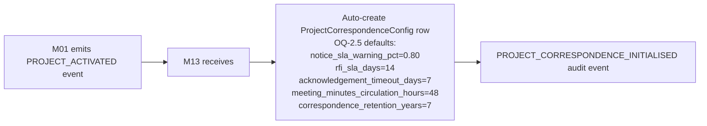

### Correspondence Lifecycle State Machine

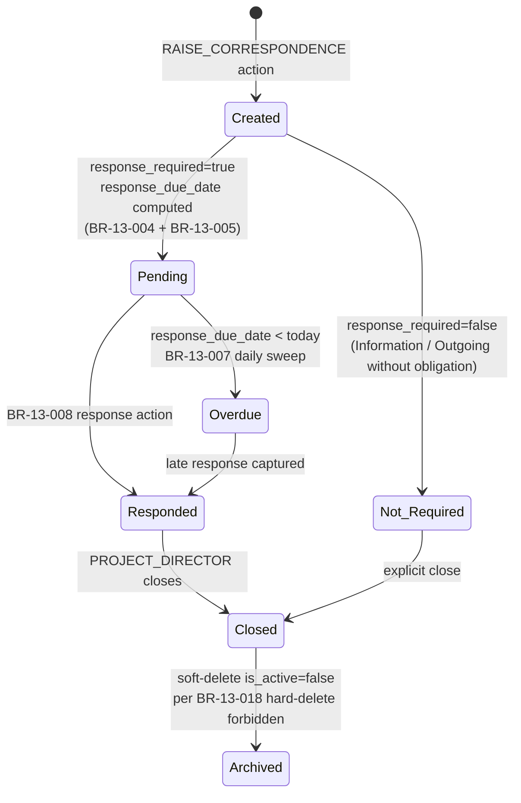

### Runtime Flow

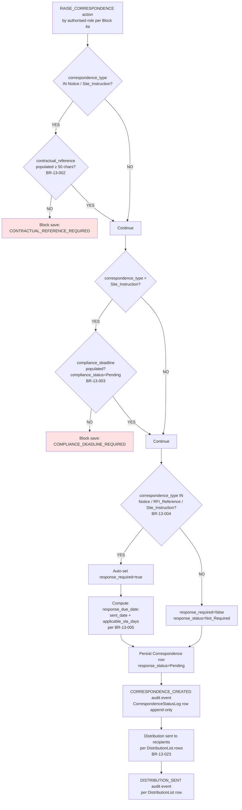

### Notice SLA Sweep (Daily 🟢 24hr — BR-13-006 + BR-13-007)

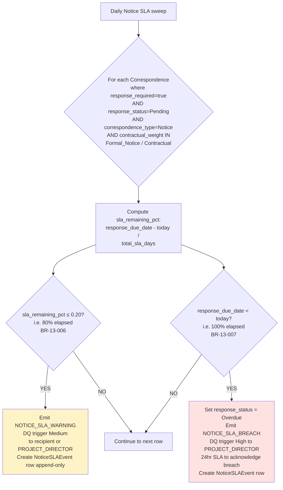

### Correspondence Response (BR-13-008)

```mermaid
flowchart LR
    A[Recipient or PROJECT_DIRECTOR<br/>RESPOND_TO_CORRESPONDENCE action] --> B[Create new Correspondence row<br/>direction = opposite of original<br/>parent_correspondence_id = original.id]
    B --> C{Same parent_correspondence_id<br/>OR original is parent?}
    C -->|NO| D[Block: INVALID_THREAD_LINK]
    C -->|YES| E[Update original Correspondence:<br/>response_status = Responded<br/>responded_at = now<br/>responded_by_user_id = caller<br/>responded_via_correspondence_id = new]
    E --> F[CORRESPONDENCE_RESPONDED audit event]
    F --> G{Was original Overdue?}
    G -->|YES| H[Emit NOTICE_SLA_OVERDUE_RESOLVED<br/>(informational; closes prior breach)]
    G -->|NO| I[Done]
```

### Site Instruction Compliance Sweep (Daily — BR-13-022)

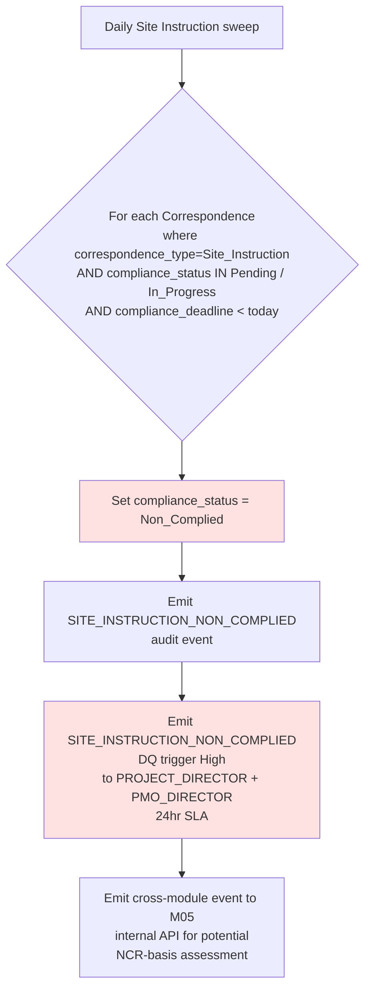

### Daily Acknowledgement Sweep (BR-13-024)

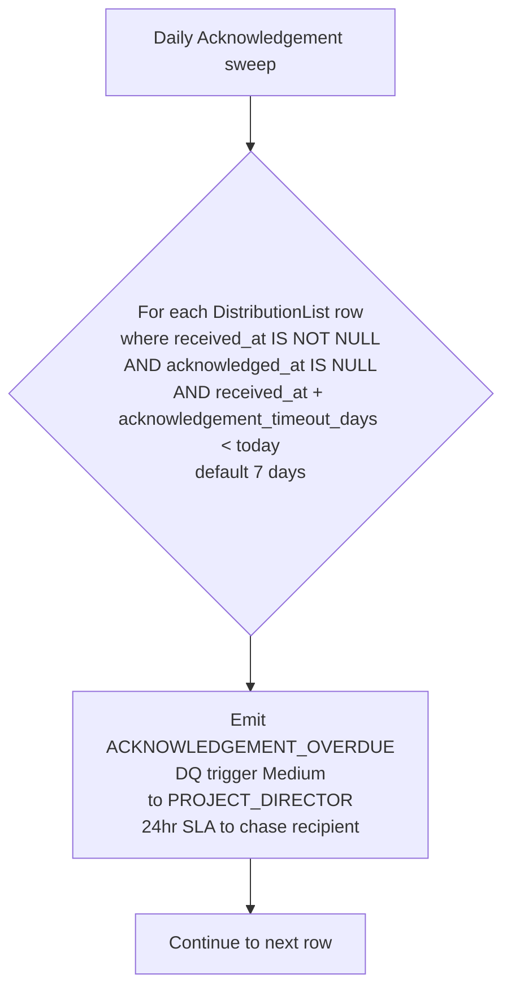

### Audit Events Emitted

| Event | Trigger BR | Severity |
|---|---|---|
| `PROJECT_CORRESPONDENCE_INITIALISED` | BR-13-001 | Info |
| `CORRESPONDENCE_CREATED` | BR-13-002..005 | Info |
| `CORRESPONDENCE_CLASSIFIED` | (type/contractual_weight change) | Info |
| `CORRESPONDENCE_SENT` | (outgoing transmission) | Info |
| `CORRESPONDENCE_RESPONDED` | BR-13-008 | Info |
| `CORRESPONDENCE_ARCHIVED` | (soft-delete) | Info |
| `NOTICE_SLA_WARNING` | BR-13-006 | Medium |
| `NOTICE_SLA_BREACH` | BR-13-007 | High |
| `NOTICE_SLA_OVERDUE_RESOLVED` | (responded after breach) | Info |
| `SITE_INSTRUCTION_NON_COMPLIED` | BR-13-022 | High |
| `DISTRIBUTION_SENT` | BR-13-023 | Info |
| `ACKNOWLEDGEMENT_RECORDED` | (recipient acknowledges) | Info |
| `ACKNOWLEDGEMENT_OVERDUE` | BR-13-024 | Medium |

### Decision Queue Triggers Emitted

| Trigger | Severity | Owner | SLA | Source BR |
|---|---|---|---|---|
| `NOTICE_SLA_WARNING` | Medium | Recipient or PROJECT_DIRECTOR | per remaining window | BR-13-006 |
| `NOTICE_SLA_BREACH` | High | PROJECT_DIRECTOR | 24 hr | BR-13-007 |
| `SITE_INSTRUCTION_NON_COMPLIED` | High | PROJECT_DIRECTOR + PMO_DIRECTOR | 24 hr | BR-13-022 |
| `ACKNOWLEDGEMENT_OVERDUE` | Medium | PROJECT_DIRECTOR | 24 hr | BR-13-024 |

---

## WF-13-002 — M05 Correspondence Trigger + Risk_Noted Promotion + RFI Impact

> **Decision:** Has correspondence been correctly flagged as triggering a formal M05 action (EWN, VO, EOT, or new Risk)? Has a meeting Risk_Noted entry been promoted to M05.Risk?
> **Primary Role:** PROJECT_DIRECTOR or PMO_DIRECTOR (only roles authorised to set `triggers_m05 = true` per BR-13-009).
> **BR Coverage:** BR-13-009 (triggers_m05 RBAC restricted), BR-13-010 (triggers_m05 → emit CORRESPONDENCE_M05_FLAGGED), BR-13-011 (Risk_Noted MinutesEntry → M05.Risk promotion), BR-13-012 (RFI cost/schedule impact → emit RFI_IMPACT_FLAGGED).

### M05 Trigger Flow

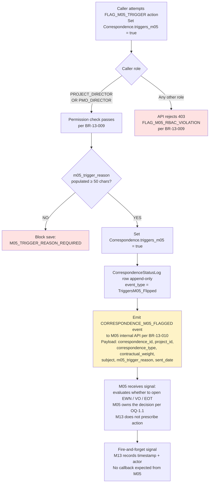

### Risk_Noted Promotion to M05.Risk (BR-13-011)

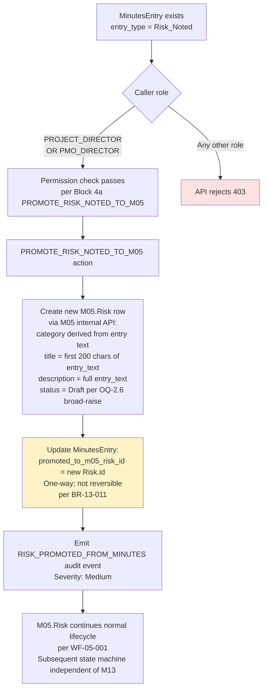

### RFI Impact Cross-Module Flag (BR-13-012)

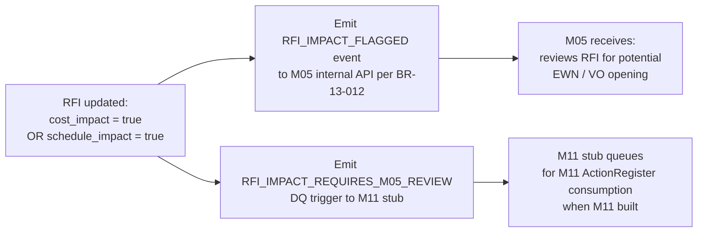

### Audit Events Emitted

| Event | Trigger BR | Severity |
|---|---|---|
| `CORRESPONDENCE_M05_FLAGGED` | BR-13-009 + BR-13-010 | High |
| `RISK_PROMOTED_FROM_MINUTES` | BR-13-011 | Medium |
| `RFI_IMPACT_FLAGGED` | BR-13-012 | High |

### Decision Queue Triggers Emitted

| Trigger | Severity | Owner | SLA | Source BR |
|---|---|---|---|---|
| `RFI_IMPACT_REQUIRES_M05_REVIEW` (informational; routed via M11 stub) | Medium (M05-defined when M05 acts) | M11 → M05 routing | per M11 SLA | BR-13-012 |

### Cross-Module Events

| Direction | Event | Target | Trigger | Speed |
|---|---|---|---|---|
| OUT | `CORRESPONDENCE_M05_FLAGGED` | M05 internal API | Correspondence.triggers_m05 → true | 🔴 Real-time |
| OUT | M05.Risk creation request | M05 internal API | PROMOTE_RISK_NOTED_TO_M05 action | 🔴 Real-time |
| OUT | `RFI_IMPACT_FLAGGED` | M05 internal API | RFI cost_impact OR schedule_impact = true | 🔴 Real-time |

---

## WF-13-003 — Meeting Management + Minutes Approval + Action Items

> **Decision:** Have meeting minutes been recorded, circulated, and approved with all action items assigned and tracked?
> **Primary Role:** Meeting chairperson (drafts minutes) + attendees (review + dispute) + PMO_DIRECTOR / PROJECT_DIRECTOR (approve).
> **BR Coverage:** BR-13-013 (Minutes Approved requires action_item_id populated for all Action entries), BR-13-014 (Auto-create ActionItem from MinutesEntry type=Action), BR-13-015 (Minutes Disputed requires note ≥100 chars), BR-13-016 (Daily ActionItem SLA sweep), BR-13-017 (Meeting minutes circulation timer 48hr).

### Meeting + Minutes State Machine

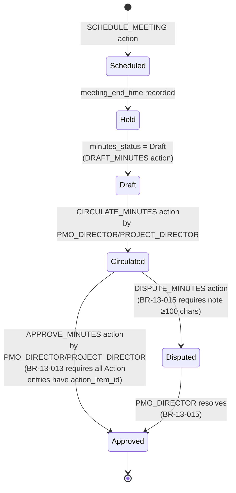

### MinutesEntry Auto-Action Creation (BR-13-014)

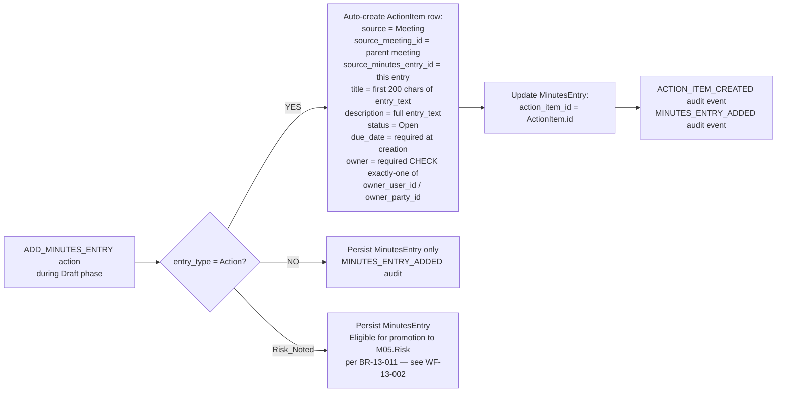

### Minutes Approval Flow

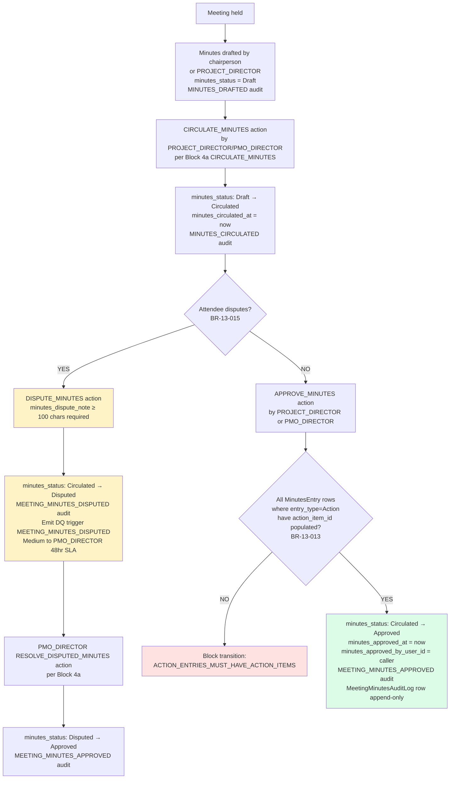

### Minutes Circulation Timer (BR-13-017)

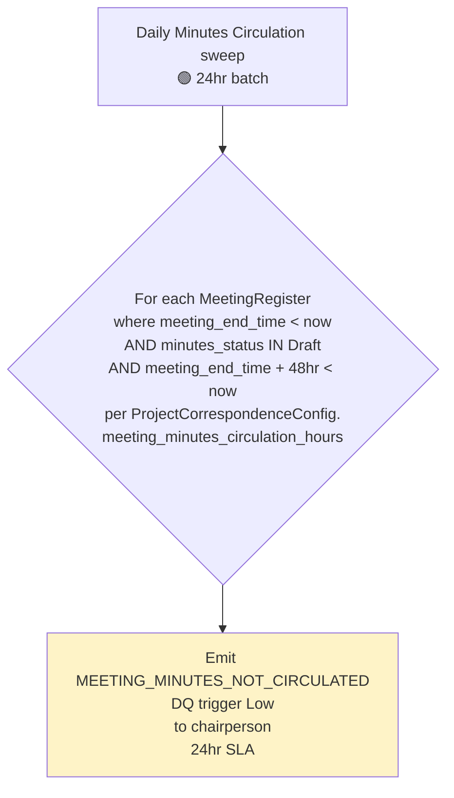

### ActionItem State Machine + Daily SLA Sweep (BR-13-016)

```mermaid
stateDiagram-v2
    [*] --> Open: Auto-created from MinutesEntry<br/>OR manual create<br/>(BR-13-014)
    Open --> In_Progress: Owner acknowledges
    In_Progress --> Completed: Owner marks complete<br/>closed_at set
    Open --> Cancelled: Cancelled (closure_note ≥50 chars)
    In_Progress --> Cancelled: Cancelled (closure_note required)
    Open --> Deferred: Deferred (closure_note required;<br/>new due_date may be set)
    In_Progress --> Deferred: Deferred
    Open --> Overdue: due_date < today<br/>BR-13-016 daily sweep
    In_Progress --> Overdue: due_date < today<br/>BR-13-016 daily sweep
    Overdue --> Completed: late completion
    Overdue --> Cancelled: Cancelled
    Completed --> [*]
    Cancelled --> [*]
    Deferred --> [*]: Deferred terminal until reactivated
```

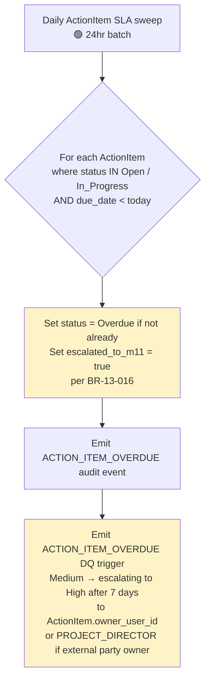

### Audit Events Emitted

| Event | Trigger BR | Severity |
|---|---|---|
| `MEETING_SCHEDULED` | (MeetingRegister.create) | Info |
| `MEETING_HELD` | (meeting_end_time recorded) | Info |
| `MINUTES_DRAFTED` | (status → Draft) | Info |
| `MINUTES_CIRCULATED` | (status → Circulated) | Info |
| `MEETING_MINUTES_APPROVED` | BR-13-013 | Info |
| `MEETING_MINUTES_DISPUTED` | BR-13-015 | Medium |
| `MINUTES_ENTRY_ADDED` | (MinutesEntry.create) | Info |
| `ACTION_ITEM_CREATED` | BR-13-014 | Info |
| `ACTION_ITEM_OWNER_NOTIFIED` | (post-create) | Info |
| `ACTION_ITEM_OVERDUE` | BR-13-016 | Medium → escalating |

### Decision Queue Triggers Emitted

| Trigger | Severity | Owner | SLA | Source BR |
|---|---|---|---|---|
| `MEETING_MINUTES_DISPUTED` | Medium | PMO_DIRECTOR | 48 hr | BR-13-015 |
| `MEETING_MINUTES_NOT_CIRCULATED` | Low | Meeting chairperson | 24 hr | BR-13-017 |
| `ACTION_ITEM_OVERDUE` | Medium → High escalating | ActionItem.owner_user_id or PROJECT_DIRECTOR | per overdue duration | BR-13-016 |

---

## WF-13-004 — RFI Lifecycle

> **Decision:** Has the contractor's Request for Information received a timely, documented response — and has any design / cost / schedule impact been escalated appropriately?
> **Primary Role:** SITE_MANAGER / PROJECT_DIRECTOR / PLANNING_ENGINEER / QS_MANAGER / PROCUREMENT_OFFICER (raise) → QS_MANAGER / PROJECT_DIRECTOR / PMO_DIRECTOR (respond) → PROJECT_DIRECTOR / PMO_DIRECTOR (close); PMO_DIRECTOR only for reopen.
> **BR Coverage:** BR-13-018 (RFI response_due_date auto-compute), BR-13-019 (RFI Responded requires response_text), BR-13-020 (Daily RFI SLA sweep), BR-13-021 (RFI close reopen requires PMO_DIRECTOR).

### RFI State Machine

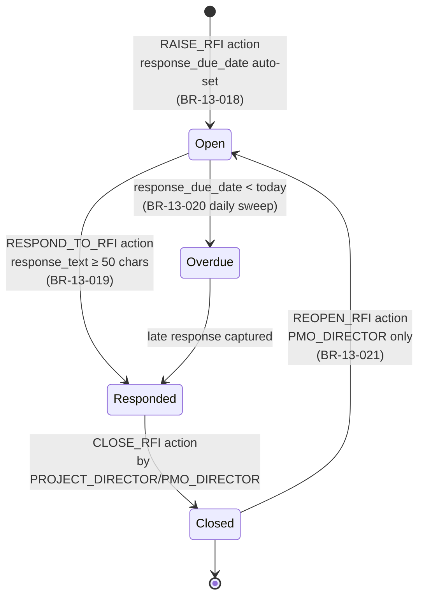

### Runtime Flow

```mermaid
flowchart TD
    A[Authorised role per Block 4a<br/>RAISE_RFI action] --> B[RFI created:<br/>question_text ≥ 100 chars<br/>raised_by_user_id<br/>or raised_by_party_id<br/>addressed_to free-text<br/>status = Open]
    B --> C[Compute response_due_date:<br/>raised_at_date + ProjectCorrespondenceConfig.rfi_sla_days<br/>default 14 days<br/>per BR-13-018]
    C --> D[Persist RFI row<br/>RFI_RAISED audit event]

    D --> E[Daily RFI SLA sweep<br/>🟢 24hr batch<br/>per BR-13-020]
    E --> F{response_due_date < today<br/>AND status = Open?}
    F -->|YES| G[Set status = Overdue<br/>Emit RFI_RESPONSE_OVERDUE<br/>DQ trigger Medium<br/>to PROJECT_DIRECTOR + PLANNING_ENGINEER<br/>48hr SLA]
    F -->|NO| H[Continue]

    D --> I[QS_MANAGER / PROJECT_DIRECTOR /<br/>PMO_DIRECTOR<br/>RESPOND_TO_RFI action<br/>per Block 4a]
    I --> J{response_text<br/>populated ≥ 50 chars?<br/>BR-13-019}
    J -->|NO| K[Block transition:<br/>RESPONSE_TEXT_REQUIRED]
    J -->|YES| L[status: Open → Responded<br/>responded_at = now<br/>responded_by_user_id = caller<br/>RFI_RESPONDED audit event]
    L --> M{cost_impact = true<br/>OR schedule_impact = true?<br/>BR-13-012 / WF-13-002]
    M -->|YES| N[Emit RFI_IMPACT_FLAGGED to M05<br/>see WF-13-002 cross-module]
    M -->|NO| O[No M05 trigger]
    N --> P[CLOSE_RFI action<br/>PROJECT_DIRECTOR or PMO_DIRECTOR]
    O --> P
    P --> Q[status: Responded → Closed<br/>closed_at = now<br/>RFI_CLOSED audit event<br/>RFIStatusLog row append-only]

    Q --> R{Reopen needed later?}
    R -->|YES| S{Caller is PMO_DIRECTOR?<br/>BR-13-021}
    S -->|YES| T[REOPEN_RFI action<br/>status: Closed → Open<br/>Audit log preserved]
    S -->|NO| U[API rejects 403<br/>REOPEN_REQUIRES_PMO_DIRECTOR]

    style K fill:#fee2e2
    style G fill:#fef3c7
    style U fill:#fee2e2
    style L fill:#dcfce7
    style Q fill:#dcfce7
```

### Audit Events Emitted

| Event | Trigger BR | Severity |
|---|---|---|
| `RFI_RAISED` | BR-13-018 | Info |
| `RFI_RESPONDED` | BR-13-019 | Info |
| `RFI_CLOSED` | (state → Closed) | Info |
| `RFI_RESPONSE_OVERDUE` | BR-13-020 | Medium |
| `RFI_IMPACT_FLAGGED` | BR-13-012 (in WF-13-002) | High |

### Decision Queue Triggers Emitted

| Trigger | Severity | Owner | SLA | Source BR |
|---|---|---|---|---|
| `RFI_RESPONSE_OVERDUE` | Medium | PROJECT_DIRECTOR + PLANNING_ENGINEER | 48 hr | BR-13-020 |

### Failure Modes

| Failure | Behaviour |
|---|---|
| Caller attempts CLOSE_RFI without response | Block transition; RFI cannot move to Closed without prior Responded transition |
| Non-PMO_DIRECTOR attempts to reopen Closed RFI | API rejects 403 per BR-13-021 |
| Response text < 50 chars | Block transition with reason RESPONSE_TEXT_TOO_SHORT per BR-13-019 |

---

## BR Coverage Matrix — M13

Every BR in M13 Spec v1.0 (R34) Block 6 mapped to at least one workflow. **0 coverage gaps.**

| BR Code | BR Summary | WF-13-001 Correspondence | WF-13-002 M05 Trigger | WF-13-003 Meetings | WF-13-004 RFI |
|---|---|---|---|---|---|
| BR-13-001 | Project Activation auto-create config | ✓ | | | |
| BR-13-002 | Notice contractual_reference required | ✓ | | | |
| BR-13-003 | Site Instruction compliance_deadline required | ✓ | | | |
| BR-13-004 | response_required auto-set | ✓ | | | |
| BR-13-005 | response_due_date auto-compute | ✓ | | | |
| BR-13-006 | Notice SLA Warning sweep (80%) | ✓ | | | |
| BR-13-007 | Notice SLA Breach sweep (100%) | ✓ | | | |
| BR-13-008 | Correspondence respond action | ✓ | | | |
| BR-13-009 | triggers_m05 RBAC restricted | | ✓ | | |
| BR-13-010 | triggers_m05 → emit CORRESPONDENCE_M05_FLAGGED | | ✓ | | |
| BR-13-011 | Risk_Noted promotion to M05.Risk | | ✓ | | |
| BR-13-012 | RFI cost/schedule impact emit | | ✓ | | ✓ |
| BR-13-013 | Minutes Approved requires action_item_id | | | ✓ | |
| BR-13-014 | Auto-create ActionItem from MinutesEntry | | | ✓ | |
| BR-13-015 | Minutes Disputed requires note ≥100 chars | | | ✓ | |
| BR-13-016 | Daily ActionItem SLA sweep | | | ✓ | |
| BR-13-017 | Meeting minutes circulation timer 48hr | | | ✓ | |
| BR-13-018 | RFI response_due_date auto-compute | | | | ✓ |
| BR-13-019 | RFI Responded requires response_text | | | | ✓ |
| BR-13-020 | Daily RFI SLA sweep | | | | ✓ |
| BR-13-021 | RFI close reopen requires PMO_DIRECTOR | | | | ✓ |
| BR-13-022 | Site Instruction non-compliance sweep | ✓ | | | |
| BR-13-023 | Distribution sent event | ✓ | | | |
| BR-13-024 | Daily Acknowledgement sweep | ✓ | | | |

**Coverage:** 24 / 24 BRs covered. **0 gaps.**

---

*v1.0 — Workflows LOCKED 2026-05-04 (Round 36). C1b batch with M05 Workflows. M13 build-ready after this round.*

---

## M05+M13 Batch Status (post-R36)

```
✅ R31  M05 Brief v1.0a (7-state VO patch R33)
✅ R32  M13 Brief v1.0
✅ R33  M05 Spec v1.0 + X8 v0.7
✅ R34  M13 Spec v1.0 + X8 v0.8 + X9 v0.5
✅ R35  M05 + M13 Wireframes v1.0 (C1b batch)
✅ R36  M05 + M13 Workflows v1.0 (C1b batch)  ← THIS ROUND
       ↓
       M05 + M13 BUILD-READY
```

### Next Rounds (per Build Execution Plan §3a)

**Build-track:**
- R37 — Monorepo scaffold + 10 ADRs + CI workflow + Docker Compose + Keycloak realm seed (first code in repo)

**Spec-track (parallel):**
- R37 — M07 EVMEngine Brief (M05 contract `RISK_ADJUSTED_EAC_DELTA` event now locked in M05 Block 7b — M07 unblocked)
